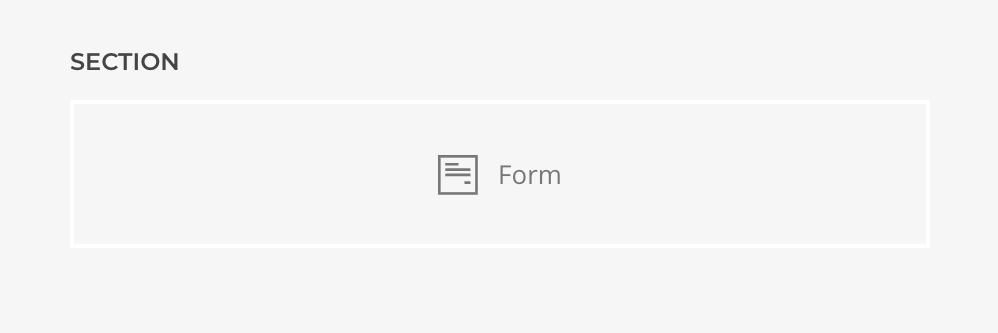
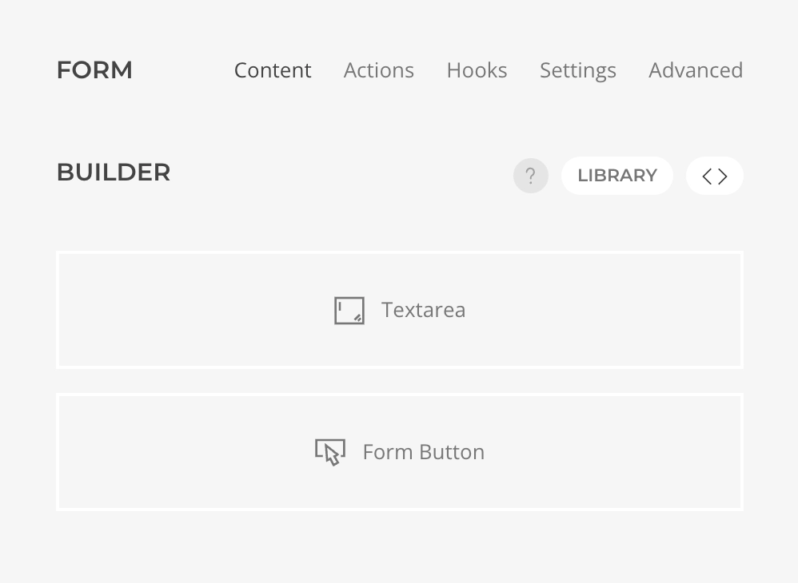
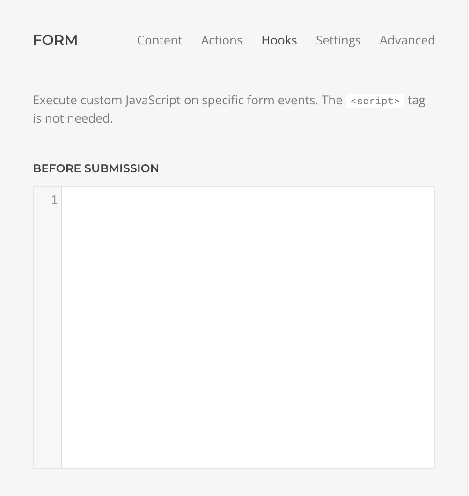
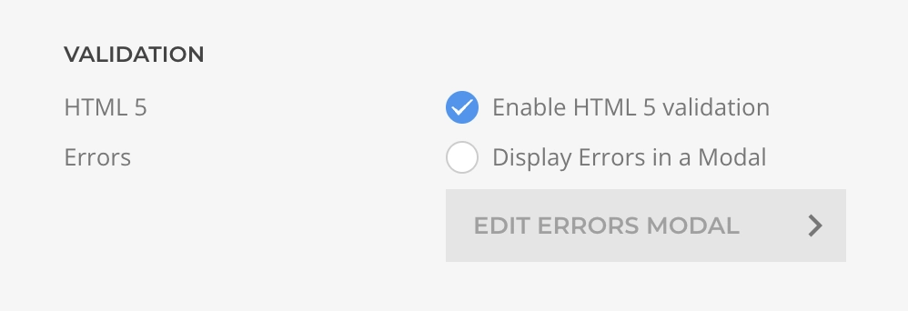
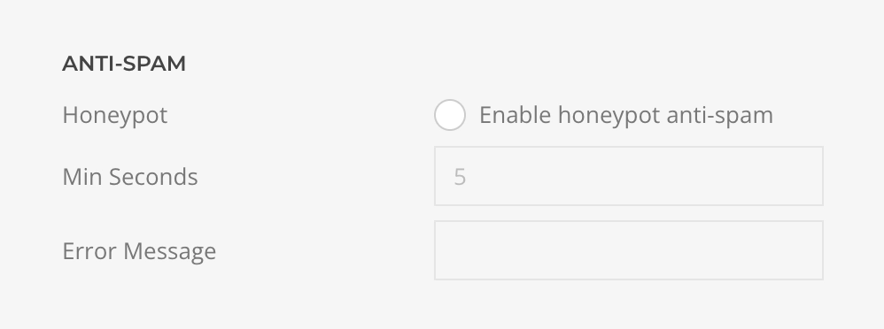
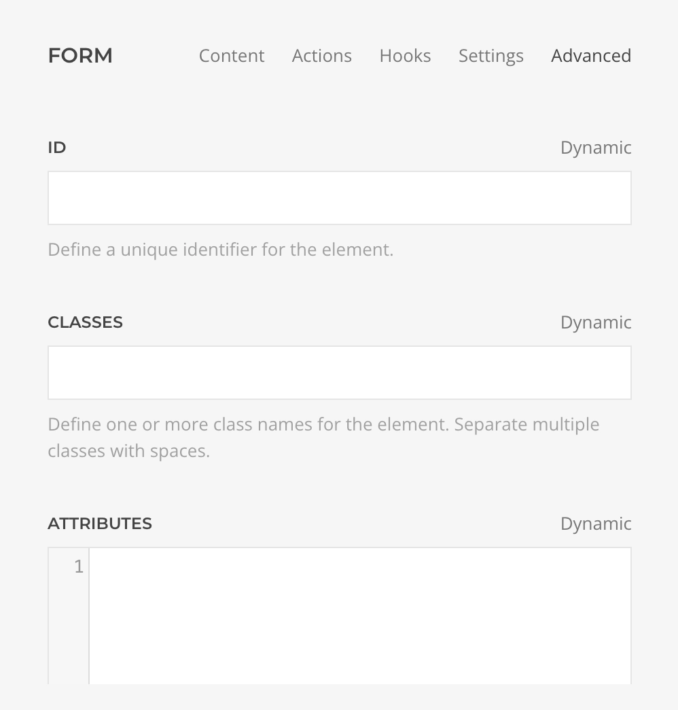

# Form Element

The **Form Element** is a sublayout element from the _Essentials_ group that creates a complete form area with built-in submission handling, validation, and anti-spam protection. When added to your layout, its content is enclosed with a standard `<form>` HTML element while maintaining full YOOtheme Pro builder capabilities.

## Content

The content area allows you to structure your form however you need. Combine form field elements with any other YOOtheme Pro elements—add headings, text, images, dividers, or even complex layouts. You have complete control over the form's appearance and flow, enabling you to create anything from simple contact forms to multi-step wizards.

For detailed information about each field type and its configuration options, see the [Form Field Elements](./elements) documentation.

## Actions

Actions define what happens after a form is successfully submitted. They execute sequentially in the order configured, allowing you to chain multiple operations—send emails, store data, redirect users, or integrate with external services.

For detailed information about each action type and its configuration options, see the [After Submit Actions](./after-submit-actions) documentation.

## Hooks

Hooks enable you to execute custom JavaScript at key moments in the form lifecycle. These events are triggered automatically as users interact with the form, giving you precise control over behavior and enabling sophisticated features like multi-step forms, conditional logic, dynamic field updates, and third-party integrations.

| Event | Scope Variables | Description |
| --- | --- | --- |
| _Before Submission_ | `event`, `form`, `data` | Executes before the submission allowing to prevent it by returning `false`. |
| _After Submission_ | `event`, `form`, `data`, `response` | Executes after successful submission. |
| _On Field Change_ | `event`, `form`, `field`, `data` | Executes after any form field value has changed. |
| _On Submission Error_ | `event`, `form`, `data`, `errors`, `validation` | Executes after server side submission error, including validation errors. |
| _On Validation Error_ | `event`, `form`, `data` | Executes after front-end validation error. |

::: tip
For more advanced integrations and details consult [Form Events](./form-events) section.
:::

## Settings

Configure how your form behaves through several setting categories, each controlling different aspects of form submission and validation.

### Submission Settings

| Setting | Default | Description |
| --- | --- | --- |
| _Reset After_ | `true` | Whether to reset the form to its initial state after a successful submission. |
| _Override Action_ | `false` | Submit the form to a custom URL and method, useful for 3rd party form integrations. |
| _Action URL_ | | The URL where the form should submit the data to (when override is enabled). |
| _Action Method_ | `POST` | The HTTP method to use for submitting the data: `GET` or `POST` (when override is enabled). |

::: warning Side Effects
When a custom action URL is set, server-side validation and after submit actions will not be executed.
:::

### Validation Settings

| Setting | Default | Description |
| --- | --- | --- |
| _HTML 5_ | `true` | Whether to execute client-side HTML5 validation before submission. Server side validation is always executed. |
| _Display Errors in Modal_ | `false` | Whether to display server side errors in a Modal instead of the bottom block. |
| _Modal Content_ | | The content to be displayed in the modal, use `{errors}` as placeholder for the list of errors. |
| _Center Modal_ | `false` | Whether to vertically center the modal. |

::: tip
For field-specific validation refer to [form field elements settings](./elements).
:::

::: warning Custom Error Message
At the moment, it is only possible to customize the validation error messages for server-side validation, not for HTML5 validation. A workaround is to disable HTML5 validation in the Form Element configuration.
:::

### Anti-Spam Settings

| Setting | Default | Description |
| --- | --- | --- |
| _Honeypot_ | `false` | Honeypot protection uses two techniques: a hidden field that bots fill but users don't see, and time-based validation that rejects submissions faster than the minimum threshold. |
| _Min Seconds_ | `5` | A submission done in less than the specified seconds will be considered invalid. |
| _Error Message_ | | Override the honeypot validation error message. |

::: tip Recommendations

- Enable on all public-facing forms (lightweight and effective)
- Combine with CAPTCHA elements for enhanced protection
- Set minimum seconds based on form complexity:
  - Simple forms (2-3 fields): 3-5 seconds
  - Medium forms (5-10 fields): 5-10 seconds
  - Complex forms (10+ fields): 10-15 seconds
- Test to avoid rejecting legitimate users with autofill/password managers
:::

## Advanced Settings

Customize HTML attributes for the form element to enable custom styling, JavaScript targeting, or third-party integrations.

| Setting | Description |
| --- | --- |
| _ID_ | Set a unique identifier for the form element. Useful for CSS targeting, JavaScript manipulation, or analytics tracking. |
| _Classes_ | Add custom CSS classes to apply styling or enable framework-specific behaviors. |
| _Attributes_ | Define custom HTML attributes such as `data-*` attributes for JavaScript frameworks, accessibility attributes, or tracking parameters. |
