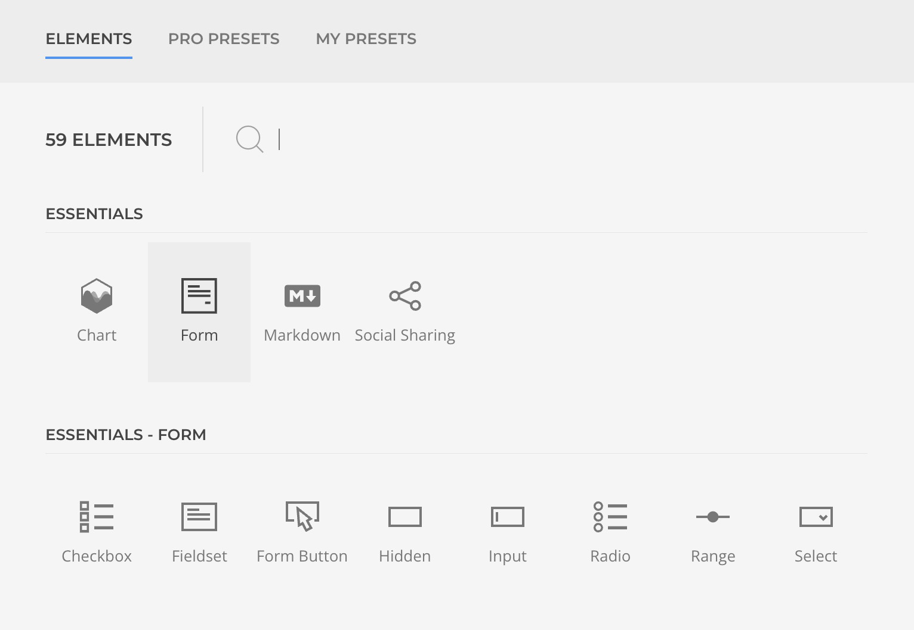
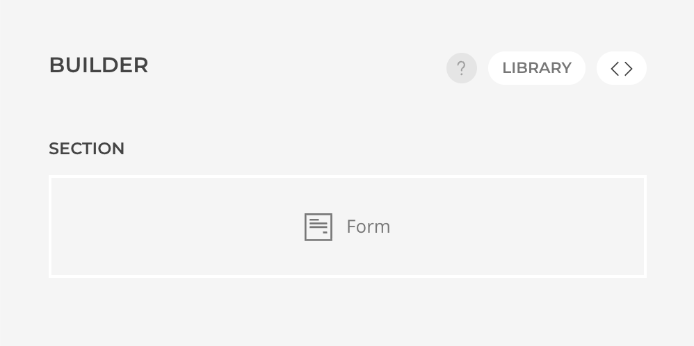
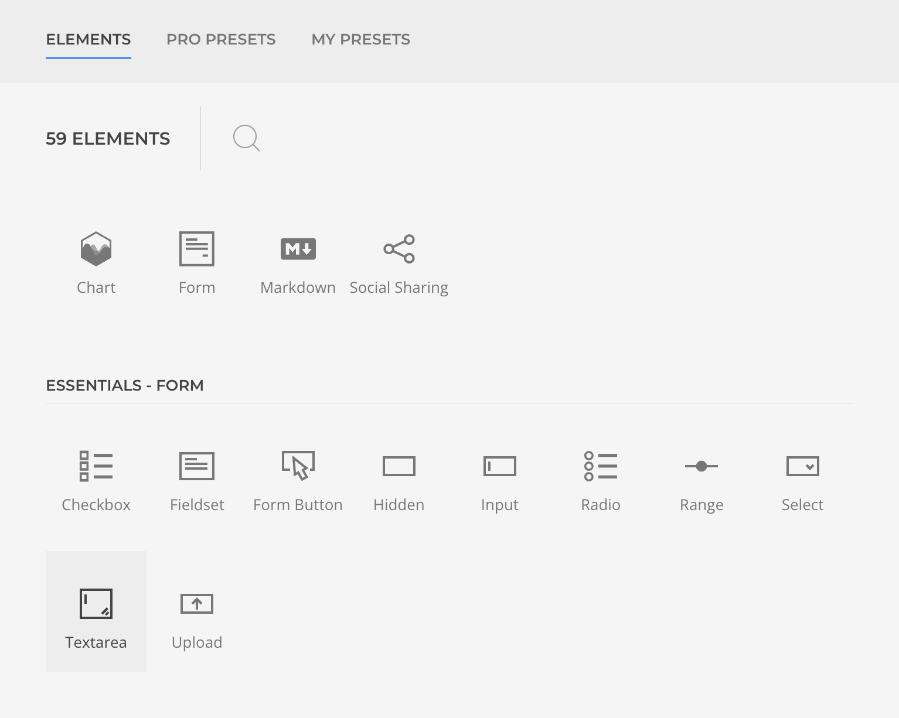
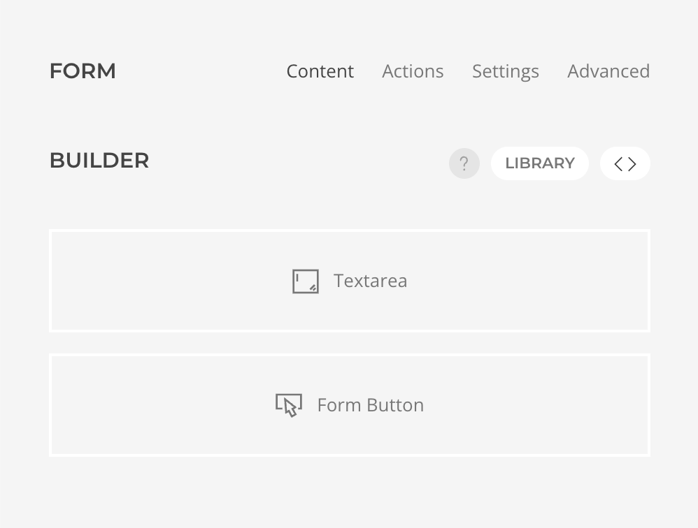
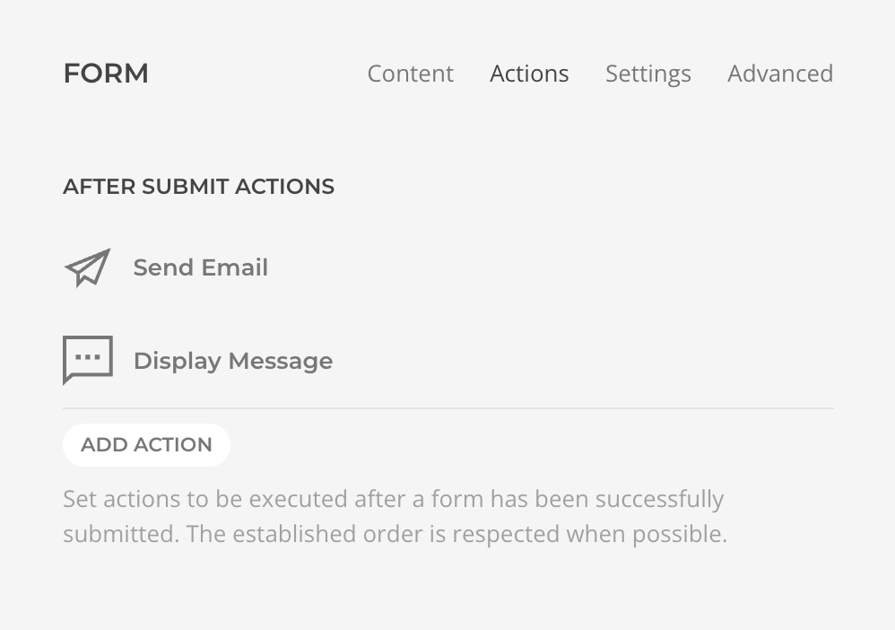
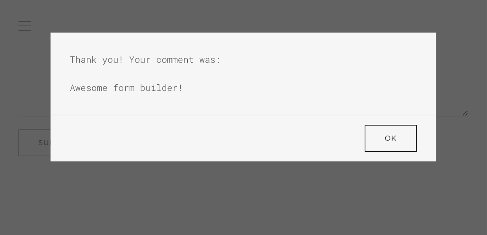

# Form Builder

Essential Forms lets you build fully functional forms directly within YOOtheme Pro's layout builder — no code required. Send emails, save submissions, display messages, or connect with external services, all configured visually.

<!--@include: ../_partials/enable-addon.md-->

This walkthrough creates a simple comment form that displays a confirmation message on submission. By the end you'll understand the three core building blocks: the **Form Element**, **Field Elements**, and **After Submit Actions**.

## Add a Form Element

Every form starts with the [Form Element](./form-element) — a sublayout element that acts as the form container. All fields and other content are placed inside it, and the whole sublayout is wrapped in a standard `<form>` tag.

1. Open the layout builder where you want the form.
2. Add a **Form** element from the _Essentials_ group.

The element is now ready to accept fields and actions.

## Add Form Fields

Essentials ships with a set of prebuilt [field elements](./elements) — inputs, selects, checkboxes, and more. For this example we'll add a textarea and a submit button.

1. Open the Form Element and within the Content tab start a new layout.
1. Add a **Textarea Element** from the _Form Essentials_ group.
1. Open the element settings and set the _Control Name_ as `comment`.

Add as well a **Button Element** from the same group, it will render a submit button by default.

## Add Form Actions

Actions define what happens when a user submits the form. They run sequentially, so you can chain multiple operations together. Here we'll display a simple confirmation message.

1. Open the Form Element.
2. Switch to the _Actions_ tab and add a **Display Message** action.
3. Set the _Message_ to `Thank you for your submission, your comment was {comment}!`.

::: info Going further
For real-world forms you'll typically add more actions — for example an **Email** action to notify yourself and a **Database** action to persist submissions. See [After Submit Actions](./after-submit-actions) for the full list.
:::

::: tip What is `{comment}`?
The curly-brace syntax is a [Data Placeholder](./dynamic-data#data-placeholders) — a simple way to reference submitted field values by their control name. Placeholders work in any action setting that accepts text.
:::

## Test Form Submission

1. Locate the form in the builder preview.
2. Type a message in the Comment textarea and click **Submit**.

A modal should appear displaying the confirmation message with your submitted text.
