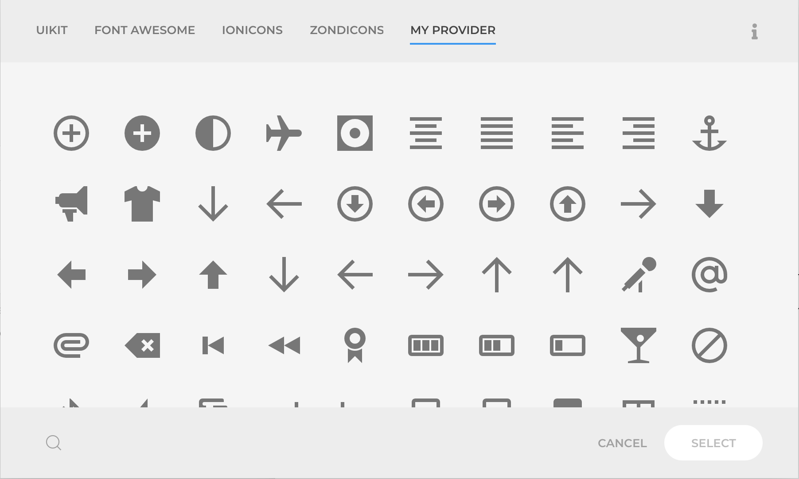

# Icons

## Integration

The Icons Addon extends the YOOtheme Pro Builder with new icon providers like Font Awesome, Ionicons, and others. The icons will be accessible in the core icons Modal when choosing an icon with the Icon Picker.


Each provider will be displayed on it own Tab with sub tabs separating the groups. The modal is enhanced with a Search field that also extends the core UIkit icons making it possible to easily find an icon by it name.


The addon is enabled by default, but if required it can be completely disabled in the `Theme -> Settings -> ZOOlanders` panel.

## Providers

The icon providers are a collection of icons in `.svg` format under a common brand or topic, with optional groups. Being all GPL, MIT or Creative Commons licensed, you can use them in personal as commercial projects.

The icons are stored in:

- Joomla: `plugins/system/yooessentials/modules/icons/icons`
- WordPress: `wp-content/plugins/yooessentials/modules/icons/icons`

### Available Providers

#### FontAwesome

[fontawesome.com](https://fontawesome.com/) - Licensed under GPL

The most popular and complete icon collection, offering a Free and Pro version. This Addon only includes the Free collection, but if you have a licence for the Pro collection you can include it as a [custom provider](#custom-providers).

#### Ionicons

[ionicons.com](https://ionicons.com/) - Licensed under MIT

Beautifully crafted open source icons built by the Ionic Framework team.

#### Zondicons

[zondicons.com](https://zondicons.com/) - Licensed under Creative Commons

A set of icons with charming yet sophisticated personality designed by Steve Schoger.

## Custom Icons

You can add your own collection of icons in your [Child Theme](https://yootheme.com/support/yootheme-pro/joomla/child-themes), under the `{MyChildThemeDir}/myicons` directory. Those would become availble only for the current Child Theme in the icons picker Modal under the `My Icons` tab. Optionally you can group them into subfolders for a better organization or style separation.


> The use of _My Icons_ is encouraged as those will persist any changes from 3rd party icon providers.

## Custom Providers

Creating your own custom provider is useful if you need the icons available for any theme, or those are intended for cross project use. Simply place the `.svg` files in the right directory:

- Joomla: `media/yooessentials/icons/my-provider`
- WordPress: `wp-content/yooessentials/icons/my-provider`

You can optionally group the icons into subfolders for a better organization or style separation, eg `my-provider/group-a`, `my-provider/group-b`.

Then place a `my-provider.json` file beside the proviously created folder using exactly the same name, and write it conten as follows:

```json
{
  "title": "My Provider",
  "groups": ["group-a", "group-b"],
  "description": "Description of the provider",
  "meta": {
      "version": "1.0.0",
      "license": "GPL",
      "url": "https://example.com"
  }
}
```

> The title will be used in the icons picker Modal tab, while the groups props allows to custom sort the groups, if any. The rest of fields are optional.

The new provider will be automatically picked up and displayed among the other providers in the icons picker Modal.


