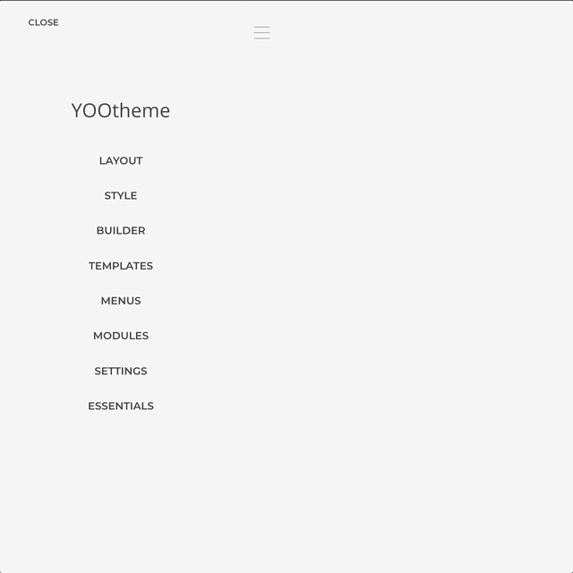

# Icons Addon

Expand the icon library with custom and curated third-party collections such as Font Awesome, Bootstrap, Ionicons, and others. Resulting in a combined collection of more than 12k icons natively integrated into the builder icons workflow.

## Integration

Follow through to learn how to install an Icon Collection and chose an icon from it. Even if you are already familiar with the concept you might learn something new.

<!--@include: ../_partials/enable-addon.md-->

### 1. Add an Icon Collection

No collection is installed per default, so let's add one withing the Icon Collection Manager.

1. Open the Icon Collections Manager.
1. Click on the `Add Collection` button and choose the collection to be installed.
1. Wait until the collection is listed in the manager.

### 2. Display an Icon

Now that a collection is installed we can select any of it icons as a source for an icon display.

1. Open the `Customizer -> Builder` section.
1. Add an Icon Element and open it Icon Picker.
1. In the picker Modal select the `Collections Tab` and select some icon.
