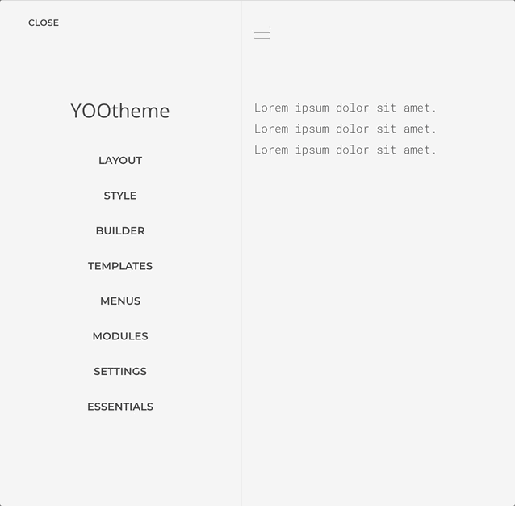

# Sources Addon

Generate content sources from configuration or service-dependent data, such as database tables, CSV files, Instagram media, Google Spreadsheets, and more.

## Integration

<!--@include: ../_partials/enable-addon-->

### 1. Create a Source Instance

The Source Manager will assist us on creating, and posterior management, of all source instances.

1. Open the manager at `Customizer -> Essentials -> Sources`
2. Create a new source of any kind, for this specific case we choose the RSS one.
3. Fulfill the instance configuration consulting the [sources reference](./providers/).
4. `Save` the new instance when ready.

### 2. Map the Source Content

Once the source instance has been created it schema will be generated based on the configuration and it content made available for mapping as any other source. In this case we are gonna map the feed entries to a List Element.

1. Open the builder and add a List Element.
1. Add an Item to the element and open the new item Advanced Tab.
1. Under `Dynamic Content`, select the source you want to use for the list. In this case, `RSS Entries` located under the RSS group.
1. Open the item Content Tab and map some data to the item content field.

At this point a list of data from the RSS feed should be rendered.

## Source Manager

The Source Manager can be accessed at `Customizer -> Essentials -> Sources` section. There you can manage source instances which will become part of the Dynamic Content workflow.

