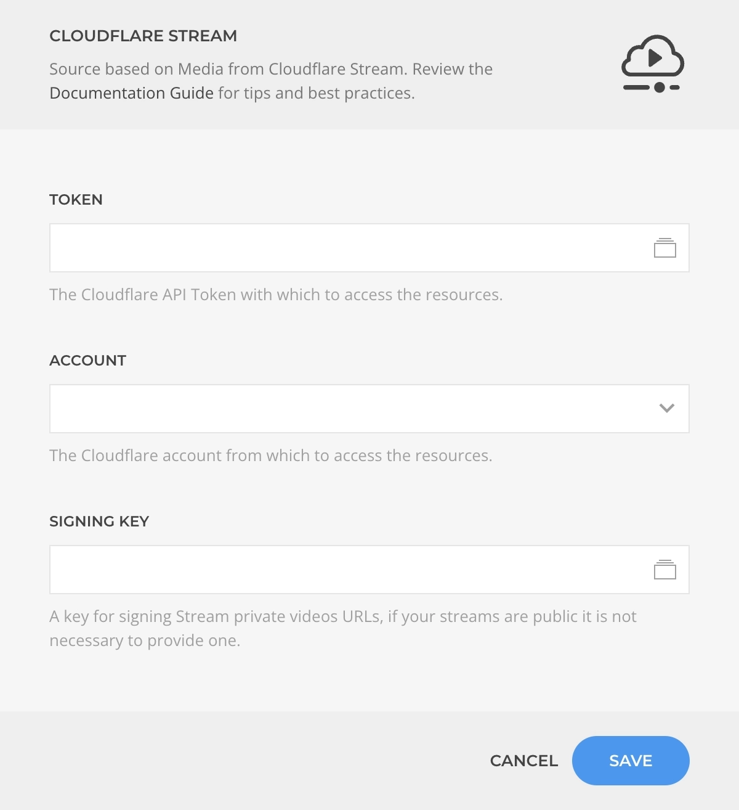

<!--@include: ../_partials/provider-intro.md-->

The Cloudflare Source feeds data from [Cloudflare Stream](https://www.cloudflare.com/products/cloudflare-stream/) videos. Based on the [multi-instance](/essentials-for-yootheme-pro/addons/sources/multi-instance-sources/) source workflow it allows connecting to multiple accounts with different configurations.

## Settings

The source settings determines the content structure, every time the instance is saved the structure will be regenerated.

| Setting | Description | Required |
| ------- | ----------- | :------: |
| **Token** | The Cloudflare API Token which to authenticate with. | &#x2713; |
| **Account** | The Cloudflare account which to connecto to. | &#x2713; |
| **Signing Key** | An auto-generated key used to signing private videos. | |

::: details Common Settings
<!--@include: ../_partials/provider-common-settings.md-->
:::

### Authentication

Authentication is based on an API Token driven by the [Cloudflare API Token Driver](/essentials-for-yootheme-pro/auth/drivers/cloudflare-api-token).

::: tip Keys Security
Learn more about Essentials [Keys security protocols](/essentials-for-yootheme-pro/oauth-keys-secrets#security).
:::

## Content Queries

For every source instance the following content queries will be made available as Dynamic Content option.

### Video Query

Fetches a single video from the authenticated account and resolves to a [Video Type](#video-type).

| Setting | Default | Description | Required |
| ------- | ------- | ----------- | :------: |
| **Video** | | The Cloudflare Stream video to create the source from. | &#x2713; |
| **Cache** | `3600` | The duration in seconds before the cache is invalidated and the query re-executed. |

### Videos Query

Fetches videos from the authenticated account and resolves to a list of [Video Type](#video-type).

| Setting | Default | Description |
| ------- | ------- | ----------- |
| **Search** | | The video name search term by which to filter the results. |
| **Since/Until** | | Restricts the results to videos that have been published within the specified range of dates. |
| **Status** | `Ready` | The status by whic to filter the results, within `Ready`, `Queued`, `In Progress`, `Downloading`, and `Error`. |
| **Quantity** | `20` | The amount of videos to fetch. |
| **Cache** | `3600` | The duration in seconds before the cache is invalidated and the query re-executed. |

## Content Types

The content types define the mapping options for the source content.

### Video Type

The **Video Type** defines the mapping options of a Cloudflare Stream Video object.

| Option | Description | Type | Filters |
| ------ | ----------- | ---- | ------- |
| **ID** | The unique identifier of this video. | `String` |
| **Title** | The title of this video. | `String` | `Limit` |
| **Iframe URL** | Generates an iframe URL with `Autoplay`, `Loop`, `Muted`, `Controls`, and `Time` arguments. | `String` |
| **Preview URL** | The preview URL of this video. | `String` |
| **Playback URL** | The streaming playback URL of this video. | `String` |
| **Size** | The formated size of this video. | `String` |
| **Duration** | The duration of this video in seconds. | `Int` |
| **Width** | The width of this video in pixels. | `Int` |
| **Height** | The height of this video in pixels. | `Int` |
| **Thumbnail** | The path to the dynamically generated and locally cached thumbnail of this video, with `Time`, `Height`, `Width`, and `Fit` arguments. | `String` |
| **Thumbnail (animated)** | The path to the dynamically generated and locally cached animated thumbnail of this video, with `Time`, `Height`, `Width`, and `Fit` arguments. | `String` |
| **Created At** | The time this video was created. | `String` | `Date` |
| **Modified At** | The time this video was last modified. | `String` | `Date` |
| **Uploaded At** | The time this video was uploaded. | `String` | `Date` |
