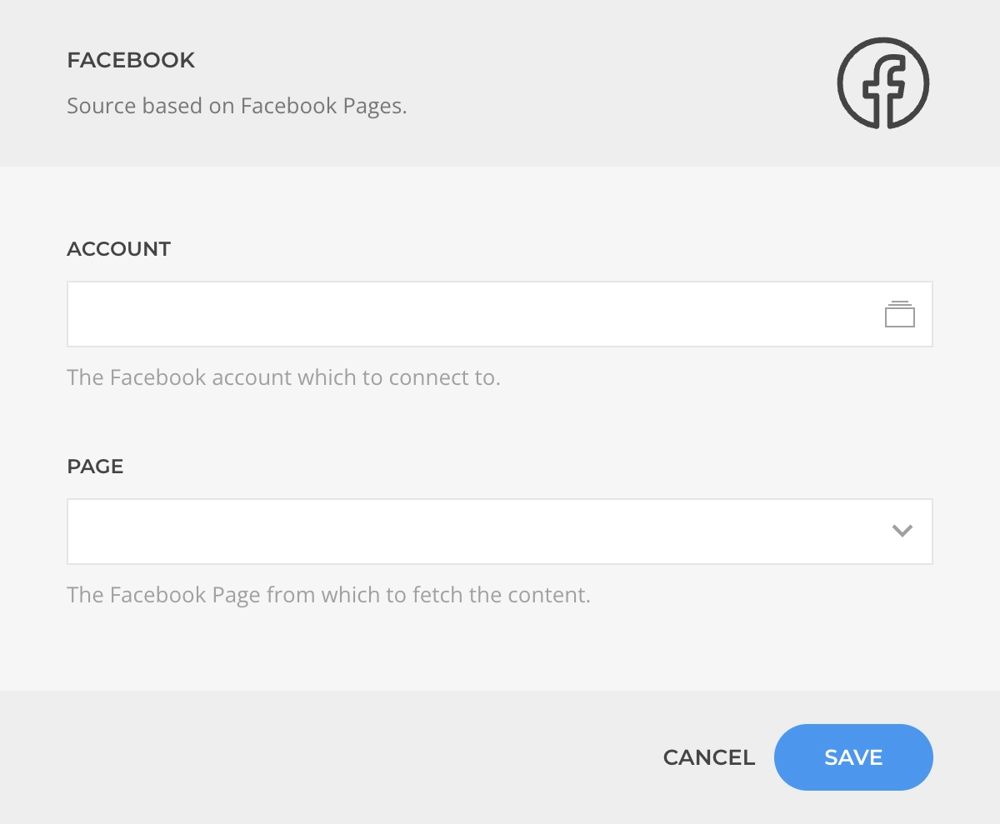
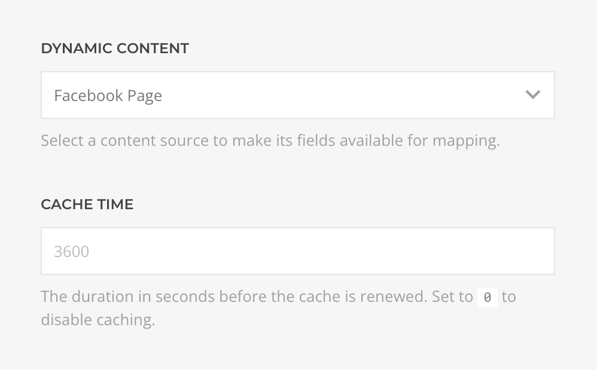

<!--@include: ../_partials/provider-intro.md-->

The Facebook Source feeds data from [Facebook](https://www.facebook.com/) Pages. Based on the [multi-instance](/essentials-for-yootheme-pro/addons/sources/multi-instance-sources/) source workflow it allows connecting to multiple accounts with different configurations.

## Settings

The source settings determines the content structure, every time the instance is saved the structure will be regenerated.

| Setting | Description | Required |
| ------- | ----------- | :------: |
| **Account** | The Facebook Account which to authenticate with. | &#x2713; |
| **Page** | The Facebook page from which to create the source content. | &#x2713; |

::: details Common Settings
<!--@include: ../_partials/provider-common-settings.md-->
:::

### Authentication

Authentication is based on the OAuth protocol driven by the [Facebook OAuth Driver](/essentials-for-yootheme-pro/auth/drivers/facebook-oauth).

## Content Queries

For every source instance the following content queries will be made available as Dynamic Content option.

### Page Query

Fetches the content from the page resolving to a list of [Page Type](#page-type).

| Setting | Default | Description |
| ------- | ------- | ----------- |
| **Cache** | `3600` | The duration in seconds before the cache is invalidated and the query re-executed. |

### Page Posts Query

Fetches the posts from the page resolving to a list of [Page Post Type](#page-post-type).

| Setting | Default | Description |
| ------- | ------- | ----------- |
| **Limit** | `20` | The maximum amount of posts to fetch. |
| **Cache** | `3600` | The duration in seconds before the cache is invalidated and the query re-executed. |

## Content Types

The content types define the mapping options for the source content.

### Page Type

Defines the mapping options of a Facebook Page object.

| Option | Description | Type | Filters |
| ------ | ----------- | ---- | ------- |
| **ID** | Unique identifier of this Page. | `String` |
| **Name** | The name of this Page. | `String` |
| **Username** | The alias of this Page, e.g for `www.facebook.com/platform` the username is `platform`. | `String` |
| **Link** | The Page's Facebook URL. | `String` |
| **Category** | The Page's category, e.g. `Product/Service`, `Computers/Technology`. | `String` |
| **Description** | The description of this Page. | `String` | `Limit` |
| **Description HTML** | The description of this Page in raw HTML. | `String` |
| **About** | Information about this Page. | `String` | `Limit` |
| **General Info** | General information provided by this Page. | `String` | `Limit` |
| **Website** | The URL of this Page's website. | `String` |
| **WhatsApp Number** | The WhatsApp number of this Page. | `String` |
| **Total Ratings** | Number of public ratings for this Page. | `Int` |
| **Total Followers** | Number of page followers. | `Int` |
| **Total Mentions** | Number of people talking about this Page. | `Int` |

| Page Person Options | Description | Type | Filters |
| ------ | ----------- | ---- | ------- |
| **Birthday** | The birthday of this Person Page. | `String` | `Date` |
| **Personal Info** | The personal info of this Person Page. | `String` | `Limit` |
| **Personal Interests** | The personal interests of this Person Page. | `String` | `Limit` |
| **Affiliation** | The affiliation of this Person Page. | `String` | `Limit` |

### Page Post Type

Defines the mapping options of a Facebook Page Post object.

| Option | Description | Type | Filters |
| ------ | ----------- | ---- | ------- |
| **ID** | Unique identifier of this post. | `String` |
| **Permalink** | The permanent static URL of this post, e.g `www.facebook.com/.../posts/10153449196`. | `String` |
| **Picture URL** | The full size picture attached to this post. | `String` |
| **Message** | The message written in this post. | `String` | `Limit` |
| **From** | The name of the user, page, group, or event that published this post. | `String` |
| **Tags** | The profiles tagged in post message as a custom formated string with `Separator`, `Show Link` and `Link Style` arguments. | `String` |
| **Created At** | The time this post was published. | `String` | `Date` |
| **Updated At** | The time this post was last updated, which occurs when a user comments on this post. | `String` | `Date` |
| **Is Published** | Whether this post was published. | `Boolean` |
| **Is Expired** | Whether this post has expiration time that has passed. | `Boolean` |
| **Is Hidden** | Whether this post has been set to hidden. | `Boolean` |
| **Is Popular** | Whether this post is currently popular based on whether the total actions as a percentage of reach exceeds a certain threshold. | `Boolean` |
| **Total Shares** | Number of times this post has been shared. | `Int` |
| **Total Likes** | Number of times this post has been liked. | `Int` |
| **Total Comments** | Number of comments made on this post. | `Int` |
| **Total Reactions** | Number of times people reacted to this post. | `Int` |
| **Parent ID** | Unique identifier of a parent post for this post, if it exists. | `String` |
