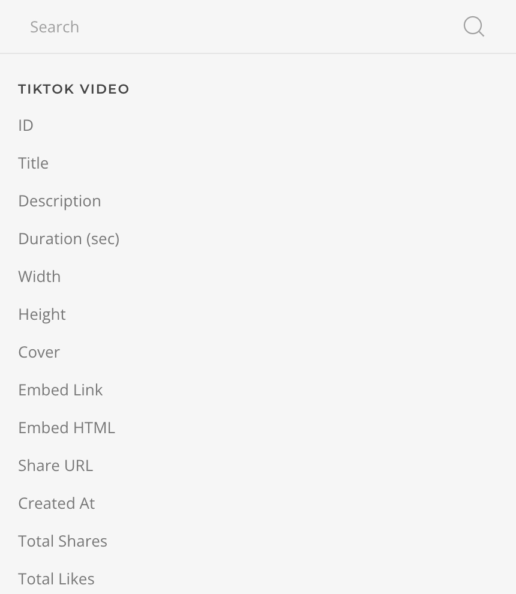

<!--@include: ../_partials/provider-intro.md-->

The TikTok Source feeds data from [TikTok](https://www.vimeo.com) media. Based on the [multi-instance](/essentials-for-yootheme-pro/addons/sources/multi-instance-sources/) source workflow it allows connecting to multiple accounts with different configurations.

## Settings

The source settings determines the content structure, every time the instance is saved the structure will be regenerated.

| Setting | Description | Required |
| ------- | ----------- | :------: |
| **Account** | The TikTok Account which to authenticate with. | &#x2713; |

::: details Common Settings
<!--@include: ../_partials/provider-common-settings.md-->
:::

### Authentication

Authentication is based on the OAuth protocol driven by the [TikTok OAuth Driver](/essentials-for-yootheme-pro/auth/drivers/tiktok-oauth).

## Content Queries

For every source instance the following content queries will be made available as Dynamic Content option.

### My Videos Query

Fetches videos from the authenticated account and resolves to a list of [Video Type](#video-type).

| Setting | Default | Description |
| ------- | ------- | ----------- |
| **Before Than** | | Limit the results to videos created before the specified date. |
| **Start** | `1` | The starting point, e.g of a list of 20 videos start from the number 2. |
| **Quantity** | `20` | The maximum amount of videos to retrieve. |
| **Cache** | `3600` | The duration in seconds before the cache is invalidated and the query re-executed. |

## Content Types

The content types define the mapping options for the source content.

### Video Type

The **Video Type** defines the mapping options of a TikTok Video object.

| Option | Description | Type | Filters |
| ------ | ----------- | ---- | ------- |
| **ID** | The unique identifier of this video. | `String` |
| **Title** | The title of this video, max length 150. | `String` | `Limit` |
| **Description** |  The description for this video, max length 150. | `String` | `Limit` |
| **Duration** | The duration of this video in seconds. | `Int` |
| **Width** | The width of this video. | `Int` |
| **Height** | The height of this video. | `Int` |
| **Cover** | The path to the locally cached video cover. | `String` |
| **Embed Link** | The embed link of tiktok.com for this video. | `String` |
| **Embed HTML** | The HTML code for embedded video. | `String` |
| **Share URL** | A shareable link for this video. Note that the website behaves differently on Mobile and Desktop devices. | `String` |
| **Created At** | The time this video was created. | `String` | `Date` |
| **Total Shares** | Number of times this video has been shared. | `Int` |
| **Total Likes** | Number of times this video has been liked. | `Int` |
| **Total Comments** | Number of times this video has been commented. | `Int` |
| **Total Views** | Number of times this video has been viewed. | `Int` |
