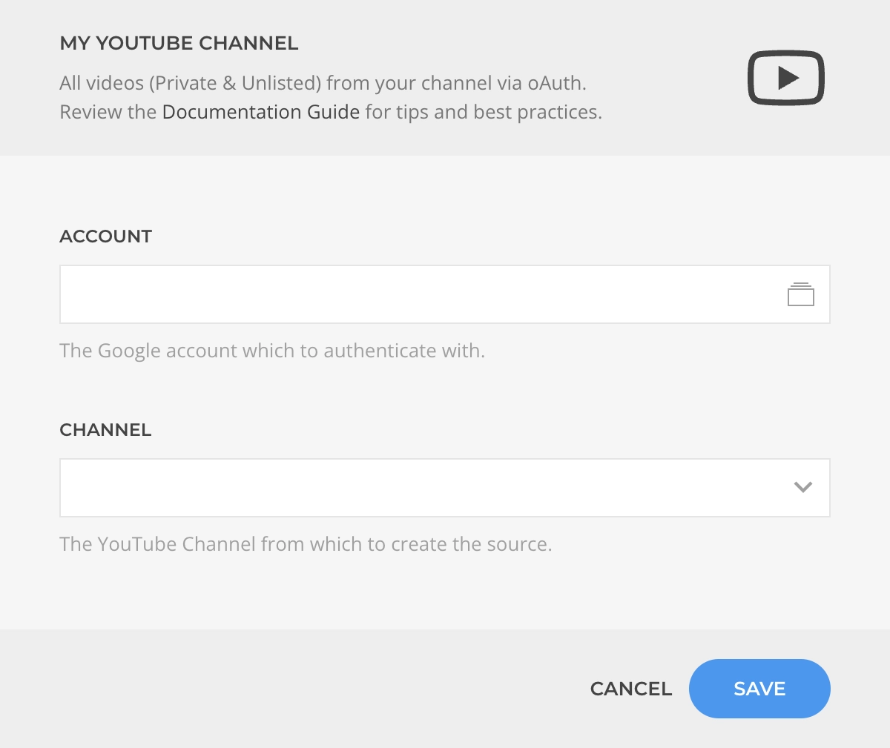

<!--@include: ../../parts/provider-intro-->

The YouTube My Channel Source, part of the [YouTube Source](../) collection, creates sources based on a YouTube channel from the authenticated user.

## Settings

The source settings determines the content structure, every time the instance is saved the structure will be regenerated.

| Setting | Description | Required |
| ------- | ----------- | :------: |
| **Account** | The Google Account which to [authenticate](#authentication) with. | &#x2713; |
| **Channel** | The YouTube Channel from which to create the source. | &#x2713; |

::: details Common Settings
<!--@include: ../../parts/provider-common-settings-->
:::

### Authentication

Authentication is based on the OAuth protocol driven by the [Google OAuth Driver](/essentials-for-yootheme-pro/auth/google).

## Content Queries

For every source instance the following content queries will be made available as Dynamic Content option.

### My Channel Query

Fetches the channel content resolving to a [Channel Type](../#channel-type).

| Setting | Default | Description | Required |
| ------- | ------- | ----------- | :------: |
| **Cache** | `3600` | The duration in seconds before the cache is invalidated and the query re-executed. |

### My Channel Video Query

Fetches a single video from the channel resolving to a [Video Type](../#video-type).

| Setting | Default | Description | Required |
| ------- | ------- | ----------- | :------: |
| **Video** | | The playlist video which content to fetch. | &#x2713; |
| **Cache** | `3600` | The duration in seconds before the cache is invalidated and the query re-executed. |

### My Channel Videos Query

Fetches videos from the channel resolving to a list of [Video Type](../#video-type).

| Setting | Default | Description |
| ------- | ------- | ----------- |
| **Start** | `1` | The starting position to retrieve the videos at. |
| **Quantity** | `20` | The maximum amount of videos to fetch. |
| **Cache** | `3600` | The duration in seconds before the cache is invalidated and the query re-executed. |

### My Channel Playlist Query

Fetches a single playlist from the channel resolving to a [Playlist Type](../#playlist-type).

| Setting | Default | Description | Required |
| ------- | ------- | ----------- | :------: |
| **Playlist** | | The YouTube Playlist which content to fetch. | &#x2713; |
| **Cache** | `3600` | The duration in seconds before the cache is invalidated and the query re-executed. Minimum amount allowed is `3600`. |
| **Multi Items** | | The related multi-items content to query instead with `Videos` as the only option. |

### My Channel Playlist Videos Query

Fetches videos from the playlist resolving to a list of [Video Type](../#video-type).

| Setting | Default | Description |
| ------- | ------- | ----------- |
| **Start** | `1` | The starting position to retrieve the videos at. |
| **Quantity** | | The maximum amount of videos to fetch. |
