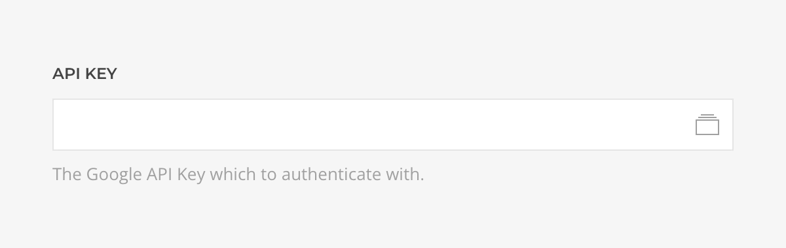

<!--@include: ../../parts/provider-intro.md-->

The YouTube Videos Source, part of the [YouTube Source](../) collection, creates sources based on YouTube videos fetched with advanced search and API Key.

## Settings

The source settings determines the content structure, every time the instance is saved the structure will be regenerated.

| Setting | Description | Required |
| ------- | ----------- | :------: |
| **API Key** | The Google API Key which to [authenticate](#authentication) with. | &#x2713; |

::: details Common Settings
<!--@include: ../../parts/provider-common-settings.md-->
:::

### Authentication

Authentication is based on an API Key driven by the [Google API Key Driver](/essentials-for-yootheme-pro/auth/drivers/google-api-key).

::: tip Keys Security
Learn more about Essentials [Keys security protocols](/essentials-for-yootheme-pro/oauth-keys-secrets#security).
:::

## Content Queries

For every source instance the following content queries will be made available as Dynamic Content option.

### Videos Query

Fetches public videos with advanced query params resolving to a list of [Video Type](..#video-type).

| Setting | Default | Description |
| ------- | ------- | ----------- |
| **Channel** | | Restricts the results to videos created by a specific channel ID. |
| **Query Term** | | The list of terms the videos should be associated with. Use the Boolean NOT (`-`) and OR (`\|`) operators to exclude or find videos that are associated with one of several search terms. For example, to match either "boating" or "sailing", set as `boating\|sailing`. Similarly, to exclude "fishing", set as `boating\|sailing -fishing`. |
| **Since/Until** | | Restricts the results to videos that have been published within the specified range of dates. |
| **Location/Radius** | | Location in conjunction with radius, defines a circular geographic area to which to restrict the videos. The location points the center of the area with latitude/longitude coordinates e.g. `37.42307,-122.08427`, while the radius is the maximum distance from the location in `m`, `km`, `ft`, or `mi` units, e.g `5km`. |
| **Region** | | Restricts the results to videos that can be viewed in the specified country. The value is an [ISO 3166-1 alpha-2](https://www.iso.org/iso-3166-country-codes.html) country code, e.g `ES`.
| **Language** | | Restricts the results to videos that are most relevant to the specified language. The value is typically an [ISO 639-1 two-letter](https://www.loc.gov/standards/iso639-2/php/code_list.php) language code, however, you should use the values `zh-Hans` for simplified Chinese and `zh-Hant` for traditional Chinese. Note that results in other languages will still be returned if they are highly relevant to the search query term. |
| **Definition** | `Any` | Restricts the results based on the videos quality, either `High Definition`, `Standard Definition`,  or `Any`. HD videos are available for playback in at least 720p, though higher resolutions, like 1080p, might also be available. |
| **Duration** | `Any` | Restricts the results based on the videos duration, either `Long`, longer than 20 minutes, `Medium`, between four and 20 minutes, `Short`, less than four minutes, or `Any`. |
| **Start** | `1` | The starting point, e.g of a list of 20 videos start from the number 2. |
| **Quantity** | `20` | The maximum amount of videos to retrieve. |
| **Order** | `Relevance` | The order in which the videos will be returned, within `Date`, reverse chronological order based on the date the videos were created, `Rating`, from highest to lowest rating, `Relevance`, based on their relevance to the search query, `Title`, alphabetically by title, or `View Count`, from highest to lowest number of views. |
| **Cache** | `3600` | The duration in seconds before the cache is invalidated and the query re-executed. |
