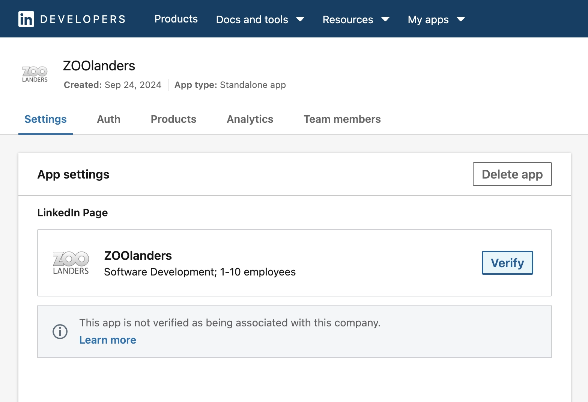
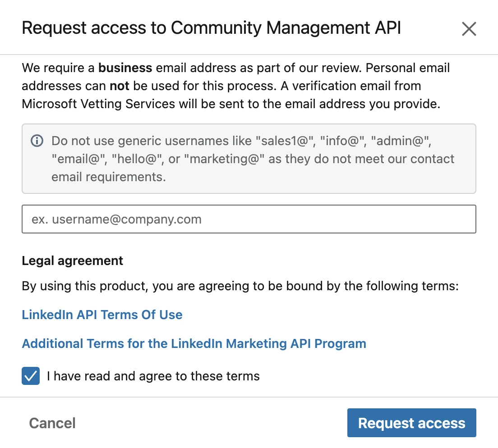

# Custom LinkedIn Dev App

Learn how to create a custom LinkedIn Developer App and generate the required access tokens to directly authenticate with Essential LinkedIn Sources.

## Create LinkedIn App

Sign in to the [LinkedIn Developer Portal](https://www.linkedin.com/developers) with your personal account. If you don't already have one, you can easily [create a free account](https://www.linkedin.com/).

Access [My Apps](https://www.linkedin.com/developers/apps) section and click on _Create App_ button. Enter the required information and submit.

| Setting         | Description                                                                        |
| --------------- | ---------------------------------------------------------------------------------- |
| _App name_      | The application name. Can be changed later.                                        |
| _App logo_      | The application logo, can be the company one.                                      |
| _LinkedIn Page_ | The associated LinkedIn Company Page URL, e.g. `https://www.linkedin.com/company`. |

::: tip Company Page
A LinkedIn App requires a LinkedIn Company Page to be associate with. Use your company's page or, if you're working for a client, their company page.

Don't have a company page yet? No problem! Simply [create one here](https://www.linkedin.com/company/setup/new/).
:::

## Verify Page Association

The organization that owns the page you have associated the app with function as the publisher of the app. The super admin must approve the association in the following 30 days. [Learn More](https://www.linkedin.com/help/linkedin/answer/a548360/).

Go to the _App Settings_ panel and click on the _Verify_ button. A modal will appear allowing you to generate a verification URL.

Generate the URL and send it to the page super admin. An email will be sent whenever the association has been approved or denied. Wait for the approval before proceeding further.

## Request API Access

For the Essentials LinkedIn Source use case, you must request the `Advertising API` product. To do so go to _App Products_ panel of the app and follow below steps.

::: warning
Note that only one product can be requested per app. If you mistakenly requested a different one, you will need to create a new app from scratch.
:::

1. Click on the _Request access_ button within the _Advertising API_ product section.
2. A modal will appear, fullfill the form as instructed and submit.

3. Wait for approximately one minute, then refresh the page.
4. A new button _Access Request Form_ should appear in the product section. Click the button and complete legal details.

::: warning
Accurate and current company information is crucial. LinkedIn will carefully review your company details to verify their validity.
:::

5. When asked about the app primary use case, choose _Direct Advertiser_.

6. When asked about what do you plan to do with the APIs, describe it without mentionining fetching or displaying data in your website. Focus on statistics or advertising, instead.

## Generate a Token

Once the app is ready you can generate a token with it and use it for authentication.

1. Visit the [LinkedIn Developer Portal Token Generator](https://www.linkedin.com/developers/tools/oauth/token-generator) tool.
2. Select the app you'd like to generate a token for.
3. Select the permission scopes. Usually that would be `r_basicprofile`, `r_organization_admin` and `r_organization_social`.
4. Copy both _Refresh_ and _Access_ generated tokens.
