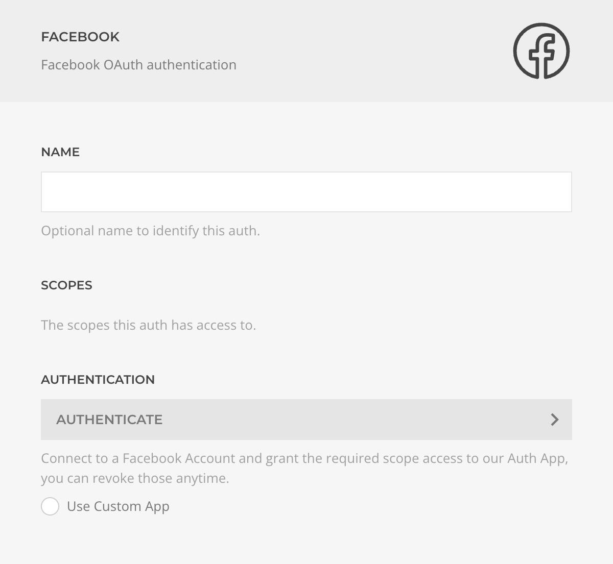

# Facebook Auth Driver

The **Facebook Auth Driver** manages the Facebook OAuth protocol to authenticate users and grant requested permissions (scopes).

::: tip Use a Custom Facebook App
For better control, security, and flexibility, create and use your own [custom Facebook Developer App](../custom-facebook-dev-app). This lets you manage permissions, settings, and integration details directly from your Facebook developer account.
:::

| Setting            | Description                                                                                                                                                                             |
| ------------------ | --------------------------------------------------------------------------------------------------------------------------------------------------------------------------------------- |
| **Name**           | Identifier for this authentication method.                                                                                                                                              |
| **Scopes**         | List of permissions granted to this auth. Scopes can be managed or revoked at [facebook.com/settings](https://www.facebook.com/settings?tab=business_tools&ref=business_login_reentry). |
| **Authentication** | Initiates the OAuth authentication and permission grant process.                                                                                                                        |
| **Custom App**     | Choose whether to use your own Facebook Dev App credentials.                                                                                                                            |
