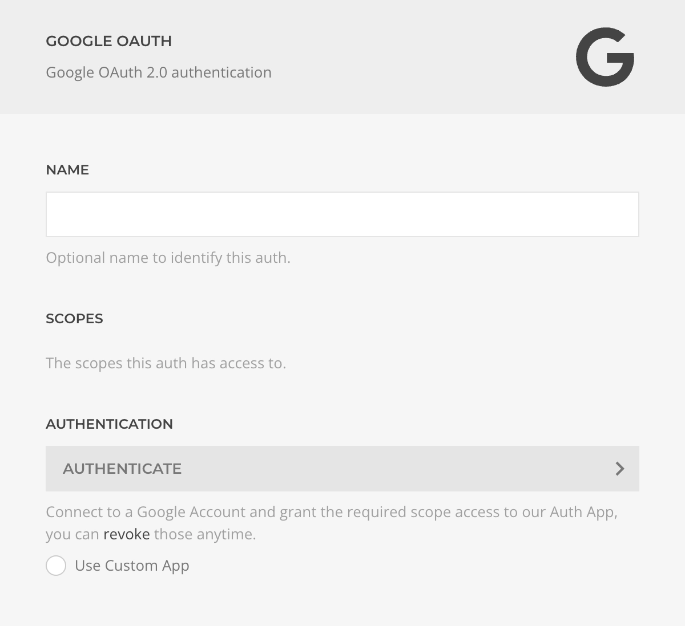

# Google Auth Driver

The **Google Auth Driver** manages authentication and permission grants using the Google OAuth 2.0 protocol.

::: tip Use a Custom Google Dev App
For enhanced security and control, create and use your own [custom Google Dev App](../custom-google-dev-app). This lets you manage permissions, settings, and integration details directly within your Google developer account.
:::

| Setting            | Description                                                                                                                                                  |
| ------------------ | ------------------------------------------------------------------------------------------------------------------------------------------------------------ |
| **Name**           | Identifier for this authentication method.                                                                                                                   |
| **Scopes**         | List of permissions granted to this auth. Scopes can be reviewed or revoked at [myaccount.google.com/permissions](https://myaccount.google.com/permissions). |
| **Authentication** | Initiates the OAuth authentication and permission request process.                                                                                           |
| **Custom App**     | Option to use your own Google Dev App credentials.                                                                                                           |
