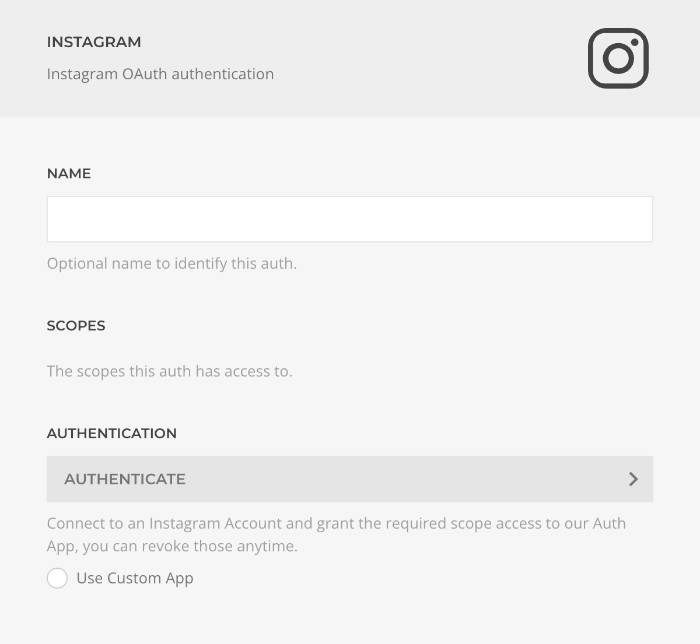

# Instagram Auth Driver

The **Instagram Auth Driver** manages the Instagram OAuth protocol to authenticate users and grant specific permissions (scopes).

## Settings

| Setting         | Description |
|-----------------|-------------|
| **Name**        | Identifier for this authentication instance. |
| **Scopes**      | List of permissions granted to this auth. Scopes can be managed or revoked at [instagram.com/accounts](https://www.instagram.com/accounts/manage_access). |
| **Authentication** | Initiates the OAuth authentication flow and permission granting process. |
| **Custom App**  | Option to use your own Facebook App credentials. |

## Authentication by Account Type

Use the authentication method that matches your Instagram account type.

| Account Type | Recommended Authentication | Requirements | Alternative |
| --- | --- | --- | --- |
| *Personal Instagram account* | Use **Instagram Auth Driver**. | Authenticate directly with Instagram. | `N/A` |
| *Business Instagram account* | Use [Facebook Auth Driver](./facebook). | The Instagram account must be connected to a Facebook Page, and the Facebook user must have access to that Page in Meta Business Manager. | If the account is not connected to an accessible Facebook Page, use **Instagram Auth Driver**. |

For Meta setup details, see:

- [Connect or disconnect an Instagram account and your Page](https://www.facebook.com/help/1148909221857370)
- [Add or change the Facebook Page connected to your Instagram professional account](https://www.facebook.com/help/570895513091465)
