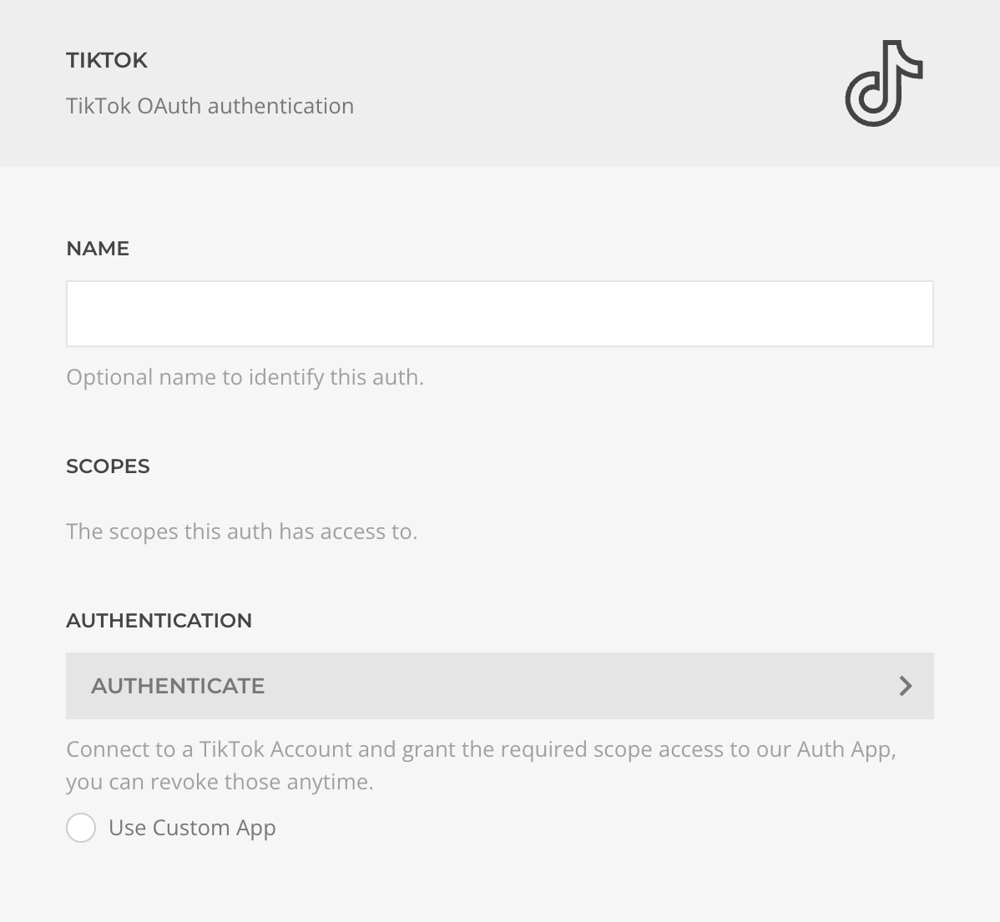

# TikTok Auth Driver

The **TikTok Auth Driver** manages the TikTok OAuth protocol, enabling user authentication and granting specific scope permissions for your application.

| Setting         | Description |
|-----------------|-------------|
| **Name**        | Identifier for this authentication method. |
| **Scopes**      | List of TikTok API scopes accessible by this auth. For details on scopes and revoking permissions, visit [TikTok Support](https://support.tiktok.com/en/safety-hc/account-and-user-safety/connect-to-third-party-apps). |
| **Authentication** | Initiates the OAuth flow to authenticate users and request permissions. |
| **Custom App**  | Option to use your own TikTok Dev App credentials. |
