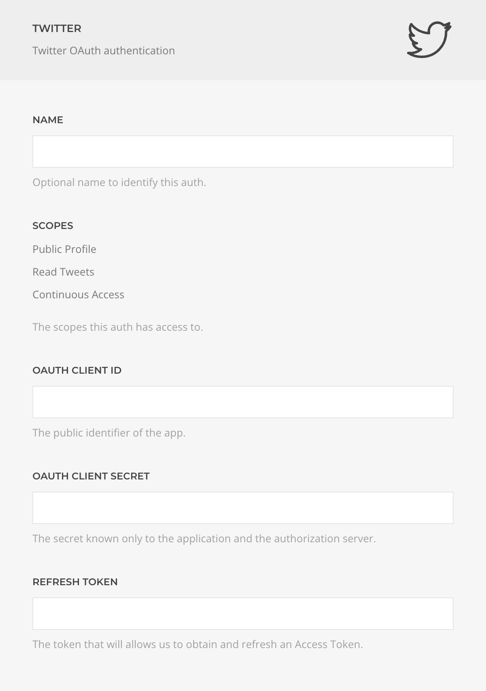

# Twitter Auth Driver

The **Twitter Auth Driver** enables user authentication and permission management via the Twitter OAuth protocol.

::: warning Custom Developer App Required
Due to Twitter API restrictions, you must [create your own Twitter Developer App](../custom-twitter-dev-app) and use its credentials. ZOOlanders OAuth Apps are not supported.
:::

| Setting           | Description                                                                                                                        |
| ----------------- | ---------------------------------------------------------------------------------------------------------------------------------- |
| **Name**          | Identifier for this authentication method.                                                                                         |
| **Scopes**        | Permissions granted to this auth. Manage or revoke them at [twitter.com/settings](https://twitter.com/settings/apps_and_sessions). |
| **Client ID**     | The client identifier issued during the Application registration process.                                                          |
| **Client Secret** | The client secret issued during the Application registration process                                                               |
| **Refresh Token** | The token used to obtain and refresh the Access Token automatically.                                                               |
