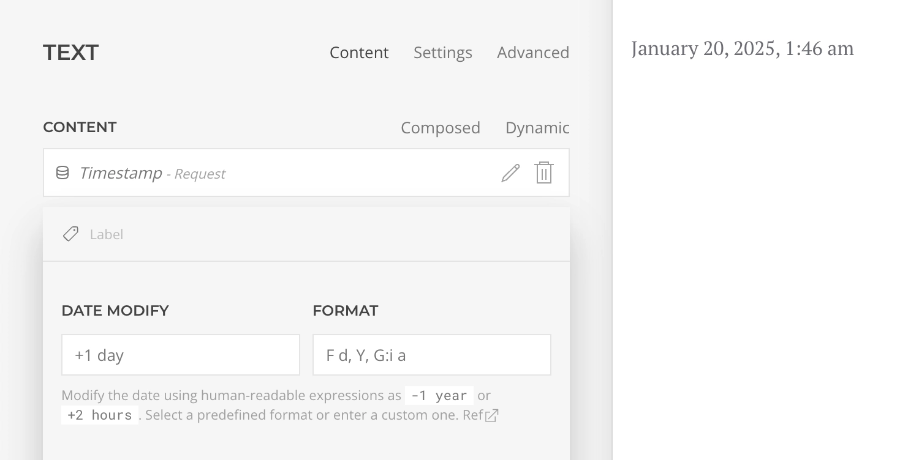

# Date and Time

The current date and time are crucial for most workflows, but unfortunately, YOOtheme Pro does not provide global access to this information. Essentials addresses this by offering a [Global Request](./addons/sources/request-source) source that provides access to the request timestamp and more.

## Timestamp Mapping

By mapping the Request Timestamp to a layout, we gain access to the current date and time, which we can then format as needed to achieve the desired outcome.

We can modify the date to obtain the timestamp for yesterday by subtracting one day (`-1 day`) or for tomorrow by adding one day (`+1 day`).

## Timestamp Evaluation

Similarly, if we map the current timestamp to access or filter [conditions](./conditions), we can alter the results based on the current date. Note that when comparing dates, both must be formatted as ISO valid dates, e.g., `Y-m-d`.

