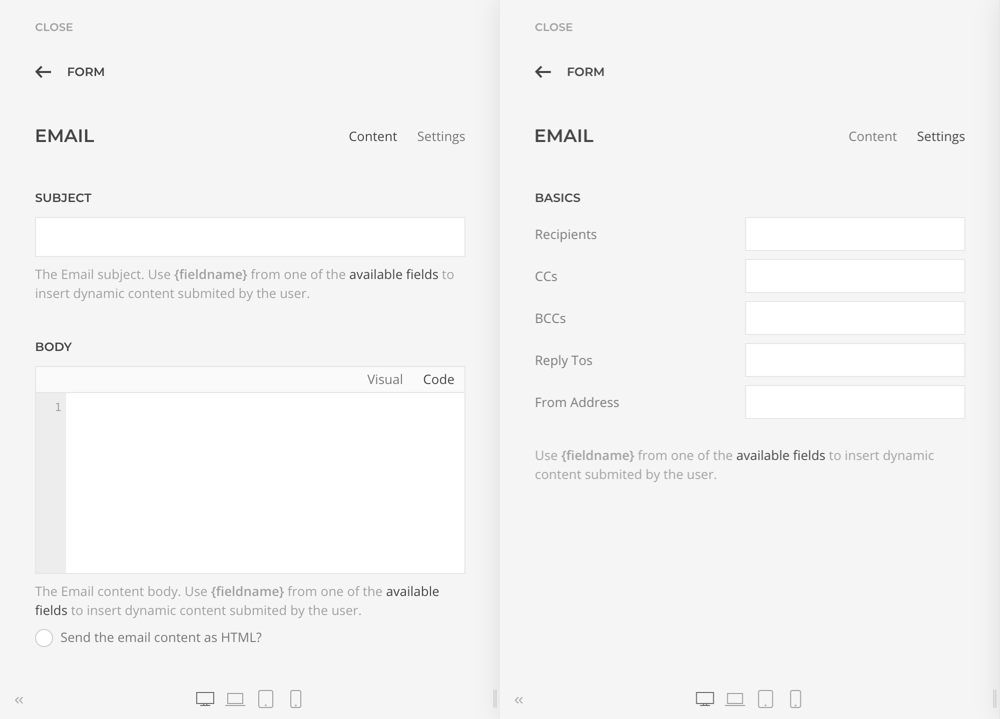
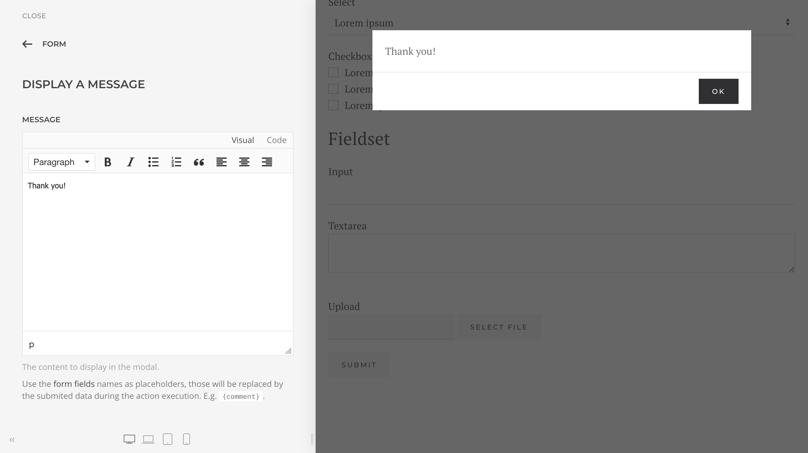
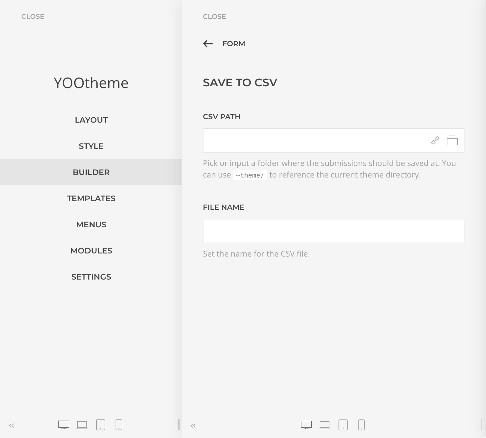

# Actions

After Submit Actions, or simply Actions, are multi-instance functions that will run consequently after a form has been successfully submitted. They are the heart of the submission workflow and allow to add extra validation, append or change the submission on the fly, send data to a 3rd party service and do any further integration or action.

## Data Placeholders

Data Placeholders are references to the form submitted data, those can be placed in actions settings and will be replaced during the action execution. E.g. provided a form with input controls `Name` and `Email` set on an email action content as:

```
Name: {Name}
Email: {Email}
```

would become

```
Name: John
Email: john@email.com
```

## Email Action

The Email Action sends preset emails with support for Data Placeholders and Attachments. Use it to send a _Thank You_ email to the submitter, a transactional email to the site owner, etc.



This action supports [Data Placeholders](#data-placeholders) in most of its settings allowing the creation of advanced, and versatile workflows. But take into consideration that the uploaded files reference is just the name of the file, if you would like to send the file within the email set it as a Dynamic Attachment instead.

### Attachments

Attachments can be set statically, e.g. a file from the server local folder, or dynamically, eg a file submitted with the form. Both types are set in the action configuration Attachment fields and they will be all merged as email attachments.

## Message Action

The Message Action displays a custom message in a modal. Use it to show the submitter a _Thank You_ message or additonal information.



This action supports [Data Placeholders](#data-placeholders) allowing to customize the message content, e.g. `Thank you {name}!`.

## Redirect Action

The Redirect Action redirects the page to a specified URL, with an optional message that will be displayed using the Joomla / WordPress core message display system. Use it to redirect the submitter to another page after a succesfull submission.


## Download Action

The Download Action triggers the download of the specified file. Use it to deliver a file to the submitter after a successful submission.

## SaveToCSV Action

The SaveToCSV Action accumulatively saves the submitted data in a specified CSV or TSV file. Use it to keep a log or a copy of the submitted data in a file that you can easily move to another system after.

The file must be created manually and set with at least one header.



## SaveToGoogleSheet Action

The SaveToGoogleSheet Action accumulatively saves the submitted data in a Google Drive Spreadsheet. Use it to keep a log or a copy of the submitted data in the cloud.

The spreadsheet must be created manually and set with at least one header.
