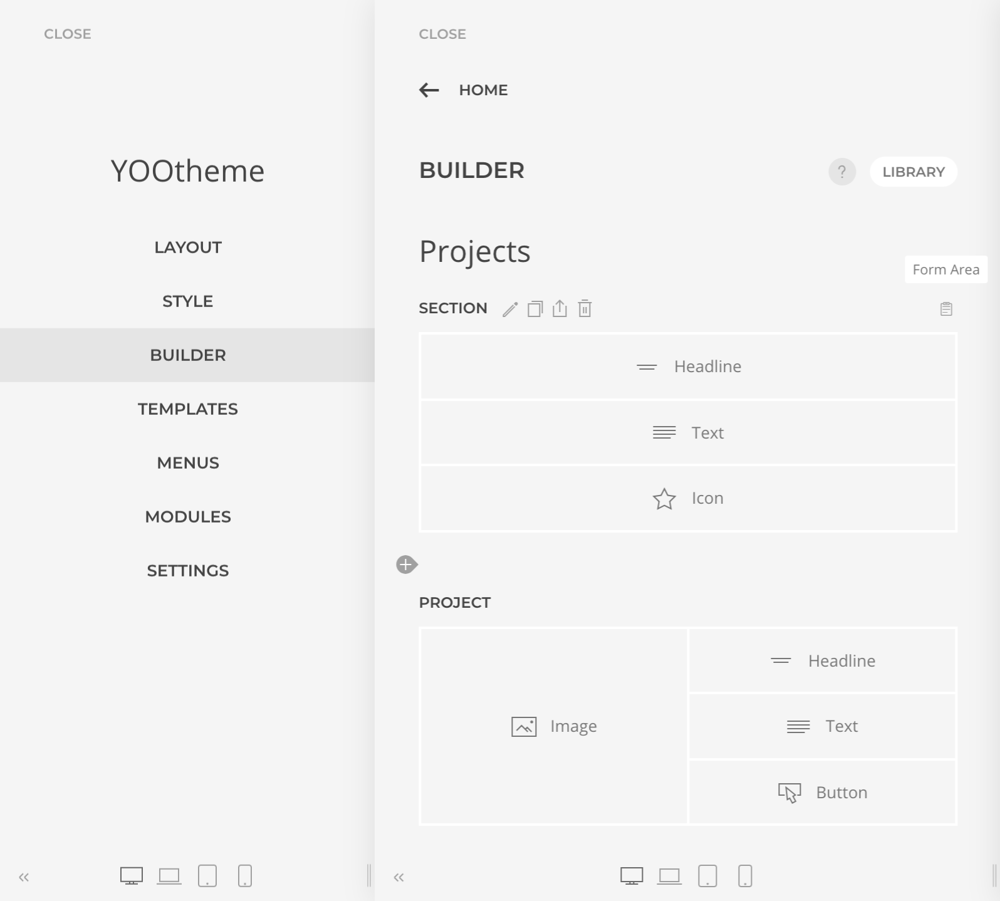

# Configuration

The configuration of any Form Area can be find in the `Section` or `Column` element Advanced Tab settings, under the Form field `Configuration` panel. When a Form Area is enabled an icon is displayed in the Builder element giving a hint about the form configuration.

## Errors

In case there is something wrong with a form configuration the Form Area icon will turn red showing one of the following errors:

- **Not a Form Area**: indicates that form fields are being used outside a Form Area.
- **Duplicated Form Area**: indicates that a `row` has been enabled as a Form Area while the `section` he is part of is already a Form Area.
- **Duplicated Field Names**: indicates that some fields of the Form Area have the same Name. Field names must be unique.
- **Duplicated Google reCaptcha element**: indicates that the Form Area has two or more Google reCaptcha elements while only one is allowed.
- **Google reCaptcha has no keys set**: indicates that the Google reCaptcha element is present in the Form Area, but has not secret keys set.

## Submission Data Placeholders

Submission Data Placeholders are used across the configuration as reference to form submission data. Any field control can be referenced with a placeholder, e.g. `{name}`, which will be **replaced** during the submission with the related submitted data.

The list of accepted field names can be reviewed on the fly by clicking on the _available fields_ link on the description of the fields supporting this feature.

