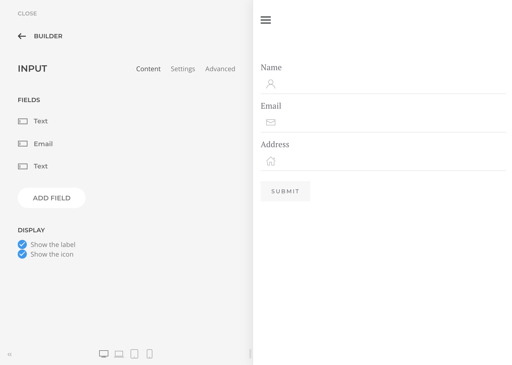
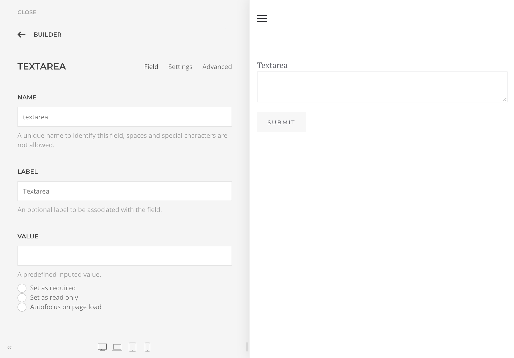
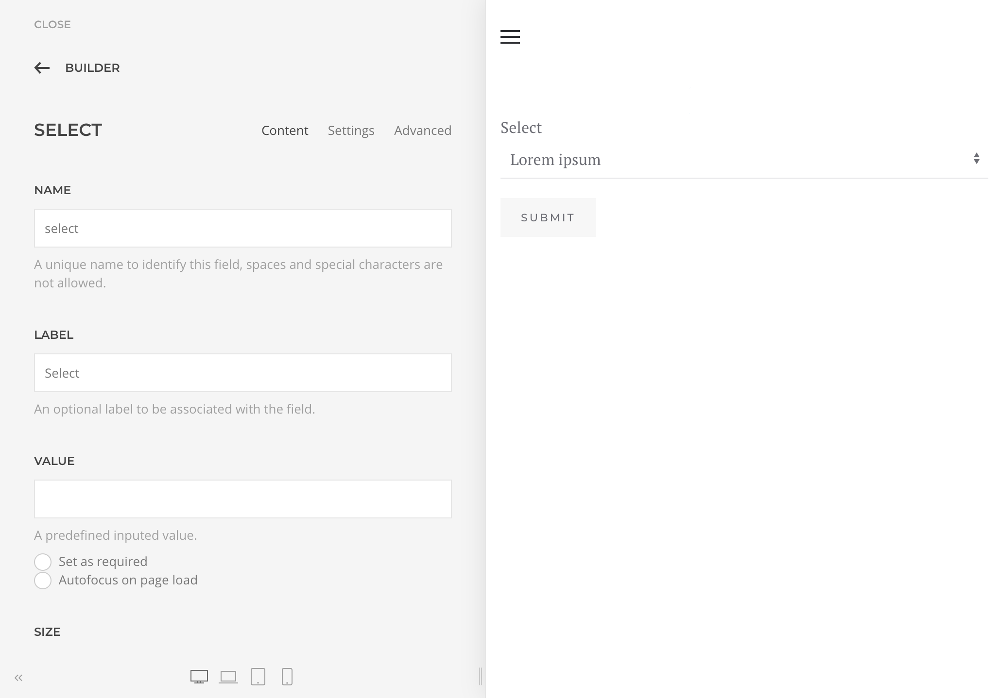
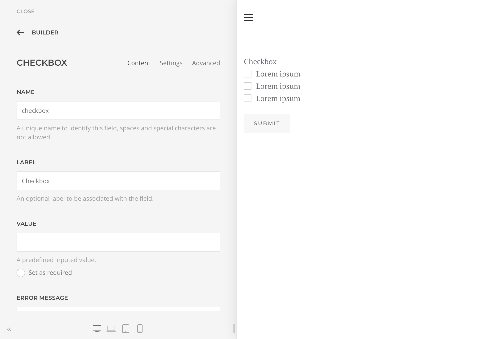
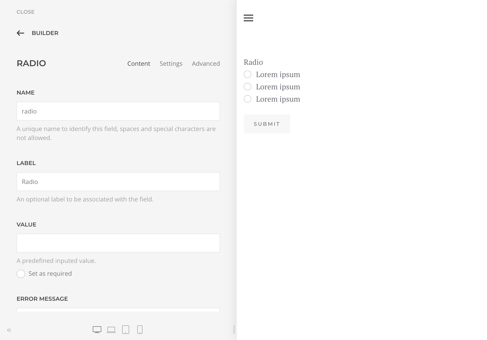
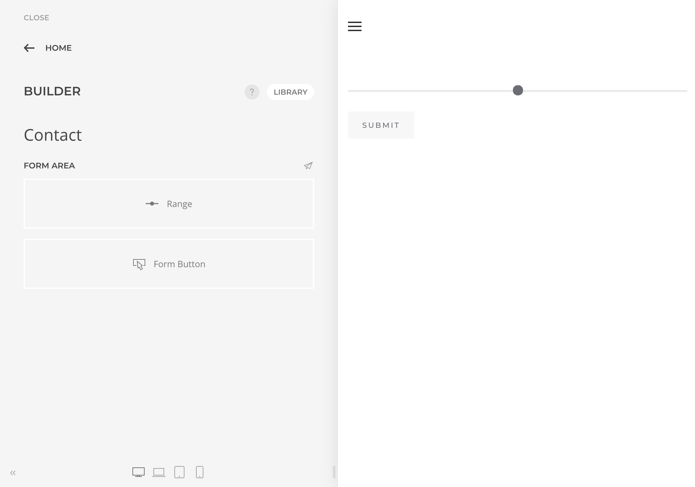
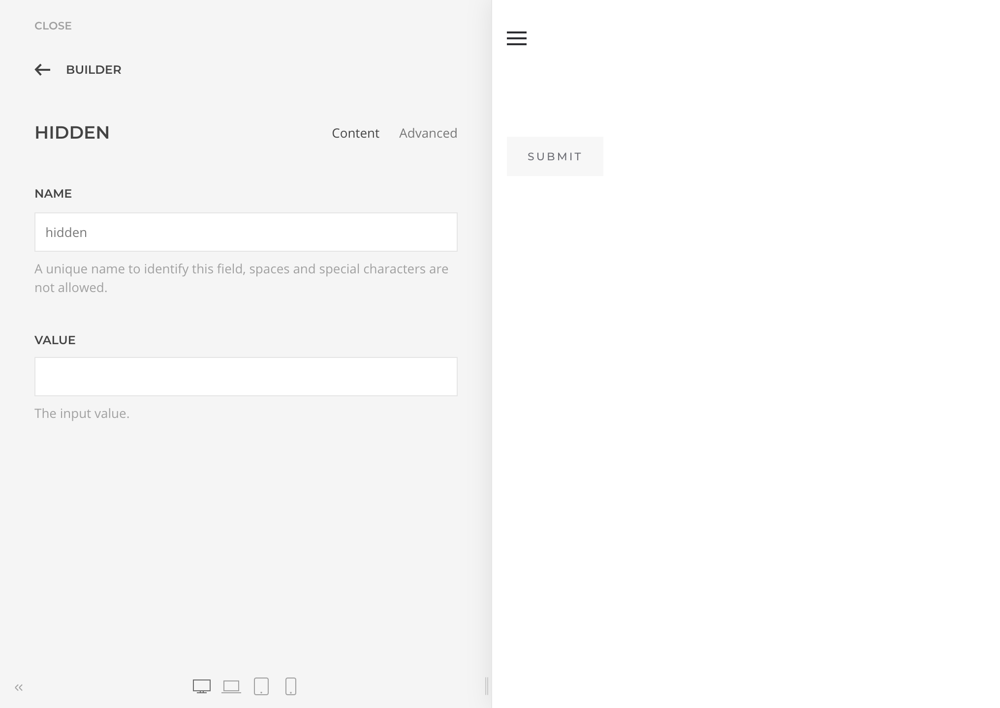
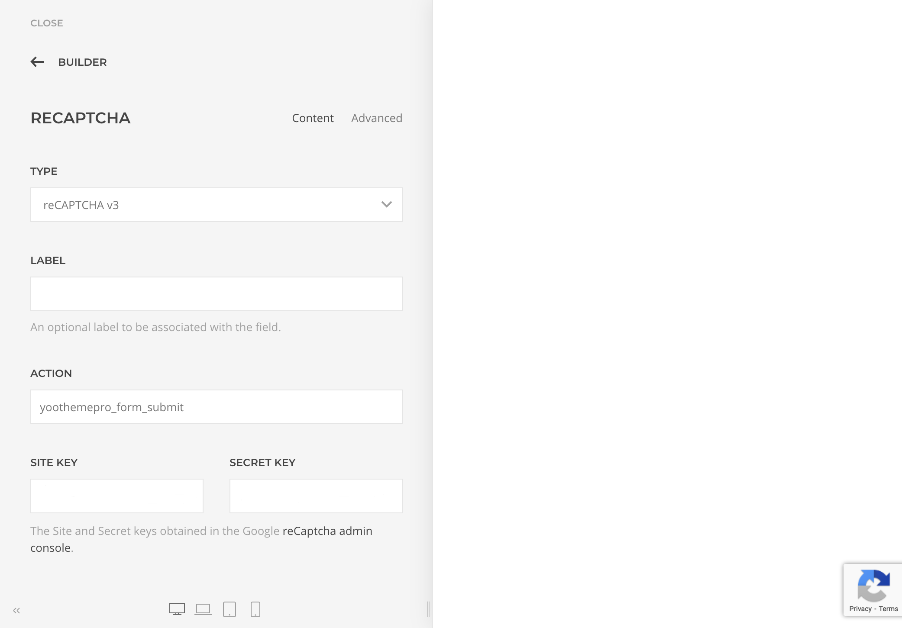
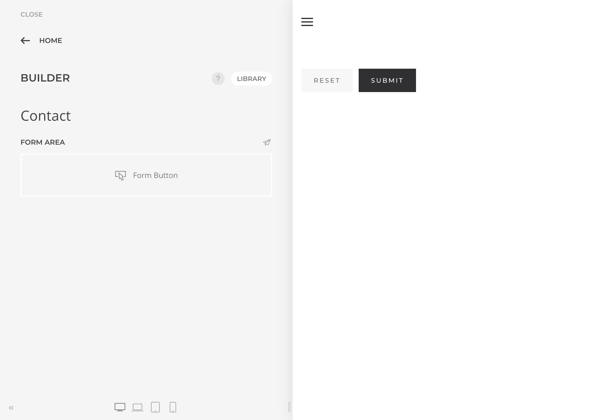
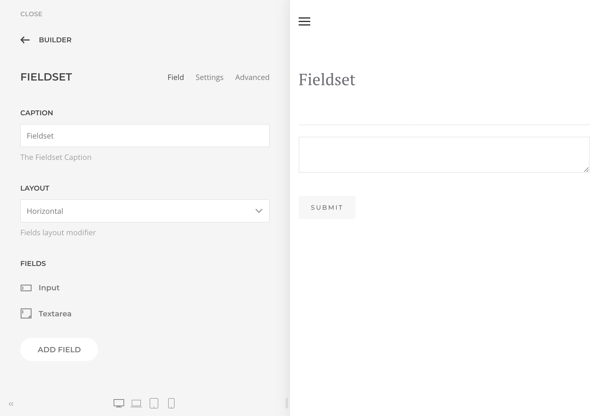

# Fields

A collection of Form Fields are available as part of the YOOtheme Pro layout builder elements. Each with its own purpose and scope will allow you to collect submitted data, prevent spam or simply submit the form.

The Field Elements meant to input data must be associated with a Control Name, which is a reference to it submitted data.

## Data Input

### Input

The Input element adds one or multiple inputs within a grid to your form layout. It supports the `text`, `date`, `email`, `number`, `password`, `tel`, `url`, `month`, `time`, and `week` type.

### Textarea

Renders a standard HTML Textarea field with additional validation options.

### Select

Renders a standard HTML Select field with additional validation options.

### Checkbox

Renders a standard HTML Checkbox group of fields with additional validation options.

### Radio

Renders a standard HTML Radio group of fields with additional validation options.

### Range

Renders a standard HTML Range field with additional validation options.

### Hidden

Renders a standard HTML Input hidden field. Allows submitting static or dynamically loaded data using Dynamic Content.

## Anti Spam

### reCaptcha

Renders a [Google reCAPTCHA](https://developers.google.com/recaptcha/) field, a free service that protects your site from spam and abuse. It uses advanced risk analysis techniques to tell humans and bots apart. It supports both v2 and v3, which helps you detect abusive traffic on your website without user interaction.

### hCaptcha

Renders a [hCaptcha](https://www.hcaptcha.com/) field, a free service that protects your site from spam and abuse while being privacy and security focused. Both Checkbox and Invisible modes supported.

### Honeypot

A GDPR friendly CAPTCHA alternative or addition for blocking spam that relies on no external services.

## Others

### Submit Button

Renders a form `submit` or `reset` button.

### Fieldset

Renders a standard HTML Fieldset field with the option to render other fields as children, making it easier to group fields.

