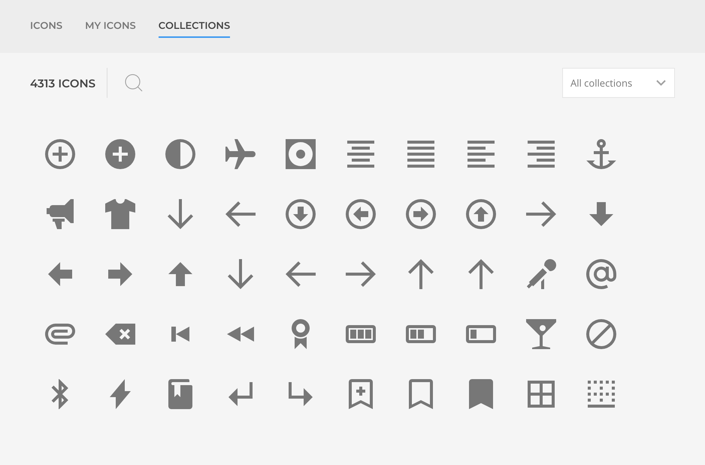

# Getting Started

## Introduction

[Icons](https://zoolanders.com/essentials-for-yootheme-pro/icons) addon extends YOOtheme Pro builder with natively integrated icon [collections](../in-depth/icons.html#collections), accessible in the icon picker Modal.

## First Icon

Let's render our first icon.

1. **Set an Element**. Place an element that contains an icon field, eg. Icon Element, and access it settings tab.

2. **Select an Icon**. Locate the icon field and click on the Icon Picker, chose an icon from one of the tabs:

  - **UIkit**, the core icons provided by YOOtheme
  - **My Icons**, only available if a Child Theme is set.
  - **Collections**, the list of preset and custom icons collections.

At this point the selected icon will render as a core icon would do, being able to adjust it as required.
