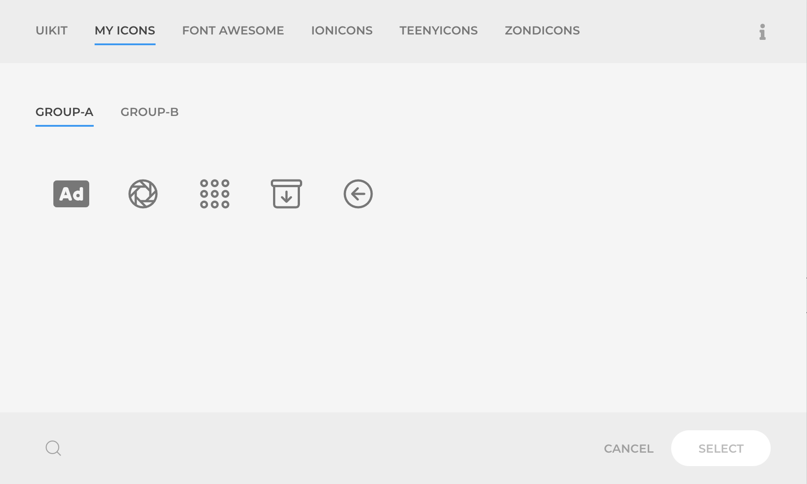
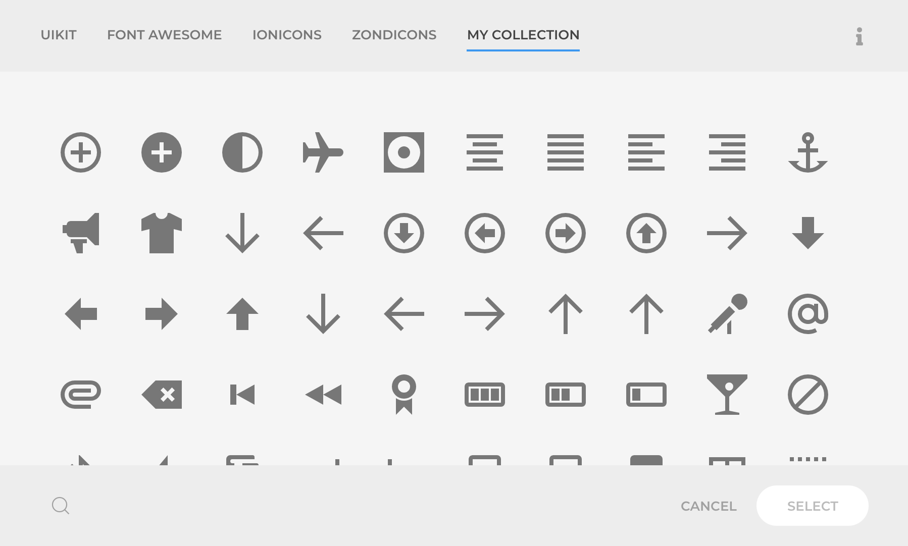

# Icons

Icons collections are provided under a common folder, with optional sub folders as groups, stored in:

- Joomla: `plugins/system/yooessentials/modules/icons/icons`
- WordPress: `wp-content/plugins/yooessentials/modules/icons/icons`

## Collections

### FontAwesome

[fontawesome.com](https://fontawesome.com/) - Licensed under GPL

The most popular and complete icon collection, offering a Free and Pro version. This addon only includes the Free collection, but if you have the Pro license you can include it as a [custom collection](#custom-collections).

### Ionicons

[ionicons.com](https://ionicons.com/) - Licensed under MIT

Beautifully crafted open source icons built by the Ionic Framework team.

### Teenyicons

[ionicons.com](https://teenyicons.com/) - Licensed under Creative Commons

Designed on a 15x15 grid, Teenyicons easily fit in very small spaces and maintain a crisp look.

### Zondicons

[zondicons.com](https://zondicons.com/) - Licensed under Creative Commons

A collection of icons with charming yet sophisticated personality designed by Steve Schoger.

## Custom Collections

There are two ways to add your collections, one is to place the icons in a [Child Theme](https://yootheme.com/support/yootheme-pro/joomla/child-themes) directory, restricting the collection to the current Child Theme. The other is to place them into a global folder, making them available for any theme and with support for multiple collections. Both methods expect a collection or collections of `.svg` files.

The use of a Child Theme directory is encouraged as those will persist the changes in future updates. eg. a FontAwesome icon could be updated in future major versions without any prior notice. Our recommendation is to keep project-related icons in the Child Theme, and only take a global approach for a 3rd party or across project collection.

::: tip
You can optionally group the icons into subfolders for a better organization or style separation, eg `my-collection/group-a` or `my-collection/group-b`.
:::

### Child Theme Collection

Place the icons under the `{MyChildThemeDir}/myicons` directory. The collection would become available for the current Child Theme under the `My Icons` tab in the icons picker Modal.



### Global Collections

Place the icons under a folder that reflects the name of your collection in the global collections directory:

- Joomla: `media/yooessentials/icons/my-collection`
- WordPress: `wp-content/yooessentials/icons/my-collection`

The collection will be automatically picked up and displayed among the other collections in the icons picker Modal.



You can optionally place a `my-collection.json` file beside the previously created folder using the same name, and write it content as the below example. It will provide us the hints to better show the collection in the icons picker Modal.

```json
{
  "title": "My Collection",
  "groups": ["group-a", "group-b"],
  "description": "Description of the collection",
  "meta": {
      "version": "1.0.0",
      "license": "GPL",
      "url": "https://example.com"
  }
}
```
