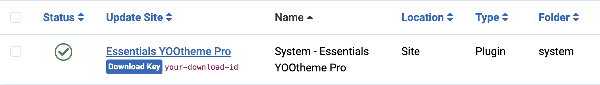

# Integration

Essentials is in essence a plugin and has to be installed and updated like any other Joomla or WordPress plugin. Essentials is compatible with YOOtheme Pro 4.x, PHP 7.4+ and WordPress 5/6 or Joomla 3/4/5 platforms.

Follow through the [installation](#installation), then go through the addons to learn more about their individual integration. This will allow you to customize your experience and only use the addons that are relevant to your needs.

## Installation

[Download](https://www.zoolanders.com/downloads) the required platform version, then follow the targeted platform installation guide, [Joomla](https://docs.joomla.org/Installing_an_extension) or [WordPress](https://wordpress.org/support/article/managing-plugins/#installing-plugins-1). After a successful installation, a plugin named **Essentials YOOtheme Pro** (a.k.a. `yooessentials`) should be listed and enabled.

::: tip Installation Folder
The plugin will be installed under the `plugins/system/yooessentials` for Joomla and `wp-contents/plugins/yooessentials` directory for WordPress.
:::

## Updating

Essentials can be updated using the platform update system. Whenever a new version of is available, you will receive a notification in the platform dashboard. Before you can update, you have to first add your Essentials Download ID.

### Download ID

An Essentials Download ID is an alphanumeric code and is created individually for each website. Without it, you won't be able to update Essentials. You can find and manage your IDs in the [Download IDs](https://zoolanders.com/account/download-ids) section of your account.

Once obtained, set it in your site, an action that slightly differs for each platform.

::: details Joomla
Locate the **ZOOlanders Installer Plugin** and input the Download ID into it settings.

:::

::: details WordPress
Locate the **ZOOlanders Settings Panel** in Global Settings, then input the Download ID into it settings.

:::

### Minimum Stability

Choose the minimum stability for Essential updates on your site, either Stable or Beta.

| Release | Description |
| --- | --- |
| `Stable` | This release is a version which has been thoroughly tested by both our team and the community. Use it for production sites. |
| `Beta` | This release is a version which has been thoroughly tested by our team. Use it to help us test and prevent issues in the Stable release. |

::: details Joomla
In Joomla go to the Installer Options in the **Global Configuration**.

**Notice** that this option applies to all theme and extension updates.
:::

::: details WordPress
In WordPress go to the **ZOOlanders Settings Panel** in Global Settings.

:::

## Upgrading

The upgrade from Essentials Freemium to Premium version is as simple as [installing](#installation) the premium package without uninstalling the freemium one. The upgrade process must be done manually, after that automatic updates will take over.

### Upgrade to v2

Upgrading Essentials v1.x to v2.x should be planned carefully as it's a major version release only compatible with YOOtheme Pro 4.0, which is itself a new major release. Follow these steps in the given order.

1. Make a full, restorable backup of the site.
1. In the Joomla backend head over to `System > Extensions > Plugins` and **disable** the _Essentials_ plugin. In WordPress head over to `Plugins` and **deactivate** _the Essentials_ plugin.
1. Upgrade YOOtheme Pro to version 4.x.
1. Upgrade Essentials to version 2.x.
1. In the Joomla backend head over to `System > Extensions > Plugins` and **enable** the _Essentials_ plugin. In WordPress head over to `Plugins` and **activate** _the Essentials_ plugin.

Thoroughly clear all caches, and test. If anything goes wrong, restore the backup.
