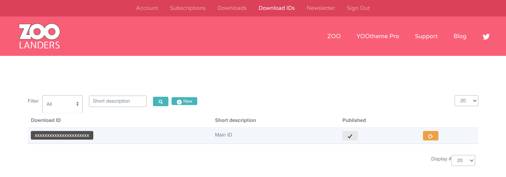
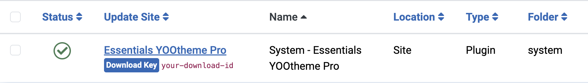
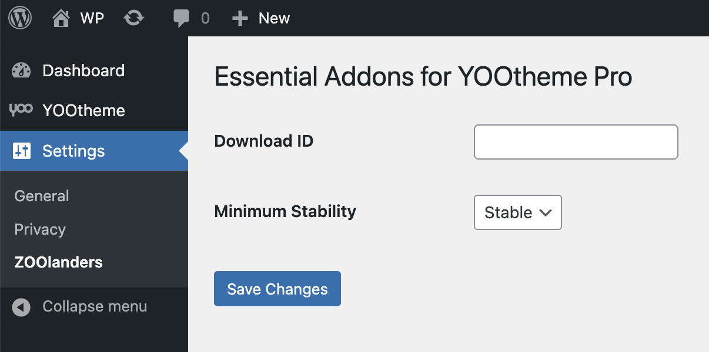
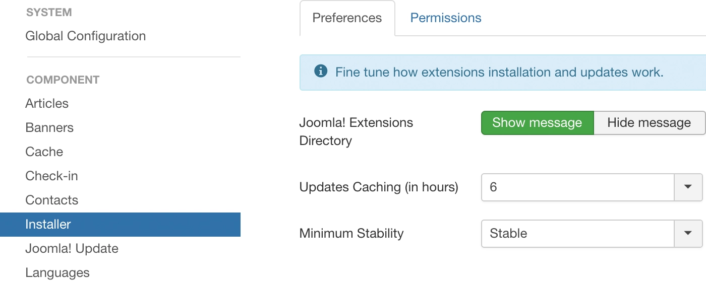

# Installation

## Installing

### Step 1: Download and Install

1. Download the [Essentials for YOOtheme Pro](https://www.zoolanders.com/downloads) plugin from your account
2. Install it following the platform-specific instructions:
   - **Joomla**: Use the [official extension installation guide](https://docs.joomla.org/Installing_an_extension)
   - **WordPress**: Follow the [WordPress plugin installation guide](https://wordpress.org/support/article/managing-plugins/#installing-plugins-1)

### Step 2: Verify Installation

After successful installation, verify that the **Essentials YOOtheme Pro** plugin (also known as `yooessentials`) is listed and enabled in your platform's plugin manager.

### Step 3: Initial Configuration

1. Navigate to **Customizer → Essentials** to access the settings panel
2. Review and configure the [basic settings](./settings)
3. Set up your [Download ID](#download-id) for automatic updates

::: tip Installation Directory

- **Joomla**: `plugins/system/yooessentials`
- **WordPress**: `wp-content/plugins/yooessentials`
:::

::: warning First-Time Setup
After installation, you may need to clear your site's cache and refresh the Customizer for all features to become available.
:::

## Updating

Keep your Essentials installation up-to-date with the latest features and security improvements. You can update manually or set up automatic updates through your platform.

### Prerequisites for Automatic Updates

Before setting up automatic updates, ensure you have:

1. A valid Download ID from your ZOOlanders account
2. The correct minimum stability setting configured
3. A recent backup of your site

### Download ID

An Essentials Download ID is a unique alphanumeric code generated for each website. It is required to update Essentials. You can find and manage your Download IDs in the [Download IDs](https://zoolanders.com/account/download-ids) section of your account.

Once obtained, set it in your site, an action that slightly differs for each platform.

::: details Joomla

Go to `System -> Update -> Update Sites` and locate `Essentials YOOtheme Pro` where you can input your Download ID.
:::

::: details WordPress

Go to `Global Settings -> ZOOlanders` panel where you can input your Download ID.
:::

### Minimum Stability

| Release | Description |
| --- | --- |
| *Stable* | This release is a version which has been thoroughly tested by both our team and the community. Use it for production sites. |
| *Beta* | This release is a version which has been thoroughly tested by our team. Use it to help us test and prevent issues in the Stable release. |

::: details Joomla
In Joomla go to the Installer Options in the **Global Configuration**.

**Notice** that this option applies to all theme and extension updates.
:::

::: details WordPress
In WordPress go to the **ZOOlanders Settings Panel** in Global Settings.

:::

### Updating Major Release

When updating Essentials v1.x to v2.x, or v2.2 to v2.3, plan carefully as those version introduce major changes and have specific compatibility with YOOtheme Pro. In order to properly update, follow these steps in the given order.

1. Make a full, restorable backup of the site.
1. Head over to *System > Plugins* and disable the *Essentials* plugin.
1. Upgrade YOOtheme Pro to latest stable version.
1. Upgrade Essentials to latest stable version.
1. Head over to the plugins manager and enable back the *Essentials* plugin.

Thoroughly clear all caches, and test. If anything goes wrong, restore the backup and reach out support.

## Upgrading

The upgrade from Essentials Freemium to Premium version is as simple as [installing](./#installation) the premium package without uninstalling the freemium one. The upgrade process must be done manually, after that automatic updates will take over.
