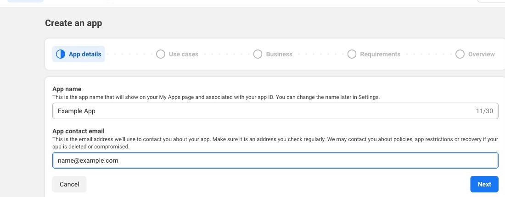
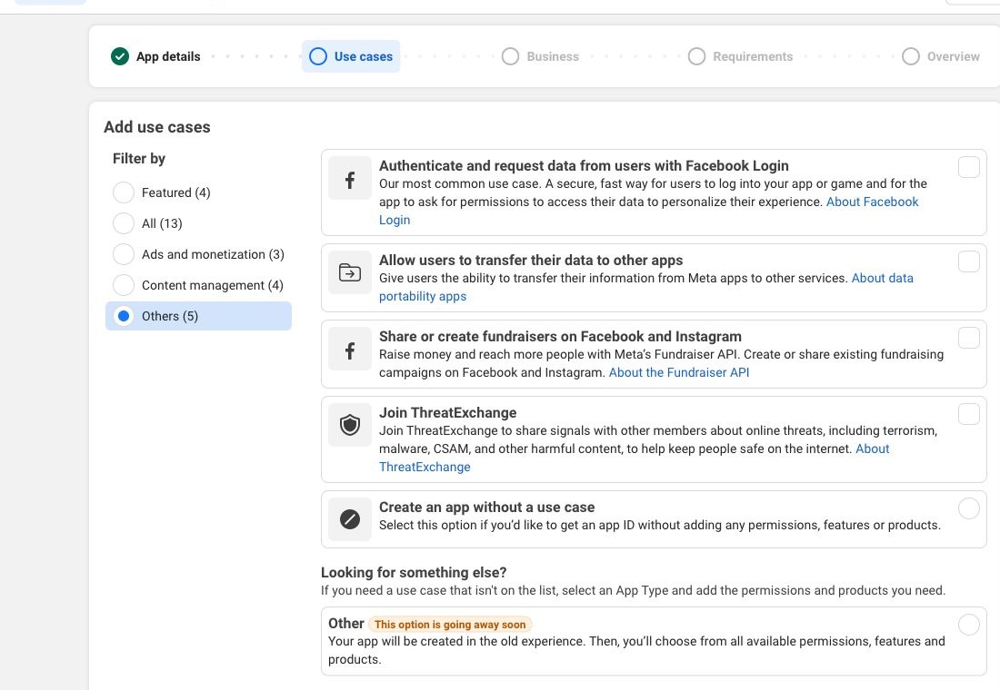
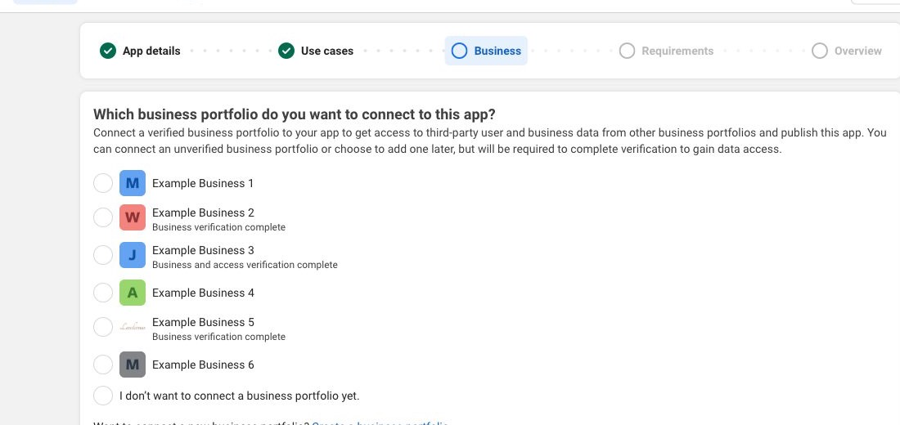
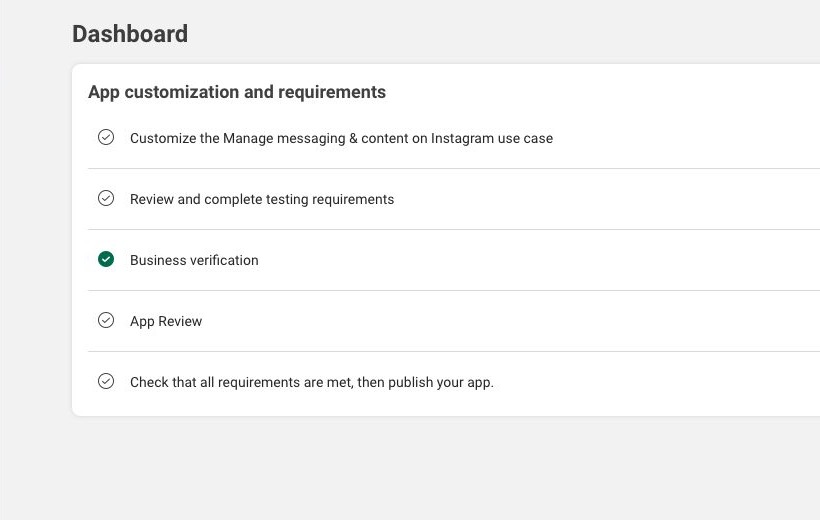
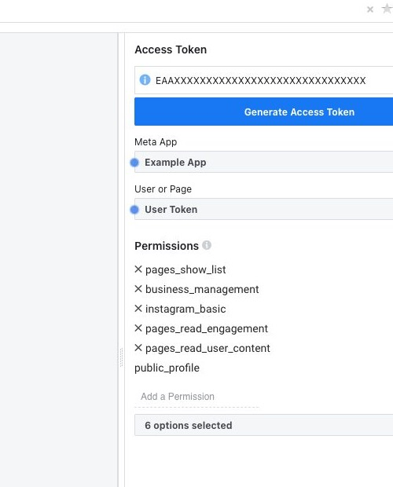
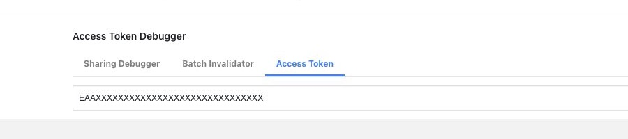
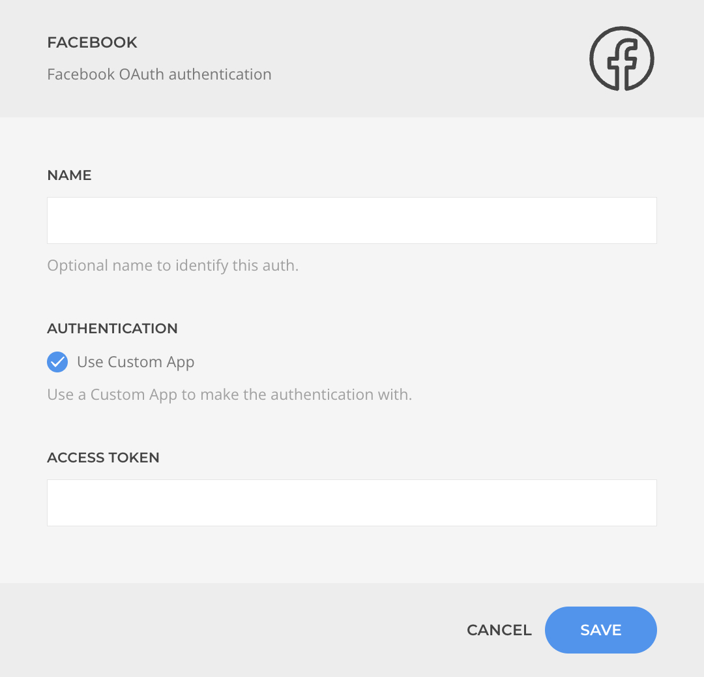

# Facebook Integration

    <!--@include: ./assets/brands/facebook.svg-->

The Facebook integration is available through [Facebook Source](../addons/dynamic/sources/facebook) and is also used when authenticating Instagram Business accounts through the Facebook Auth driver in **[Instagram Source](../addons/dynamic/sources/instagram)**.

For better control, security, and flexibility, you can create a custom Facebook developer app and use its _Access Token_ with the [Facebook Auth](../auths/drivers/facebook) driver when configuring Facebook or Instagram Business sources.

## 1. Create a New Dev App

Go to [https://developers.facebook.com/apps/creation](https://developers.facebook.com/apps/creation), fill in the app details, and continue.

On the _Use cases_ step, choose **Other** under the _Others_ section. This is the route that leads to the product-based app setup required for this integration.

On the _Business_ step, connect the business portfolio you want to use for the app.

After the app is created, open the dashboard and add the products required for the integration:

- **Facebook Login for Business**
- **Instagram API**

Meta has renamed and reorganized parts of the Instagram platform over time, so older references to _Instagram Graph API_ now map to the current **Instagram API** for professional accounts.

## 2. Generate Access Token

Go to the [Graph API Explorer](https://developers.facebook.com/tools/explorer), select the app you just created, and request the permissions your source needs.

For the Facebook and Instagram Business sources in Essentials, use:

- instagram_basic
- pages_show_list
- pages_read_engagement
- pages_read_user_content
- business_management

Be sure that the list matches with the screenshot and _Generate Access Token_.

- Sign in with the Meta account that owns the app, or an account assigned to the app as an **Administrator**, **Developer**, or **Tester**.
- Select the business assets you want to authorize.
- Select the Facebook Pages you want to allow.
- If applicable, select the Instagram professional accounts connected to those Pages.
- Confirm the requested access.

::: tip Account Permissions
While the app is in development mode, only people with an app role can generate tokens that work with it. If you try to authorize with a different account, Meta will require app review and a published app before the token can be used broadly.
:::

After the token is generated, open it in the [Access Token Debugger](https://developers.facebook.com/tools/debug/accesstoken/) to inspect the granted permissions and expiration.

If Meta offers the option, extend the token and copy the updated value. Use that token when authenticating a source with your custom app.

::: tip Instagram Business Requirement
Meta's current Instagram API with Facebook Login works only with **professional Instagram accounts** and requires the Instagram account to be connected to a **Facebook Page**. For personal Instagram accounts, use the dedicated [Instagram Auth](../auths/drivers/instagram) flow instead.
:::

## 3. Authenticate a Source

Now that you have an access token, create a Facebook or Instagram Business source. When authenticating choose _Custom App_, paste the generated access token, and complete the source setup.

::: tip Token Expiration
The token can still expire or become invalid if the user changes permissions, loses access to the business assets, or the token is not refreshed for a long time. If that happens, generate a new token and reconnect the source.
:::

## Official Meta References

- [Meta App creation](https://developers.facebook.com/apps/creation)
- [Facebook Login for Business](https://developers.facebook.com/docs/facebook-login/facebook-login-for-business)
- [Graph API Explorer](https://developers.facebook.com/tools/explorer)
- [Access Token Debugger](https://developers.facebook.com/tools/debug/accesstoken/)
- [Instagram Platform](https://developers.facebook.com/docs/instagram-platform/)
- [Connect or disconnect an Instagram account and your Page](https://www.facebook.com/help/1148909221857370)
- [Add or change the Facebook Page connected to your Instagram professional account](https://www.facebook.com/help/570895513091465)
