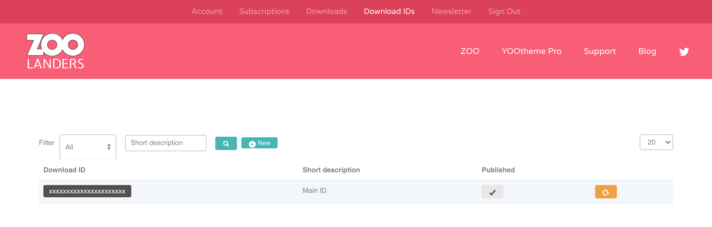

# Joomla

## Installation

Download the Free or Premium `Essentials_YOOthemePro_{version}_j3.zip` package from [ZOOlanders Downloads](https://www.zoolanders.com/downloads).

> A Premium version will be available only if you have a valid subscription and are logged in.

Follow the official [Joomla](https://docs.joomla.org/Installing_an_extension) plugin installation guide and make sure a plugin named `Essential Addons for YOOtheme Pro` is listed and enabled in the Joomla Plugins control panel, if not, enabled it manually.

> The plugin will be installed under the `plugins/system/yooessentials` directory.

## Updating

Whenever a new version is available, you will receive a notification in the `Joomla Extensions Update` control panel. Within it, you can easily update with a one-click action. For the Premium version, you will have to set your [ZOOlanders Download ID](#download-id).

A ZOOlanders Download ID is an alphanumeric code created in the [ZOOlanders Download IDs section](https://zoolanders.com/account/download-ids) that is required to update the Premium version. If you are using the Free version you can skip these steps.

Once you have created and copied a Download ID you are ready to set it in your site. Note that you can create as many IDs as necessary.

::: warning Don't upload by FTP
Even if technically possible, we strongly discourage this method as update scripts will be omitted, resulting in unexpected outcomes.
:::

In the Joomla Plugins Control Panel find the ZOOlanders Installer plugin, access its settings, and paste the Download ID into the field.

::: tip
You can alternatively update manually by downloading the latest package version from the [Downloads](https://www.zoolanders.com/downloads) section and installing it over using the Joomla Installer control panel.
:::
