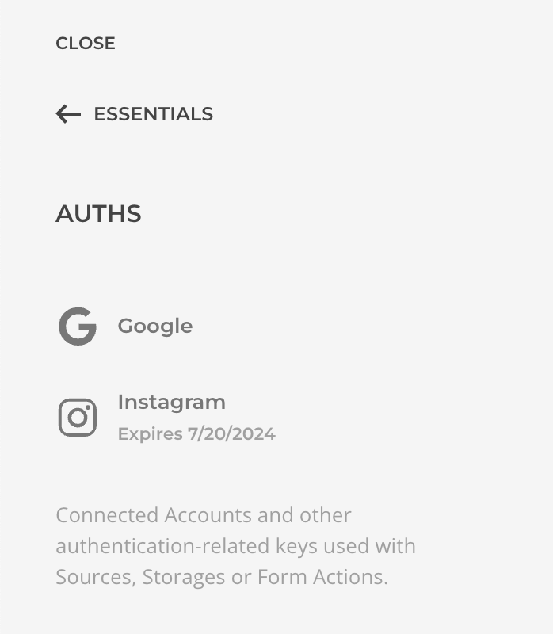

# Settings

Essentials global settings, accessed within `Customizer -> Essentials` panel, are stored independently from the theme in a database tabse. Most of these setting need to be configured only once and can be imported/exported within the Advanced section.

## Sources

Create and manage sources from all [Source Providers](./addons/sources/providers/). Those will become available as sources in the builder dynamic workflow.

## Global Queries

Create and manage source [Global Queries](./addons/dynamic/global-queries). Those will become available as sources in the builder dynamic workflow.

## Layout Libraries

Create and manage [Layout Libraries](./addons/layouts/libraries-manager). Those will become available as additional libraries in the builder layouts library.

## Icon Collections

Create and manage [Icon Collections](./addons/icons/collections/). Those will become available as additional icon collections in the builder icons library.

## Storages

Create and manage [Storages](./storage/). Those will become available as storage options for Layout Libraries.

## Auths

Manage [Auths, Keys & Secrets](./auth/) that have been created during other resources creation. At the moment you cannot create auths directly.

## Advanced

Configure some advanced settings.

| Option | Description |
| --- | --- |
| *Addons* | Disable Essential addons individually. A disabled addon will be completely skipped from execution and is a good way to debug issues or to keep the global execution as smooth as possible. |
| *GeoIP Database Source* | The IP Geolocation database is required to localize the device IP geographically, used for example by the **Access IP Geolocation Rule**. If required, follow the [Geolocation Database Installation](./geoip-database-installation). |
| *Import/Export* | Being Essentials Settings independent from the Theme, the only way to backup and/or restore is using the dedicated methods within `Customizer -> Essentials -> Advanced` panel. |
| *Debug Data* | If the support team requests it, here is where you can generate and download Debug Data information which includes a copy of the Theme Settings, Essentials Settings, Sources Schema, and the server configuration. As it might include sensitive data, be carefull who you share this with. |

## About

This panel shows the Essentials version currently used on this site, as well as the release changelog. Refer to this section after an update to see what has changed.

