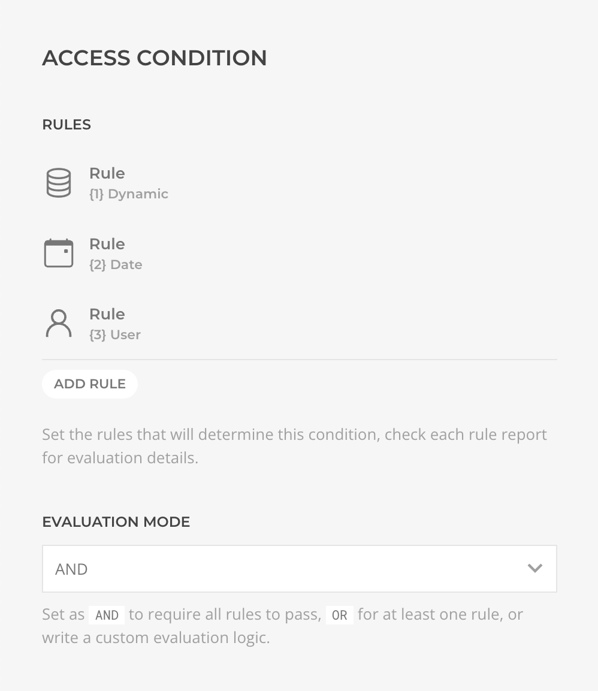
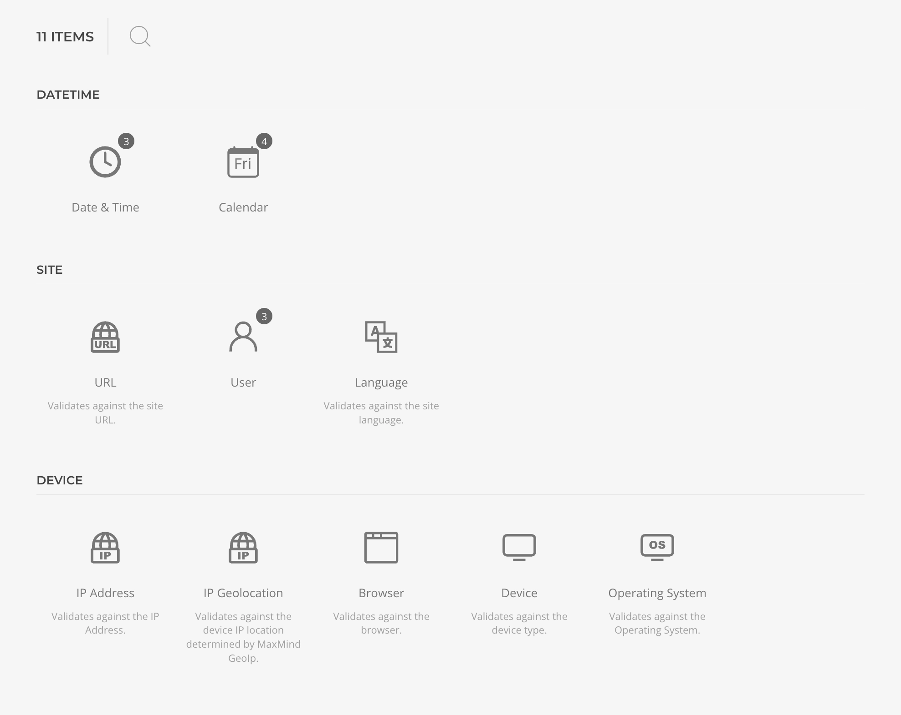
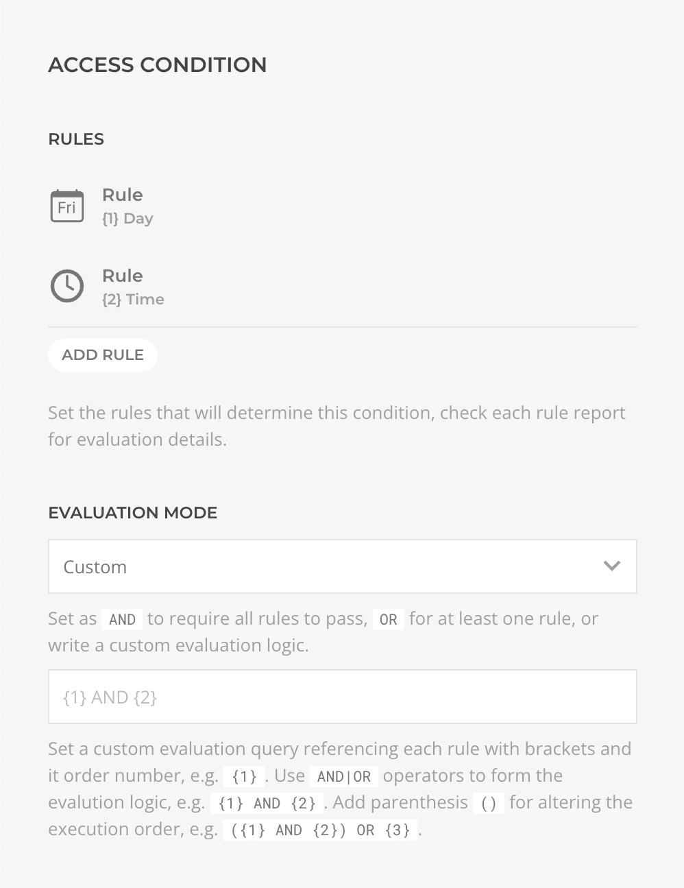

# Access Condition

The rules are composed in the builder element _Advanced Tab_ settings.

## Composable

Essentials provides a variety of rules organized into groups of _Site_, _Device_ and _DateTime_. It is possible to include multiple types of the same rule within a single condition, with different configurations.

## Evaluation Mode

When an Access Condition is applied to an element, it will first evaluate each of the specified rules individually, then will apply an evaluation mode, `AND|OR|Custom`, to determine the final result. The `AND` mode requires all rules to pass, `OR` mode requires at least one, while `Custom` mode would apply a custom logic.

A custom logic is inputed with a query that references each rule using their order number within brackets, such as `{1}`, and use `AND|OR` operators, such as `{1} AND {2}`, or `{1} OR {2}`. Parentheses can also be used to alter the execution order, such as `({1} AND {2}) OR {3}`.

