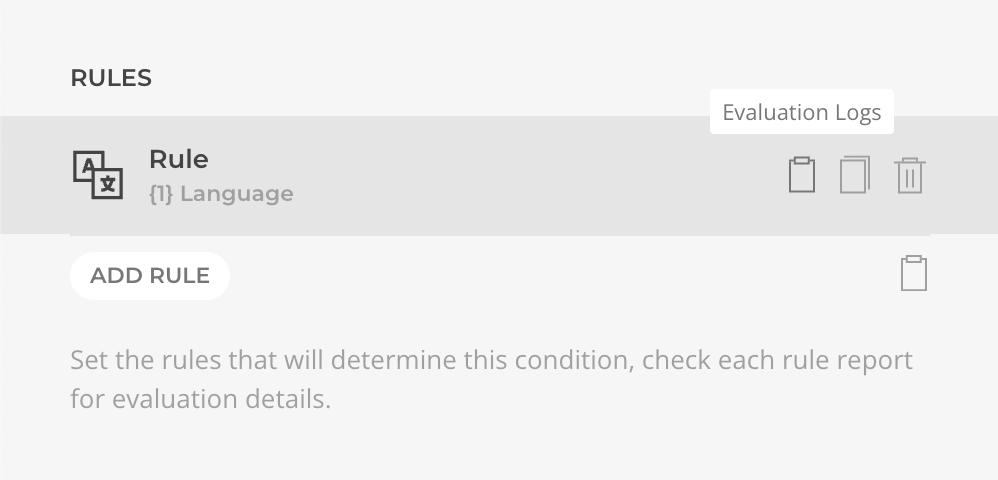
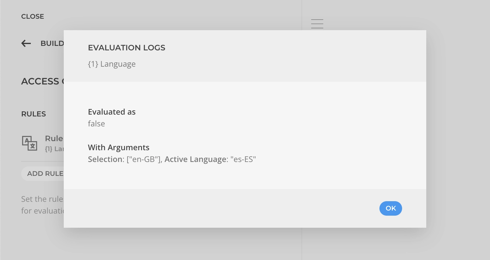

# Evaluation Logs

While in the customizer, the Access Condition will display evaluation logs for each rule as well the final result. These logs can be used to gain insights into the evaluation process and troubleshoot any issues with the logic.

