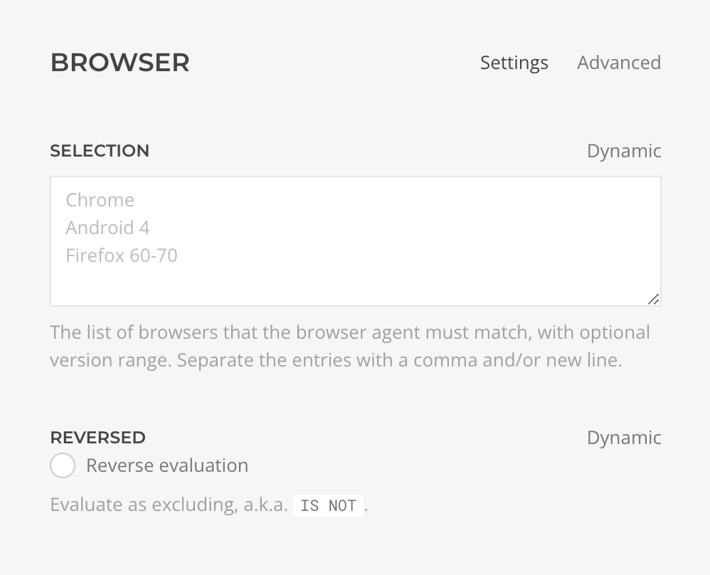

# Browser Rule

    <!--@include: ./assets/rule-browser.svg-->

The **Browser Rule** evaluates whether the browser agent matches one of the specified patterns, e.g. `Firefox 90`.

Supported browsers:

- Desktop: _Chrome_, _Firefox_, _Opera_, _Safari_, _Edge_, _MSIE_.
- Mobile: _Android_, _iPad_, _iPhone_, _iPod_, _Blackberry_, _IEMobile_, _NetFront_, _NokiaBrowser_, _Opera Mini_, _Opera Mobi_, _UC Browser_.

::: warning Limited Detection
Notice that browser detection is not always accurate, users can setup their browser to mimic other agents.
:::

| Setting | Description | Required | Dynamic |
| --- | --- | :---: | :---: |
| *Selection* | The browsers list with optional version range that the browser agent must match for the condition to be considered valid. Separate the entries with a comma and/or new line, e.g `Chrome, Firefox 60-70`. | &#x2713; | &#x2713; |
| *Reversed* | Whether the evaluation result should be returned reversed. Use it to set a condition as `IS NOT`. | | &#x2713; |
<!--@include: ./advanced-rule-settings-->
