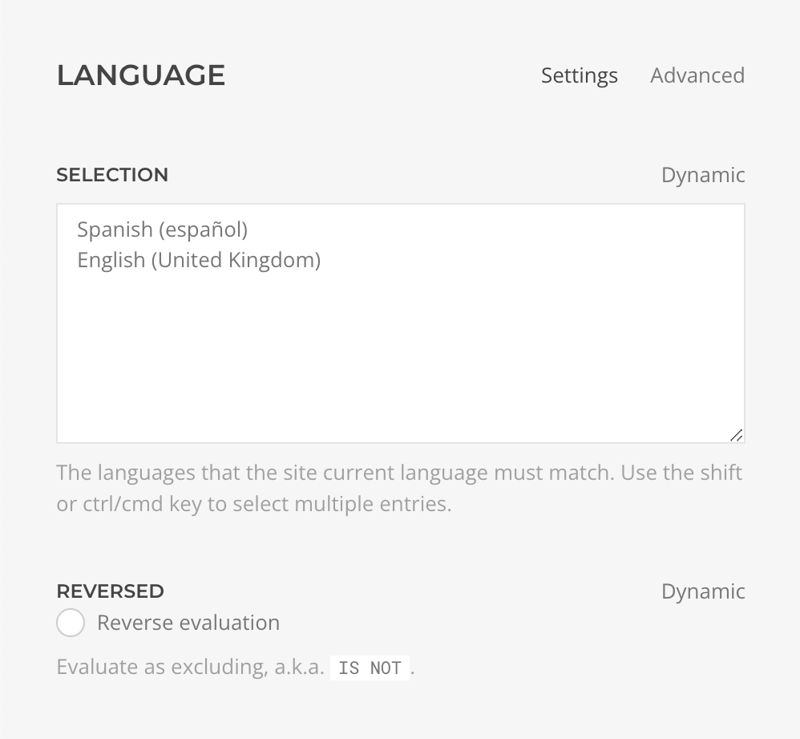

# Language Rule

    <!--@include: ./assets/rule-language.svg-->

The **Language Rule** evaluates whether the site language matches one of the selected languages.

| Setting | Description | Required | Dynamic |
| --- | --- | :---: | :---: |
| *Selection* | The languages that the site must match, at least one, for the condition to be considered valid. Only the installed languages will be listed. | &#x2713; | &#x2713; |
| *Reversed* | Whether the evaluation result should be returned reversed. Use it to set a condition as `IS NOT`. | | &#x2713; |
<!--@include: ./advanced-rule-settings-->
