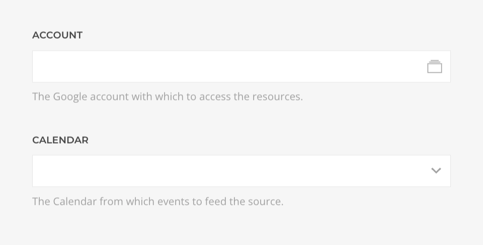

# Google Calendar Source Provider

    <!--@include: @essentials-for-yootheme-pro/assets/brands/google-calendar.svg-->

The **Google Calendar Source** feeds data from [Google Calendar](https://calendar.google.com/) supporting [Calendar](#calendar-query), [Event](#event-query) and [Events](#events-query) queries.

## Settings

<!--@include: ./_partials/common-provider-settings.md-->

| Setting | Description |
| --- | --- |
| *Account* | The Google account which to authenticate with. |
| *Calendar* | The Google calendar which data to create the source with. |

## Calendar Query

Fetches the Calendar data resolving to a [Calendar Type](#calendar-type).

| Setting | Description |  Default |
| --- | --- | --- |
| *Cache* | The duration in seconds before the cache is invalidated and the query re-executed. | `3600` |

## Event Query

Fetches a single event from the calendar and resolves to a [Event Type](#event-type).

| Setting | Description | Default | Dynamic |
| --- | --- | --- | :---: |
| *Event ID* | The ID of the event to query. | | &#x2713; |
| *Cache* | The duration in seconds before the cache is invalidated and the query re-executed. | `3600` |

## Events Query

Fetches events from the calendar and resolves to a list of [Event Type](#event-type).

| Setting | Description | Default | Dynamic |
| --- | --- | --- | :---: |
| *Query* | Optionaly filter matching terms in the summary, description, location, attendee\'s displayName and attendee\'s email fields. | | &#x2713; |
| *Time Min / Max* | Lower and Upper bounds (exclusive) for an event\'s start or end time to filter by. Can be date without time, e.g. 2011-06-03 formated as `Y-m-d`, in which case the current time will be appended, or a timestamp with time zone offset, e.g. `2011-06-03T10:00:00-07:00` formated as `c`. | | &#x2713; |
| *Order By* | The order by which to query the events. _Start Time_, by event start date/time (ascending) or _Updated_, by event last modification time (ascending). The default is an unspecified, stable order. | `Default` |
| *Quantity* | The maximum amount of events to query, cannot be higher than `2500`. | `250` | &#x2713; |
| *Cache* | The duration in seconds before the cache is invalidated and the query re-executed. | `3600` |

## Calendar Type

Defines the mapping options of a Google Calendar object.

| Option | Description | Type | Filters |
| --- | --- | --- | --- |
| *ID* | Unique identifier of the calendar. | *String* |
| *Summary* | Title of the calendar. | *String* | *Limit* |
| *Description* | Description of the calendar. | *String* | *Limit* |
| *Location* | Geographic location of the event as free-form text. | *String* | *Limit* |
| *Time Zone* | The calendars default time zone. | *String* |

## Event Type

Defines the mapping options of a Google Calendar Event object.

| Option | Description | Type | Filters |
| --- | --- | --- | --- |
| *ID* | Opaque identifier of the event. | *String* |
| *URL* | An absolute link to the event in the Google Calendar Web UI. | *String* |
| *Type* | Specific type of the event, `default`, `outOfOffice`, `focusTime` or `workingLocation`. | *String* |
| *Status* | Status of the event, `confirmed`, `tentative` or `cancelled`. - | *String* |
| *Visibility* | Visibility of the event, `default`, `public`, `private`, or `confidential* | *String* |
| *Summary* | Title of the event. | *String* | *Limit* |
| *Description* | Description of the calendar. | *String* | *Limit* |
| *Location* | Geographic location of the event as free-form text. | *String* | *Limit* |
| *Start* | The (inclusive) start time of the event. For a recurring event, this is the start time of the first instance. | *String* | *Date* |
| *End* | The (exclusive) end time of the event. For a recurring event, this is the end time of the first instance. | *String* | *Date* |
| *Created* | Creation time of the event. | *String* | *Date* |
| *Updated* | Last modification time of the event. | *String* | *Date* |
| *Creator* | The creator of the event. | [Profile Type](#profile-type) |
| *Organizer* | The organizer of the event. | [Profile Type](#profile-type) |
| *Attendees* | The attendees of the event. | [Attendee Type](#attendee-type) |
| *Attachments* | File attachments of the event. | [Attachment Type](#attachment-type) |

## Profile Type

Defines the mapping options of a Google Calendar Profile object.

| Option | Description | Type | Filters |
| --- | --- | --- | --- |
| *ID* | Identifier of the profile. | *String* |
| *Email* | The profile's email. | *String* |
| *Name* | The profile's name. | *String* | *Limit* |

## Attendee Type

Defines the mapping options of a Google Calendar Attendee object.

| Option | Description | Type | Filters |
| --- | --- | --- | --- |
| *ID* | Identifier of the attendee. | *String* |
| *Email* | The attendee's email. | *String* |
| *Name* | The attendee's name. | *String* | *Limit* |
| *Comment* | The attendee's name. | *String* | *Limit* |
| *Response Status* | The attendee's response status, `needsAction`, `declined`, `tentative` or `accepted`. | *String* |
| *Is Organizer* | Whether the attendee is the organizer of the event. | *Boolean* |
| *Is Resource* | Whether the attendee is a resource. | *Boolean* |
| *Is Optional* | Whether this is an optional attendee. | *Boolean* |
| *Additional Guests Count* | Number of additional guests. | *Int* |

## Attachment Type

Defines the mapping options of a Google Calendar Attachment object.

| Option | Description | Type | Filters |
| --- | --- | --- | --- |
| *ID* | Identifier of the attached file. | *String* |
| *Title* | Title of the attachment. | *String* | *Limit* |
| *Mime Type* | Internet media type (MIME type) of the attachment. | *String* |
| *File URL* | URL link to the attachment. | *String* |
| *Icon URL* | URL link to the attachment's icon. | *String* |
