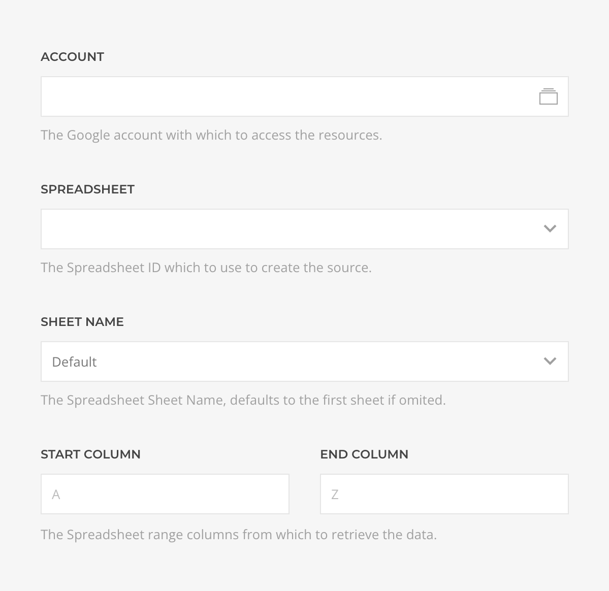
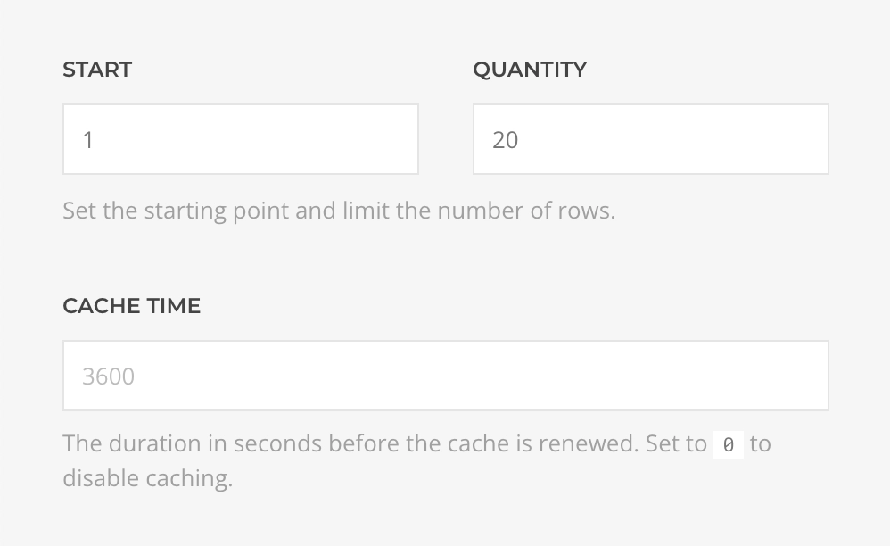

# Google Sheets Source Provider

    <!--@include: ../assets/provider-google-sheets.svg-->

The **Google Sheets Source** feeds data from [Google Sheets](https://www.google.com/sheets) supporting [Records](#records-query) query.

## Settings

<!--@include: ./_partials/common-provider-settings.md-->

| Setting | Default | Description | Required |
| --- | --- | --- | :---: |
| *Account* | | The Google Account which to authenticate with. | &#x2713; |
| *Spreadsheet* | | The spreadsheet which to retrieve the data from. | &#x2713; |
| *Sheet* | `Default` | The spreadsheet sheet which data to create the source with. |
| *Start Column* | `A` | The starting column to restrict the sheet data with. |
| *End Column* | `Z` | The ending column to restrict the sheet data with. |

## Records Query

Fetches records from the spreadsheet and resolves to a dynamically generated list of record type based on the sheet schema.

| Setting | Default | Description |
| --- | --- | --- |
| *Start* | `1` | The offset applied to the query. |
| *Quantity* | `20` | The limit applied to the query. |
| *Cache* | `3600` | The duration in seconds before the cache is invalidated and the query re-executed. |
