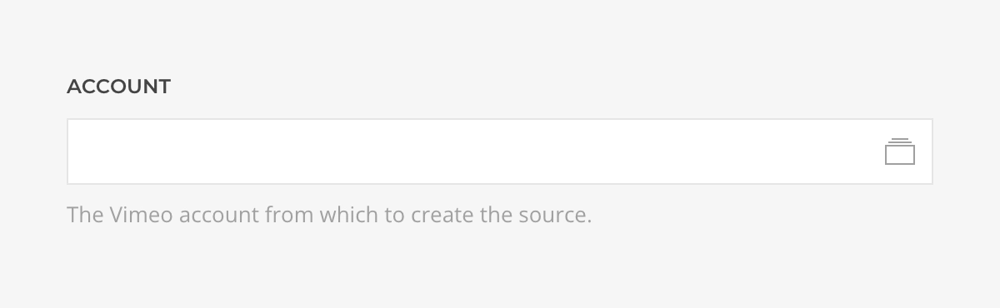
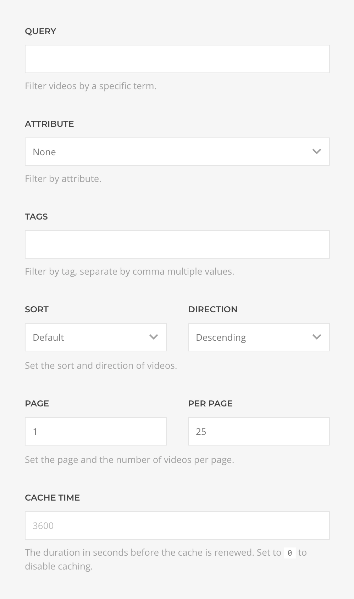
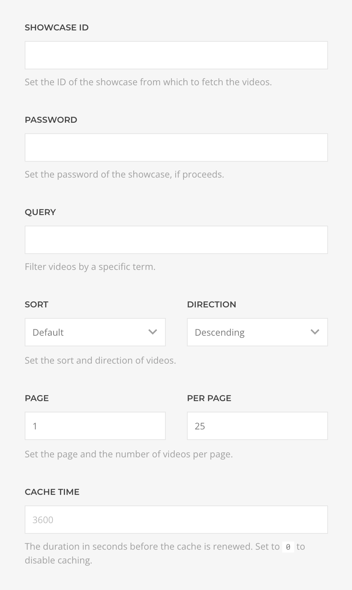
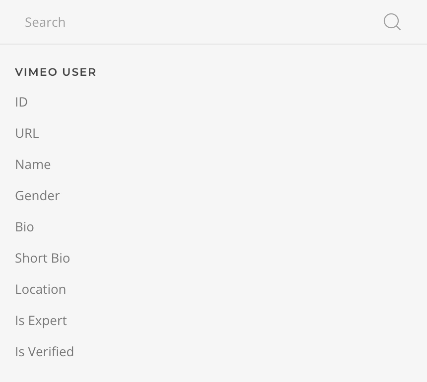

# Vimeo Source Provider

    <!--@include: @essentials-for-yootheme-pro/assets/brands/vimeo.svg-->

The Vimeo Source feeds media from [Vimeo](https://www.vimeo.com) supporting [My Videos](#my-videos-query), [My Folder Videos](#my-folder-videos-query) and [My Showcase Videos](#my-showcase-videos-query) queries.

## Settings

<!--@include: ./_partials/common-provider-settings.md-->

| Setting | Description |
| --- | --- |
| *Account* | The Vimeo Account which to authenticate with. |

## My Videos Query

Fetches videos from the authenticated account and resolves to a list of [Video Type](#video-type).

| Setting | Description | Default | Dynamic |
| --- | --- | --- | :---: |
| *Query* | The search term by which to filter the videos. | | &#x2713; |
| *Attribute* | The video attribute by which to filter the videos, within *Featured*, *Live*, and *No Live*. |
| *Tags* | Comma separated tags by which to filter the videos. | | &#x2713; |
| *Sort* | The order of the videos, within *Default*, *Alphabetical*, *Date*, *Modified*, *Duration*, *Last User Action*, *Total Plays*, and *Total Likes*. | `Default` | &#x2713; |
| *Direction* | The order direction of the videos, *Ascending* or *Descending*. | `Descending` |
| *Page* | The page number of the videos. | `1` | &#x2713; |
| *Per Page* | The number of videos to return on each page, up to a maximum of 100. | `25` | &#x2713; |
| *Cache* | The duration in seconds before the cache is invalidated and the query re-executed. | `3600` |

## My Folder Videos Query

Fetches videos from the authenticated account specific folder and resolves to a list of [Video Type](#video-type).

| Setting | Description | Default | Dynamic |
| --- | --- | --- | :---: |
| *Folder ID* | The unique identifier of the folder from which to retrieve the videos. | | &#x2713; |
| *Include Subfolders* | Whether to include videos of all subfolders. |
| *Query* | The search term by which to filter the videos. | | &#x2713; |
| *Sort* | The order of the videos, within *Default*, *Alphabetical*, *Date*, *Duration*, and *Last User Action*. | `Default` |
| *Direction* | The order direction of the videos, *Ascending* or *Descending*. | `Descending` |
| *Page* | The page number of the videos. | `1` |  &#x2713; |
| *Per Page* | The number of videos to return on each page, up to a maximum of 100. | `25` |  &#x2713; |
| *Cache* | The duration in seconds before the cache is invalidated and the query re-executed. | `3600` |

## My Showcase Videos Query

Fetches videos from the authenticated account specific showcase and resolves to a list of [Video Type](#video-type).

| Setting | Description | Default | Dynamic |
| --- | --- | --- | :---: |
| *Showcase ID* | The unique identifier of the showcase from which to retrieve the videos. | | &#x2713; |
| *Password* | The password of the showcase in case it has one. | | &#x2713; |
| *Query* | The search term by which to filter the videos. | | &#x2713; |
| *Sort* | The order of the videos, within *Default*, *Alphabetical*, *Date*, *Duration*, and *Last User Action*. | `Default` |
| *Direction* | The order direction of the videos, *Ascending* or *Descending*. | `Descending` |
| *Page* | The page number of the videos. | `1` |  &#x2713; |
| *Per Page* | The number of videos to return on each page, up to a maximum of 100. | `25` |  &#x2713; |
| *Cache* | The duration in seconds before the cache is invalidated and the query re-executed. | `3600` |

## Video Type

Defines the mapping options of a Vimeo Video object.

| Option | Description | Type | Filters |
| --- | --- | --- | --- |
| *ID* | The unique identifier of this video. | *String* |
| *URL* | The URL of this video, e.g. `vimeo.com/123456789`. | *String* |
| *Custom URL* | The custom URL of this video. | *String* |
| *Type* | The type of this video, *live* (is or was a live event), *stock* (is a Vimeo Stock video), or *video* (standard Vimeo video). | *String* |
| *Title* | The title of this video. | *String* | *Limit* |
| *Description* | A brief explanation of this video's content. | *String* | *Limit* |
| *Duration* | The duration of this video in seconds. | *Int* |
| *Language* | The primary language of this video. | *String* |
| *License* | The [Creative Commons](https://creativecommons.org/licenses/) license given to this video under *BY*, *BY-NC*, *BY-NC-ND*, *BY-NC-SA*, *BY-ND*, *BY-SA*, or *CC0*. | *String* |
| *Thumbnail* | The path to the locally cached video picture. | *String* |
| *Width* | The width of this video in pixels. | *Int* |
| *Height* | The height of this video in pixels. | *Int* |
| *Tags* | A formated list of all tags assigned to this video, joined with a custom separator. | *String* |
| *Categories* | A formated list of all categories this video belongs to, joined with a custom separator, optional link and style. | *String* |
| *Created At* | The time this video was created. | *String* | *Date* |
| *Released At* | The time this video was released. | *String* | *Date* |
| *Modified At* | The time this video was modified. | *String* | *Date* |
| *Total Plays* | Number of times this video has been played. | *Int* |
| *Total Comments* | Number of times this video has been commented. | *Int* |

## User Type

Defines the mapping options of a Vimeo User object.

| Option | Description | Type | Filters |
| --- | --- | --- | --- |
| *ID* | The unique identifier of this user. | *String* |
| *URL* | The absolute URL of this user profile page. | *String* |
| *Name* | The display name of this user. | *String* |
| *Gender* | The gender of this user. | *String* |
| *Bio* | The long bio text of this user. | *String* | *Limit* |
| *Bio Short* | The short bio text of this user. | *String* | *Limit* |
| *Location* | The location of this user. | *String* |
| *Is Expert* | Whether the creator enrolled in and successfully completed the Vimeo Experts program. | *String* |
