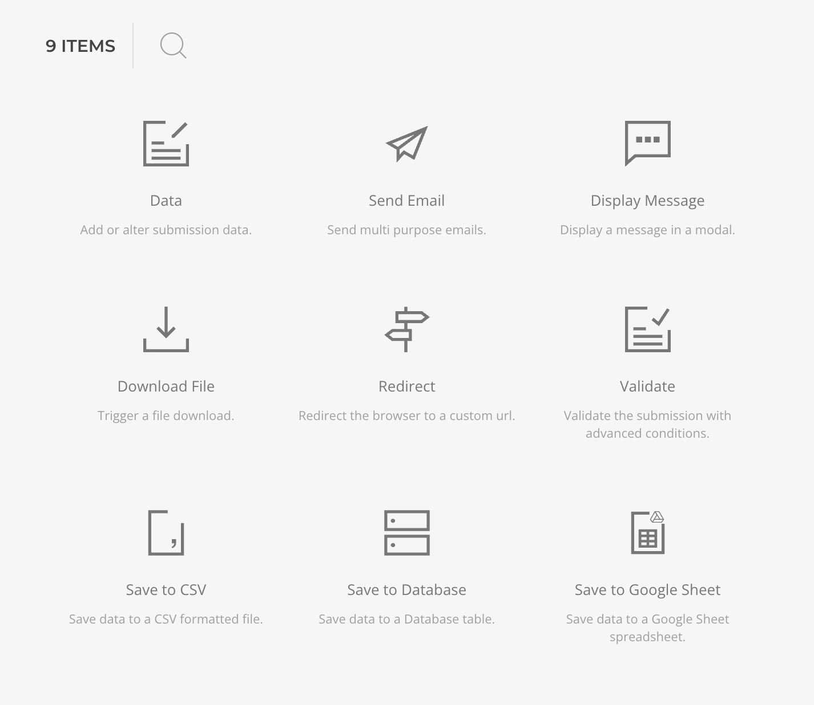

# After Submit Actions

After Submit Actions, or simply actions, are multi-instance functions that will run sequentially, after a form has been successfully submitted, as long as the chain is not disrupted by an error. These are crucial for the form workflow, as submission data is not processed or logged unless there is an action set for the task.

Actions are set in the [Form Area Configuration](./form-area.md) and tipically involves sending an email or saving the submission data to the database. For a full overview of available actions and their capabilities, consult the Actions section.

Actions will by default be always executed unless their status has been manually set to `disabled`, or it execution condition dynamically been resolved to false. The execution condition supports Dynamic Content, including the form submitted data.

::: tip
Use execution conditions for advanced workflows, e.g. subscribing to a newsletter only if a specific checkbox has been checked on.
:::
