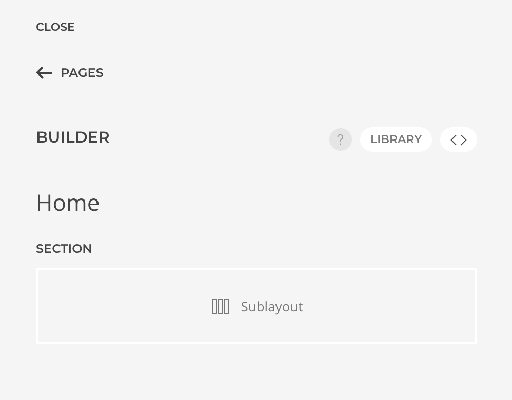
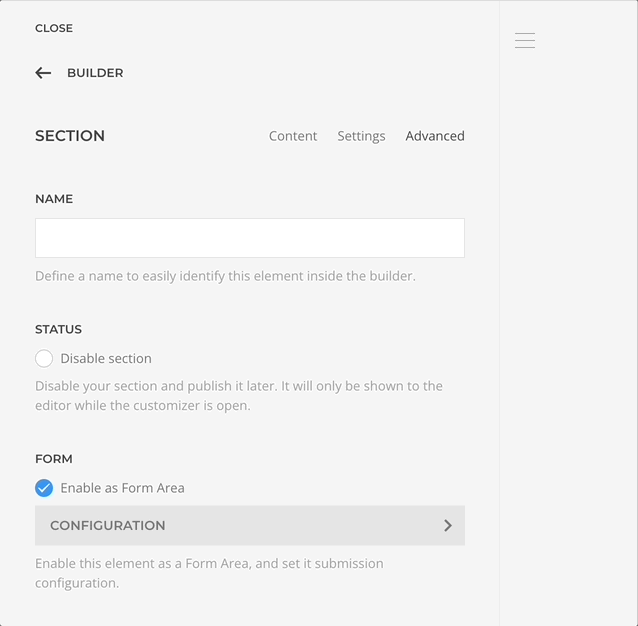
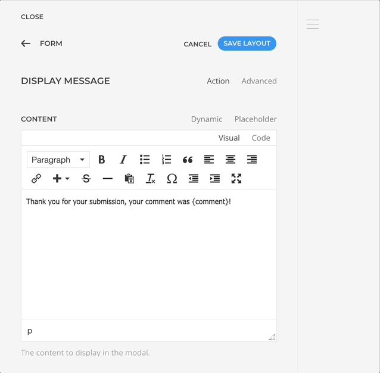
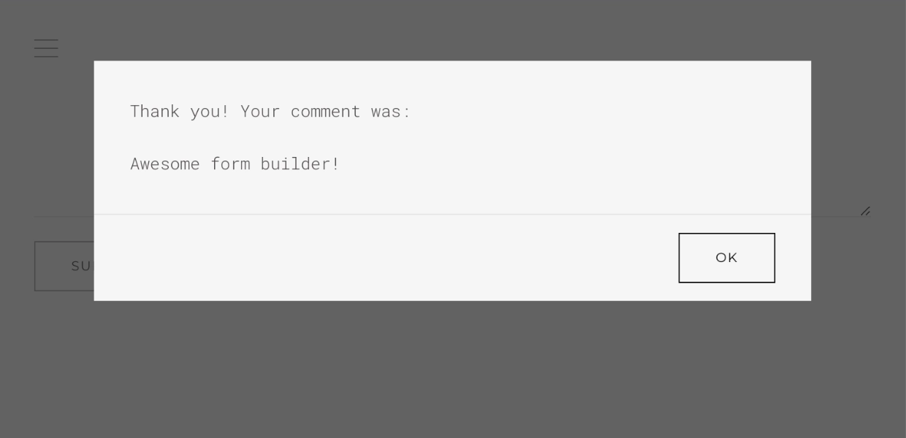

# Form Builder

Transform any sublayout into a form area, configure form fields, and define actions to execute after a successful submission—all within a streamlined workflow.

<!--@include: ../_partials/enable-addon.md-->

## Create a Form Area

An Essential form is structured inside a [Form Area](./form-area). Lets create one.

1. Open the layout builder where you want to create the form.
1. Add a Sublayout element and access its _Advanced Tab_ settings.
1. Toggle the `Enable as Form Area` checkbox.

## Add After Submit Actions

The section has now been declared as a Form Area and we can add after submit actions to greet the submitter with a custom message.

::: tip
For more advanced scenarios, adding _Email_ and _SaveTo_ actions would be necessary to send an email and save the submitted data.
:::

1. Open the Form Area configuration created in the previous step.
1. In _After Submit Actions_, add a new action of type _Display Message_.
1. Input `Thank you for your submission, your comment was {comment}!` in the _Message_ field.

::: tip Notice the `{comment}` part
It's what we call [Data Placeholders](./index#data-placeholders), and is one of the simplest and direct ways to reference submitted data.
:::

## Add Form Fields

Essentials comes with prebuild [elements](./elements) to structure a form as needed. Let's add a textarea to collect the comment and a submit button.

1. Return to the builder main panel and add a __Textarea Element__ from the `Form Essentials` group.
1. Open its configuration panel and input `comment` in the _Control Name_ setting.
1. Add a _Button Element_ which will render as a submit button by default.

## Test The Submission

Let's give it a try!

1. Locate the form in the builder preview.
1. Input a message in the Comment textarea and Submit.

You should see a modal with the submitted message!
