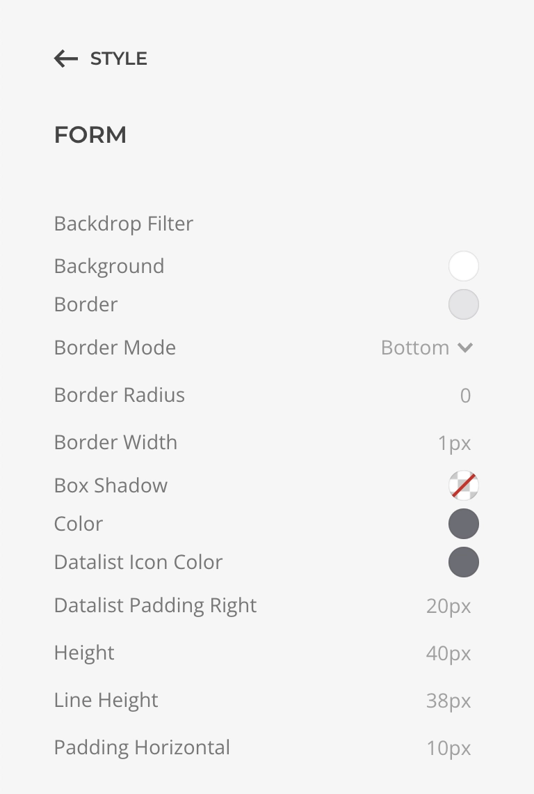

# Form Styling

Essentials focus on creating solid form HTML structures, while relies on [UIkit Form Styles](https://getuikit.com/docs/form) and [YOOtheme Pro Style Customizer](https://yootheme.com/support/yootheme-pro/joomla/style-customizer) to handle the visuals.

::: warning Native Browser Fields
Be aware that certain form fields, such as Date inputs, are natively rendered by the browser. These fields may display their own icons and styles, which cannot be customized using standard methods. To modify the appearance of these, you'll need to apply browser-specific CSS styles tailored to your particular use case.
:::

## Style Customizer

The YOOtheme Pro Style Customizer is a powerful tool that allows you to fine-tune the appearance of your forms directly within the builder interface, ensuring consistency across your entire website.

To access these customization, simply navigate to the `Builder -> Style -> Components -> Form`, and adjust the available variables to suit your design preferences.

## Custom Styles

For advanced customization and control you can [load a custom CSS](https://yootheme.com/support/yootheme-pro/joomla/developers-child-themes#javascript,-css-and-fonts) within a child theme. This approach allows you to override default styles, add new CSS rules, and fine-tune the appearance of your forms to perfectly match your design. Additionally, you can use CSS variables defined by UIkit to maintain consistency with the overall theme.

::: tip
For quick customizations, you can add custom CSS styles directly in the [Builder Custom Code Settings](https://yootheme.com/support/yootheme-pro/joomla/settings#custom-code). This method is convenient for small adjustments, but for more extensive styling, it's recommended to move your custom CSS to a Child Theme for better organization and maintainability.
:::
