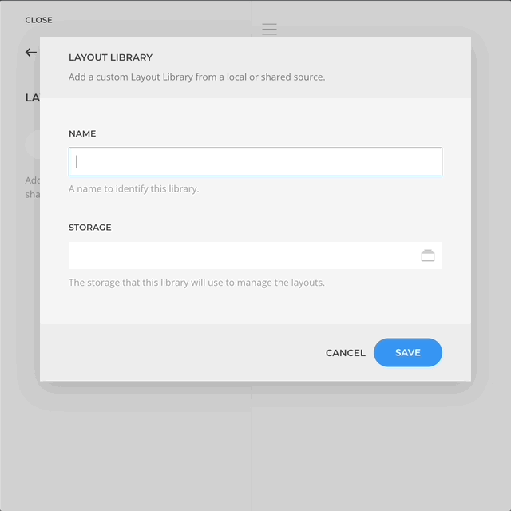
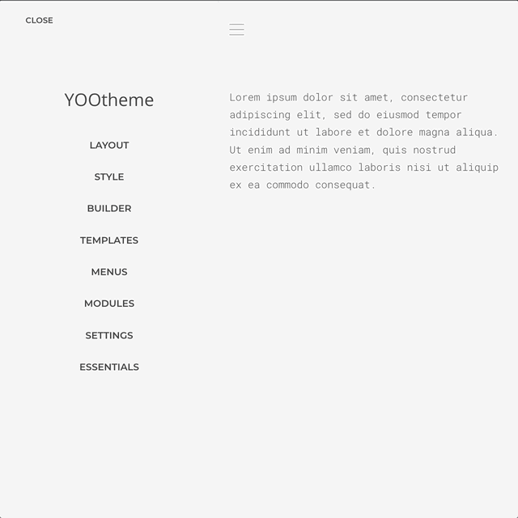

# Layout Libraries

Create custom layout libraries which layouts can be stored locally or shared across multiple sites through the use of external storage options like FTP or Amazon S3.

<!--@include: ../_partials/enable-addon.md-->

## Create Library

Let's create a custom layout library within the [Layout Libraries manager](/essentials-for-yootheme-pro/settings#layout-libraries).

1. Open the Layout Libraries manager.
1. Click on the _New Library_ button and set a name for it.

## Create Library Storage

In this case we are going to set a library with a local storage, but you can opt to set an external storage and that way enable layouts cross-site sharing.

1. In the _Storage_ field click on the storage picker.
1. Choose _local_ storage or of choice.
1. Another modal will open, set the name and details.
1. Save the storage and library by clicking _Save_ on both opened modals.

## Save Layout To Library

The new library will appear in the [Layout Library](https://yootheme.com/support/yootheme-pro/joomla/layout-library) modal Tab with the name used during it creation as well as in the elements presets modal. You can now save and load layouts within the new Library in the same way you are already used to.

