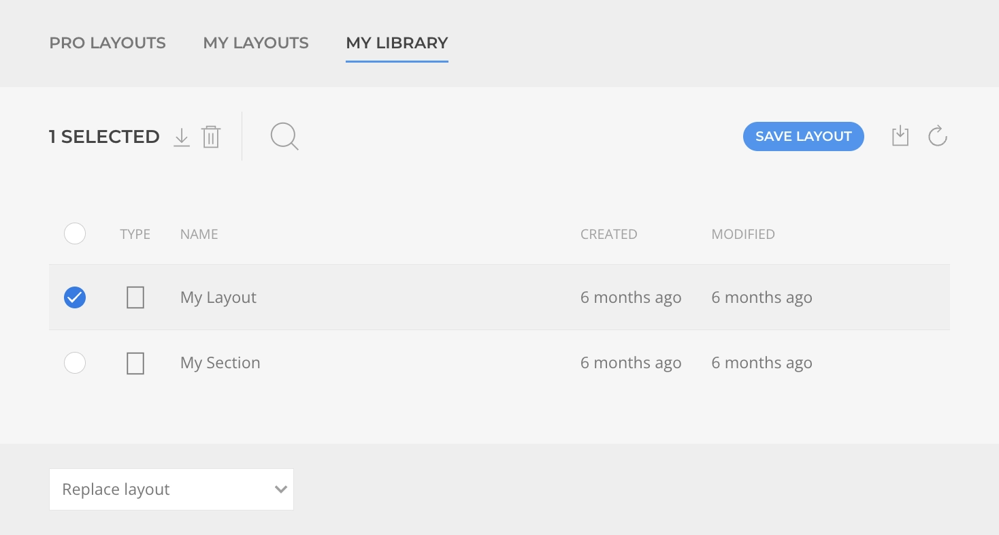
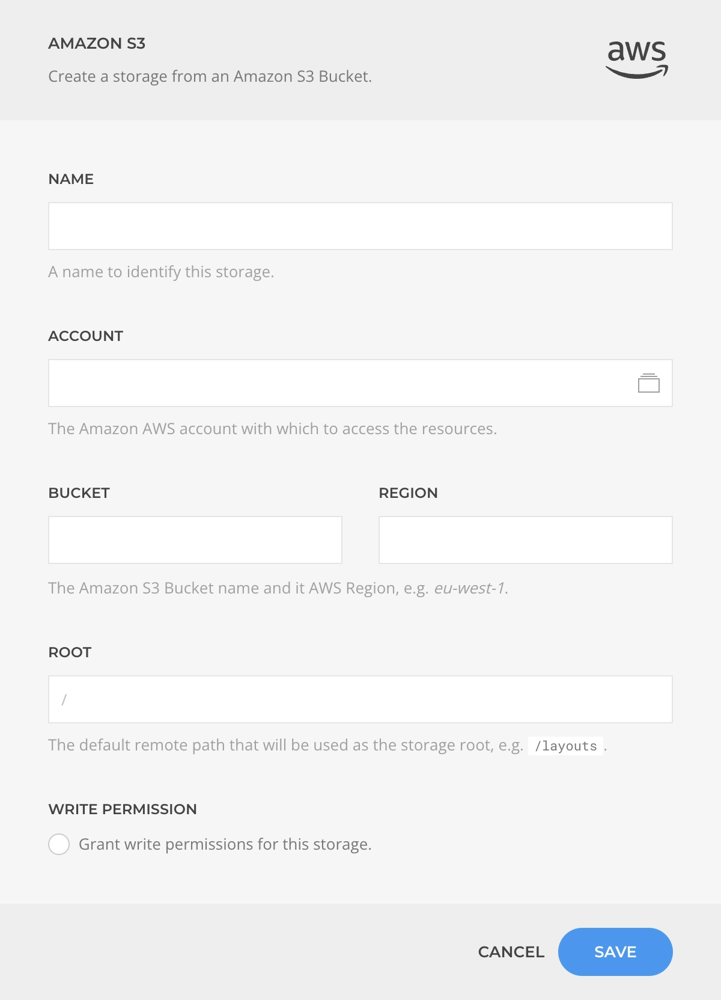

# Layout Library

A custom layout libraries store layouts in custom set locations that can be easier to backup and share across multiple sites. By [setting a custom layout library](./) you can load and browse page builder layouts from it in a workflow similar to the core Layout Library. However, a custom library come with some valuable enhancements.

## Enhanced User Experience

The user interface of the custom layout library is designed to be more advanced and user-friendly, featuring support for bulk layout management. This enables you to efficiently manage multiple layouts at once, making it easier to streamline your workflow and save time.

## Cross-Site Layout Sharing

Thanks to the library's integration with various storage options, you have the ability to specify whether your layouts are located locally or externally. For instance, if you opt to use FTP or Amazon S3 as your storage option, you can utilize the same location for your layouts across multiple sites, enabling you to share layouts seamlessly between different sites.

