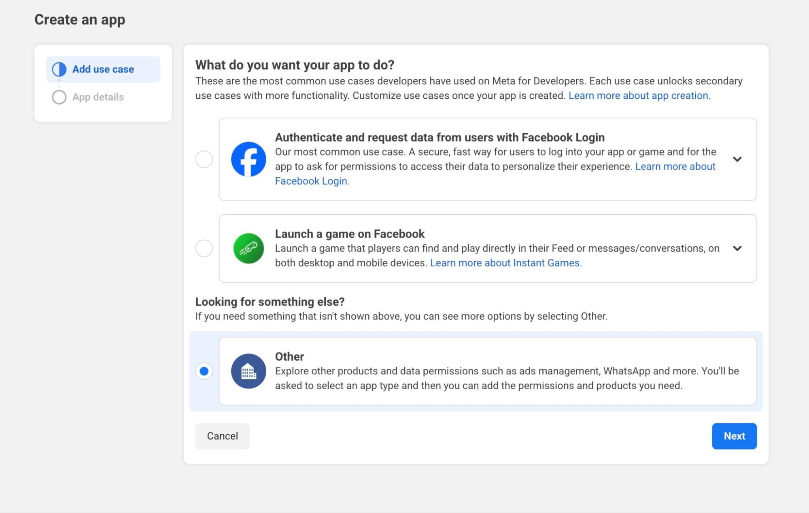
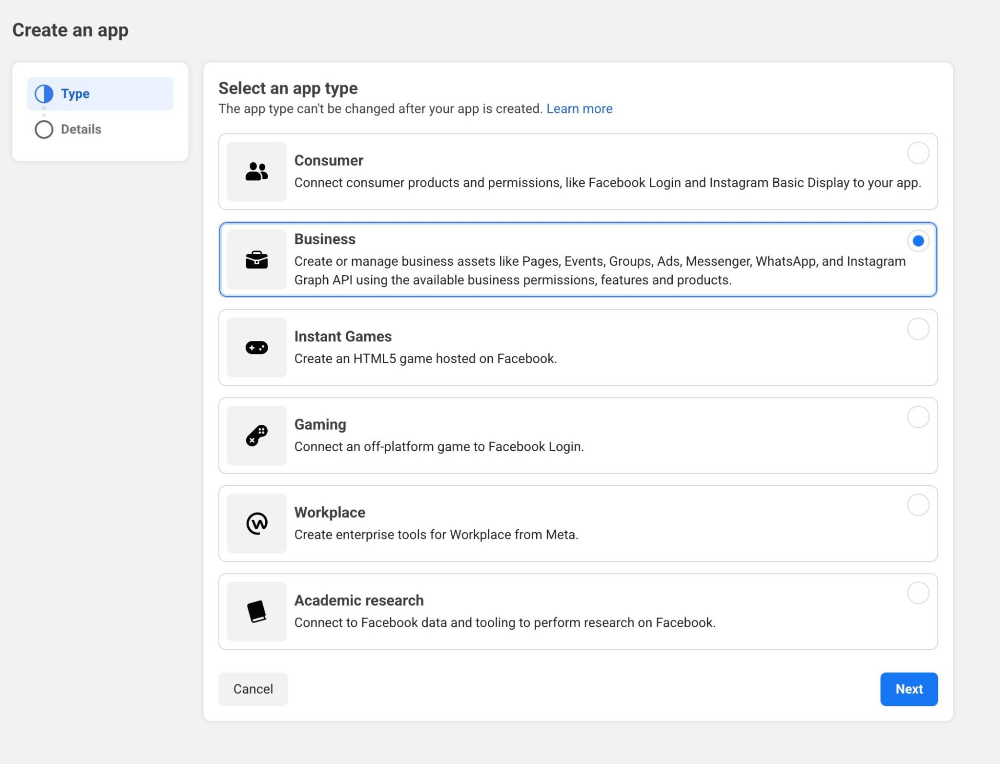
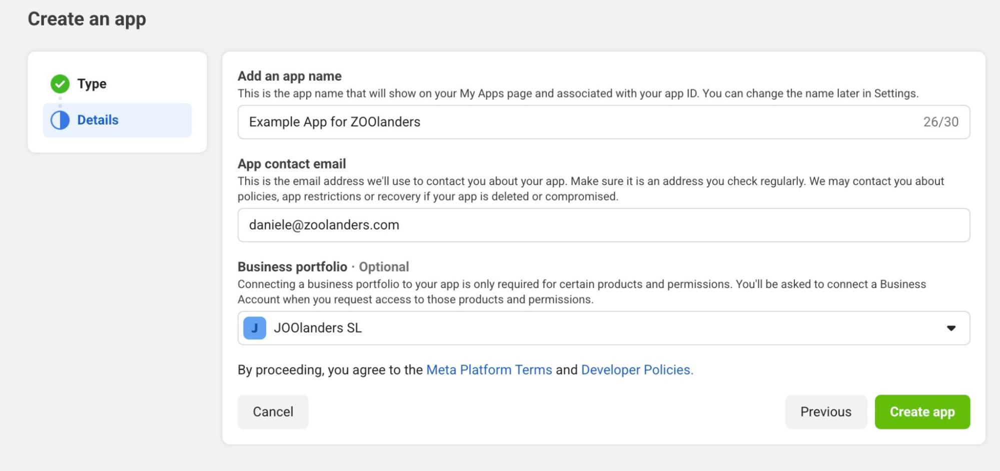
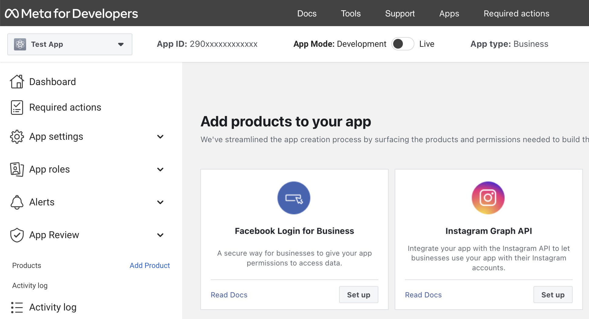
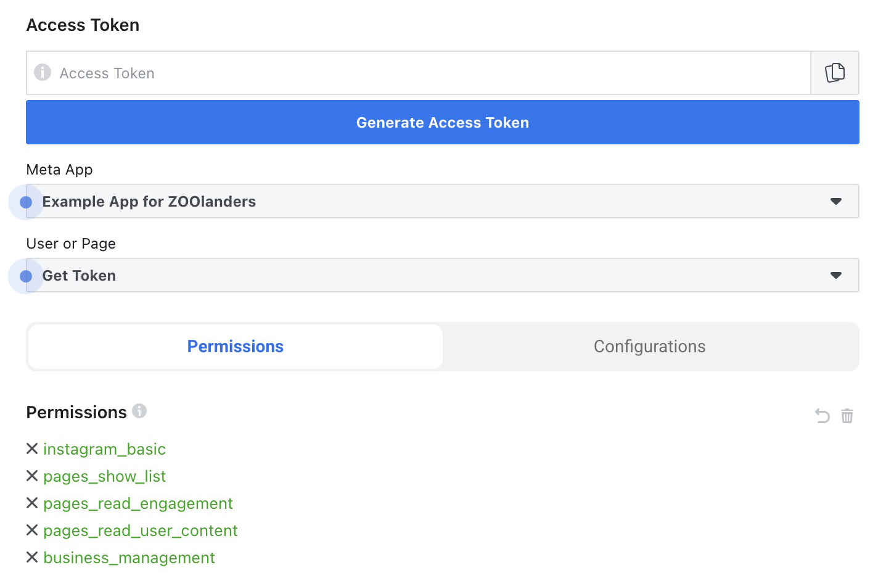
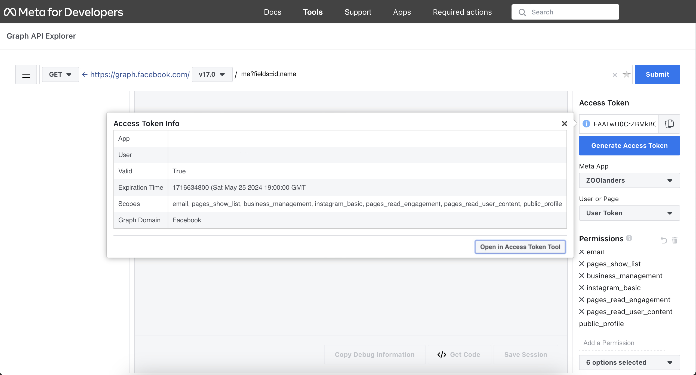
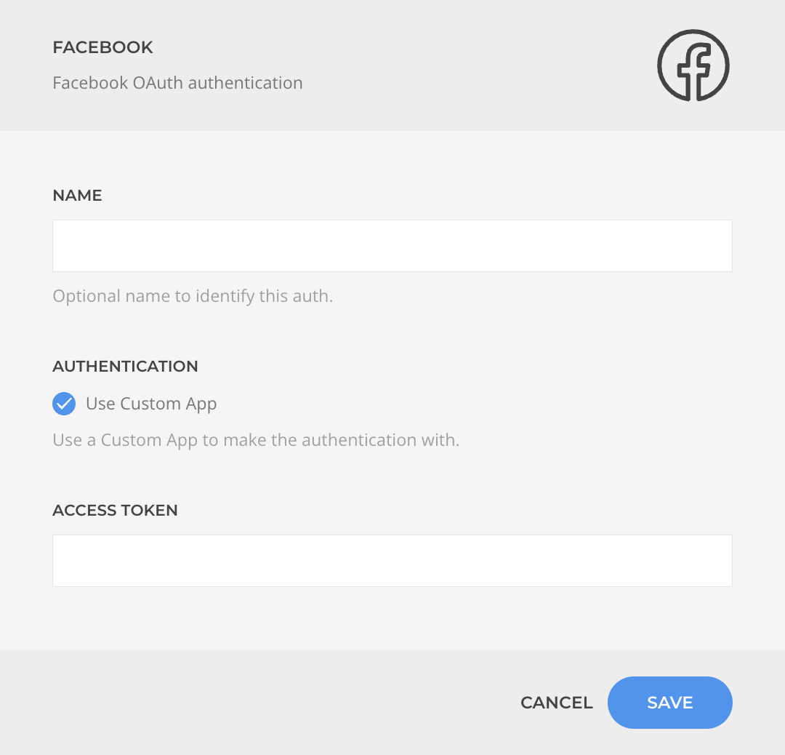

# Custom Facebook Dev App

Learn how to create a custom Facebook Dev App and get your own credentials. Once ready, you can use the resulting _Access Token_ into the respective [Facebook Auth](./drivers/facebook) driver to authenticate.

## 1. Create a New Dev App

Go to [https://developers.facebook.com/apps/creation](https://developers.facebook.com/apps/creation) and choose "Other".

On Next Choose "Business".

On Next fill in the details and Create app.

From the left column or from the dashboard, add both _Facebook Login for Business_ and _Instagram Graph API_ products leaving all settings as per their defaults.

## 2. Generate Access Token

Go to [https://developers.facebook.com/tools/explorer](https://developers.facebook.com/tools/explorer). Select from the list of apps on the right the app you just created, and add the following permissions in the permissions list:

- instagram_basic
- pages_show_list
- pages_read_engagement
- pages_read_user_content
- business_management

Be sure that the list matches with the screenshot and _Generate Access Token_.

- When prompted login with the account that created the app itself.
- Select the business accounts (or all of them).
- Select the pages you want to give access to.
- Select the Instagram accounts you want to allow.
- Confirm.

::: tip Account Permissions
The Access Token should be generated with the account that created the app or at least one of the accounts listed in the app as _Testers_, _Developers_ or _Administrators_. If you don’t do this, you will need to publish the app and get through the facebook review process (not recommended).
:::

You now have an access token. Click on the Info icon and then on the _Open in Access Token Tool_.

Click on _Extend Access Token_ and copy the new Access Token. Use that token when authenticating a source with your custom app.

## 3. Authenticate a Source

Now that you have an access token create a Facebook or Instagram Business source. When authenticating choose _Custom App_, past the generated access token and complete the source setup.

::: tip Token Expiration
Note that the token will be auto-renewed by the source when used, but it may expire if not used enough during the given time period. If it does, you will need to generate a new token.
:::
