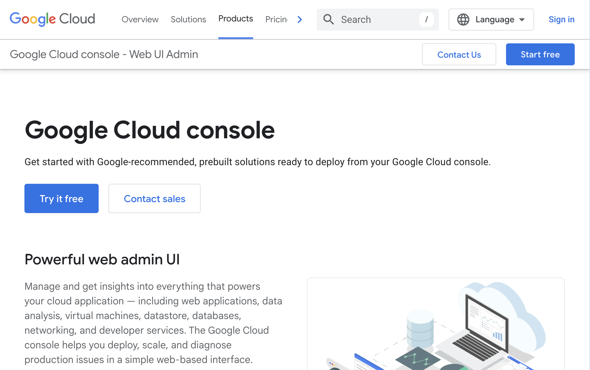
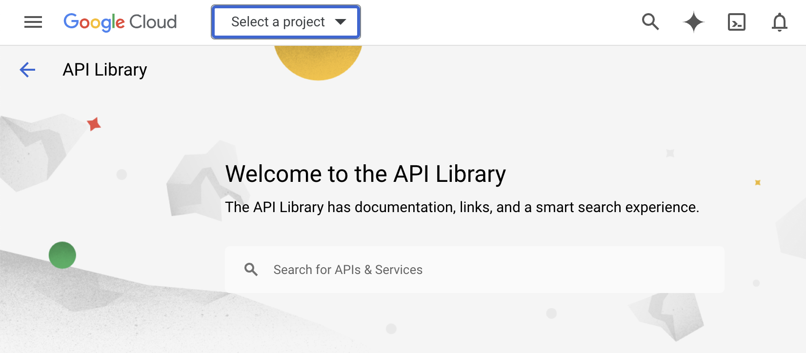
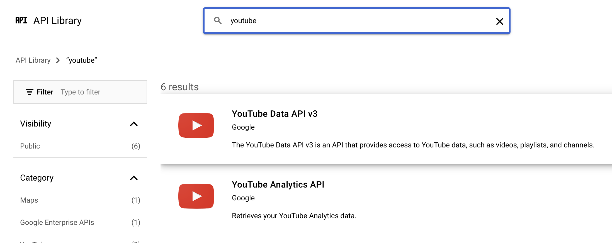
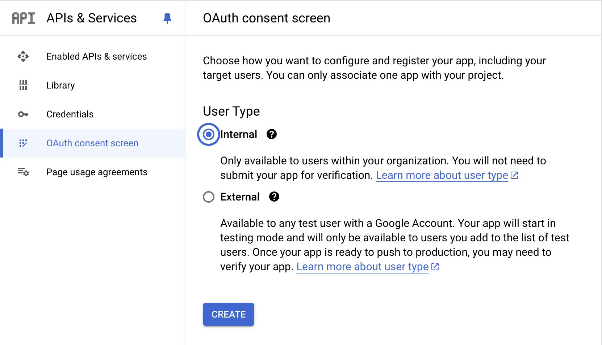
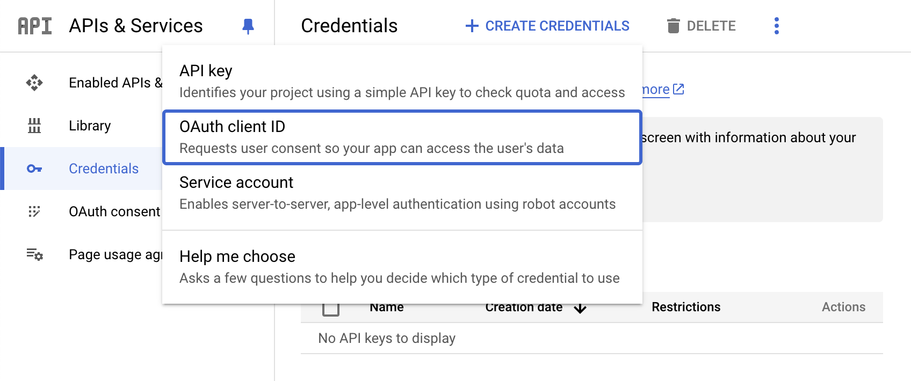
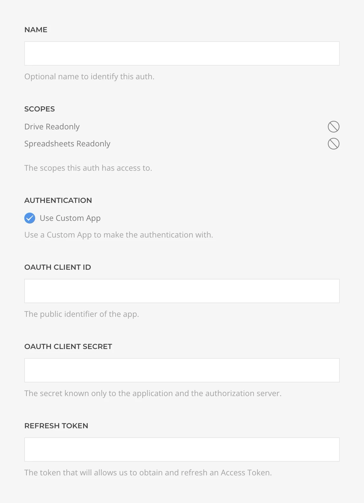

# Custom Google Dev App

Learn how to create a custom Google Dev App and get your own oAuth credentials. Once ready, you can use the resulting _Access Token_ into the respective [Google Auth](./drivers/google-oauth) driver to authenticate.

This process is covered in great extens by the [Google official guide](https://developers.google.com/identity/protocols/oauth2/web-server) while next step will try to summarize it.

## 1. Create Google Cloud Project

Login with your Google account to the [Google Cloud Console](https://cloud.google.com/cloud-console/) and create and/or choose a project where to manage the custom oAuth credentials.



## 2. Enable Google APIs

Go to the [Google Cloud Console API Libraries](https://console.cloud.google.com/apis/library) and enable the APIs you need. For example, for Google Sheets enable the _Google Sheets API_, for YouTube the _YouTube Data API_, etc.





::: tip
You can either create one project for each API, or a single-project for every API. It's up to you and your security policies.
:::

## 3. Create oAuth Consent Screen

Go to the console [oAuth Consent Screen Page](https://console.developers.google.com/apis/credentials/consent) and choose _Internal_ as the User Type. Follow through the form to fullfill all the necessary data.



In the scopes section you would usually match the scopes for the APIs you have enabled previously. Refer to the following table as the scopes required by Essential addons.

| Scope  | Addon |
|--------|-------|
| https://www.googleapis.com/auth/youtube.readonly | Youtube Source |
| https://www.googleapis.com/auth/business.manage | Google Business Profile Source. |
| https://www.googleapis.com/auth/drive.readonly | Google Sheets Source and Google Sheets Form Action |
| https://www.googleapis.com/auth/spreadsheets | Google Sheets Source and Google Sheets Form Action |
| https://www.googleapis.com/auth/calendar.readonly | Google Calendar Source |
| https://www.googleapis.com/auth/calendar.events.readonly | Google Calendar Source |

## 4. Create oAuth Client ID

Go to the console [Credentials Page](https://console.developers.google.com/apis/credentials) and create an _oAuth Client ID_. Select _Web Application_ and set a name. For the URL, input your site one or any URL you want to set as authorized.

Once created, copy the `Redirect URI`, `Client ID` and `Client Secret` parameters.



## 5. Generate Refresh Token

Through your browser, visit the following URL, replacing the placeholders with parameters from the previous steps.

```text
https://accounts.google.com/o/oauth2/v2/auth
?state=state
&access_type=offline
&response_type=code
&client_id=CLIENT_ID
&scope=LIST_OF_SCOPES
&redirect_uri=https://example.com
```

::: tip
If there are multiple scopes, separate them with a comma.
:::

You will get redirected back to the _REDIRECT_URI_ with a `code` parameter in the URL, for example `https://example.com/?code=4/P7q7W91a-oMsCeLvIaQm6bTrgtp7`. Copy that `code` value.

Through an HTTP client like [Postman](https://www.postman.com/), or your terminal using CURL, make a post request like the following one, once again, replacing the placeholders.

```bash
curl --location --request POST 'https://oauth2.googleapis.com/token' \
--header 'Content-Type: application/x-www-form-urlencoded' \
--data-urlencode 'code=THE_CODE_YOU_COPIED' \
--data-urlencode 'client_id=YOUR_APP_CLIENT_ID' \
--data-urlencode 'client_secret=YOUR_APP_CLIENT_SECRET' \
--data-urlencode 'grant_type=authorization_code' \
--data-urlencode 'redirect_uri=https://example.com' \
```

You should get back a JSON response that contains the `refresh_token` you need, for example:

```json
{
  "access_token": "1/fFAGRNJru1FTz70BzhT3Zg...",
  "expires_in": 3920,
  "token_type": "Bearer",
  "scope": "https://www.googleapis.com/auth/drive.metadata.readonly",
  "refresh_token": "1//xEoDL4iW3cxlI7yDbSRFYNG01kVKM2C..."
}
```

## 6. Authenticate

When creating a Source or Action that requires Google Authentication choose Custom App and fill in the details using the `Client ID`, `Client Secret` and `Refresh Token` obtained in the previous steps.


