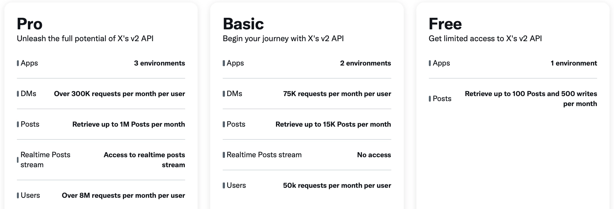
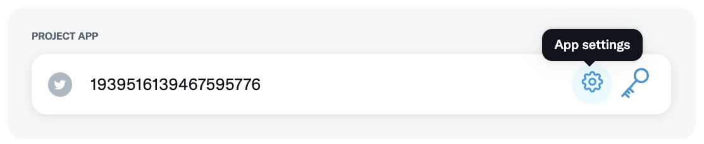
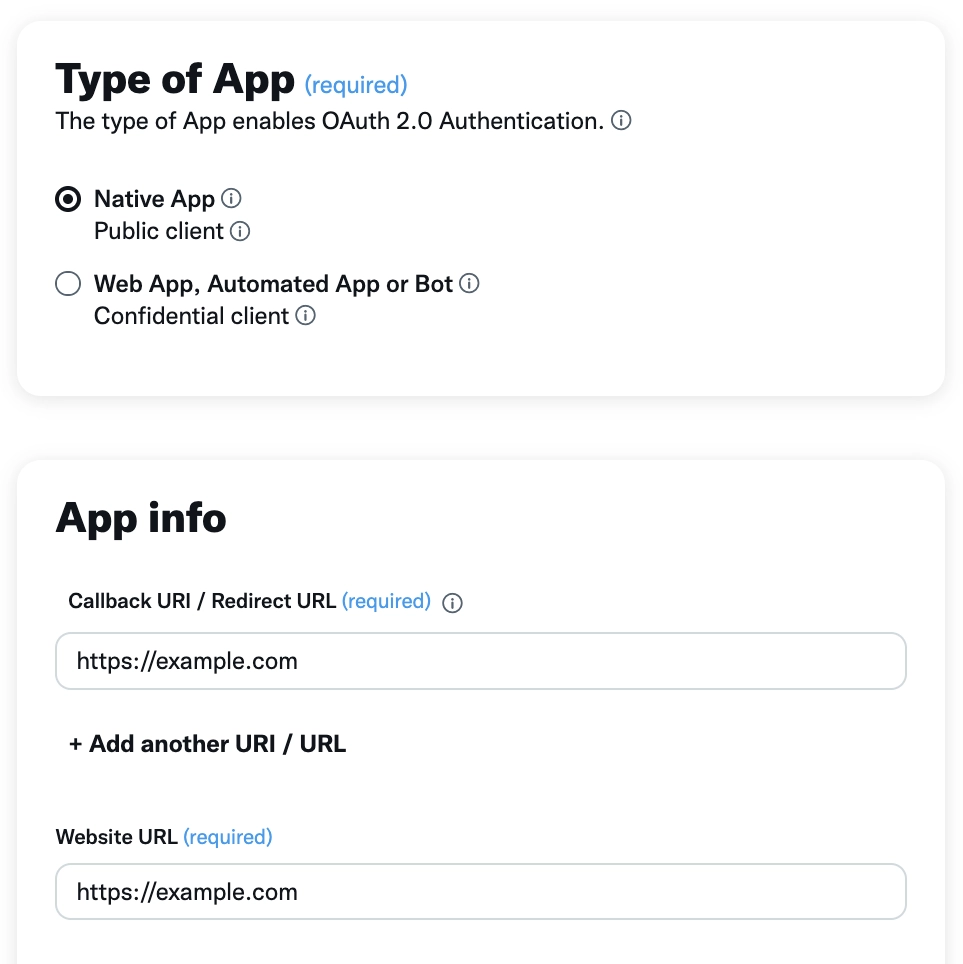
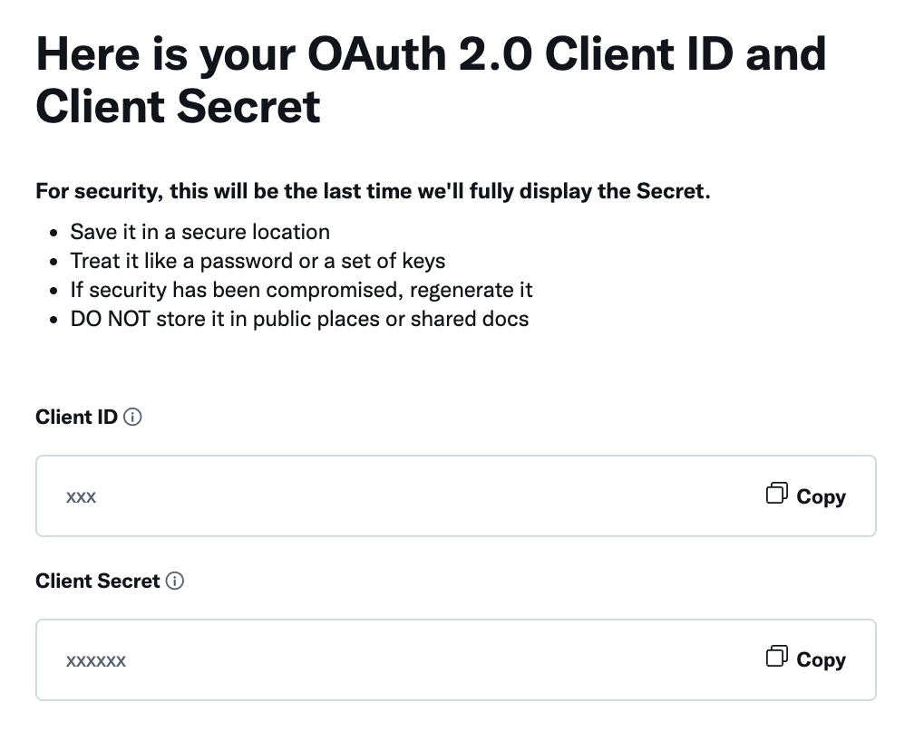
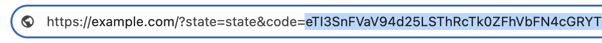

# Custom Twitter Developer App

Learn how to create a custom Twitter Developer App and obtain your own credentials. Once you have them, you can use the resulting _Client ID_, _Client Secret_, and _Refresh Token_ in the [Twitter Auth](./drivers/twitter) driver to authenticate.

::: warning Requires Technical Skills
This is a technical process that requires some development skills, such as interacting with REST APIs.
:::

## 1. Create a New Developer App

Follow the [official Twitter guide](https://developer.twitter.com/en/docs/twitter-api/getting-started/getting-access-to-the-twitter-api) to select the plan that best fits your needs and create your Developer App.



::: tip
The Free Tier does not provide read-access. To enable tweet reading capabilities, you must select a paid plan that includes this permission.
:::

## 2. Enable oAuth 2.0 Authentication

Once created, navigate to the App Settings within the [Projects Dashboard](https://developer.x.com/en/portal/projects-and-apps). Inside the settings view find the **User authentication settings** and enable OAuth 2.0 support.



Make sure to set the App Type as **Native App**, and input the required redirect URLs. Any valid URL will suffice.



When prompted, store the generated Client ID and Client Secrets safely.



## 3. Generate an Authorization URL

You can generate an authorization URL by copying and pasting the following template, replacing the placeholders with your own values:

```text
https://twitter.com/i/oauth2/authorize
?response_type=code
&client_id=YOUR_APP_CLIENT_ID
&redirect_uri=https%3A%2F%2Fexample.com
&scope=tweet.read%20users.read%20offline.access
&state=state
&code_challenge=challenge
&code_challenge_method=plain
```

Make sure the `redirect_uri` parameter matches the redirect URL you set in your app settings.
For further details review the [official guide](https://developer.twitter.com/en/docs/authentication/oauth-2-0/user-access-token).

## 4. Authorize App

Visit the authorization URL in your browser, log in with your desired Twitter account and grant access. You will be redirected to the URL specified in the `redirect_uri` parameter. Ignore the page content and look at the URL in your browser's address bar. Copy the value of the `code` parameter—you will need it in the next step.



## 5. Obtain a Refresh Token

Use a terminal or a tool like Postman to make a POST request and exchange the code for access and refresh tokens.

```bash
curl --location --request POST 'https://api.twitter.com/2/oauth2/token' \
--header 'Content-Type: application/x-www-form-urlencoded' \
--data-urlencode 'code=THE_CODE_YOU_COPIED' \
--data-urlencode 'grant_type=authorization_code' \
--data-urlencode 'client_id=YOUR_APP_CLIENT_ID' \
--data-urlencode 'redirect_uri=https://example.com' \
--data-urlencode 'code_verifier=challenge'
```
