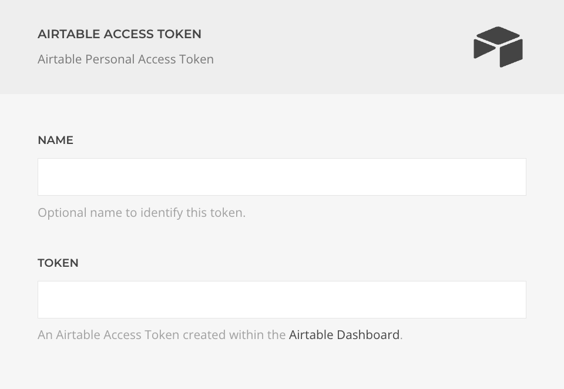

# Airtable Access Token Driver

The **Airtable Access Token Driver** enables you to securely manage and use your Airtable Personal Access Tokens. You can create and manage these tokens in your [Airtable Tokens Dashboard](https://airtable.com/create/tokens).

| Setting   | Description |
|-----------|-------------|
| **Name**  | A custom label to help you identify this token. |
| **Token** | The personal access token generated from your Airtable dashboard. |
