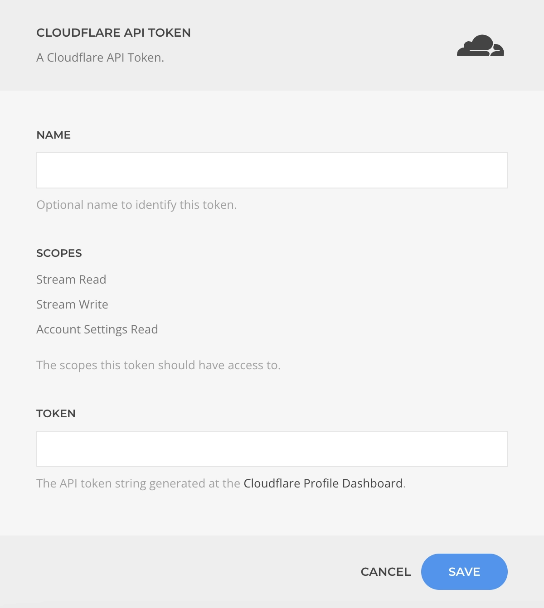

# Cloudflare Auth Driver

The **Cloudflare Auth Driver** allows you to securely manage and use Cloudflare API tokens. These tokens can be generated from your [Cloudflare Profile Dashboard](https://dash.cloudflare.com/profile/api-tokens) and are required for authenticating API requests.

