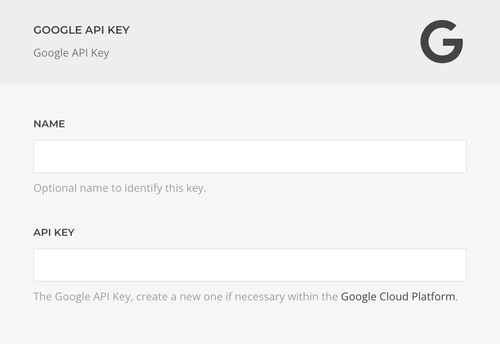

# Google API Key Driver

The **Google API Key Driver** allows you to manage and authenticate Google API keys generated via the [Google Cloud Platform Credentials](https://console.cloud.google.com/apis/credentials) dashboard.

