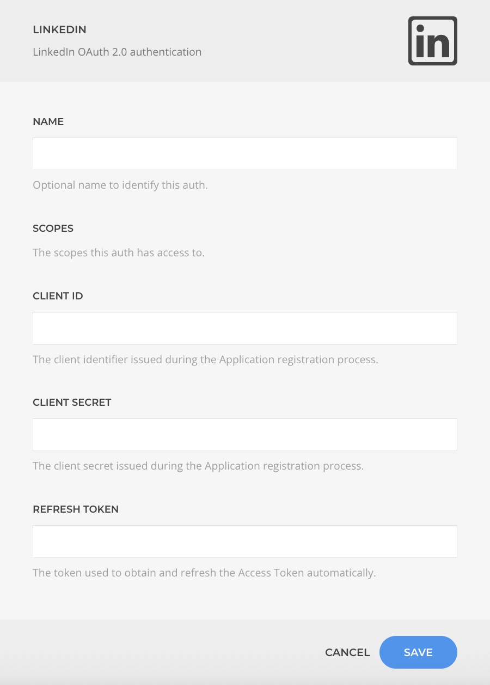

# LinkedIn Auth Driver

The **LinkedIn Auth Driver** manages the LinkedIn OAuth protocol to authenticate users and grant scope permissions.

::: warning Custom Dev App Required
Due to LinkedIn API policies, you cannot use a ZOOlanders OAuth App. You must [create your own LinkedIn Developer App](../custom-linkedin-dev-app) and use your personal credentials.
:::

| Setting        | Description |
| -------------- | ----------- |
| **Name**         | The identifier for this authentication configuration. |
| **Scopes**       | The list of permissions this auth can access. |
| **Client ID**     | The client identifier issued during the Application registration process. |
| **Client Secret** | The client secret issued during the Application registration process |
| **Refresh Token** | The token used to obtain and refresh the Access Token automatically. |
