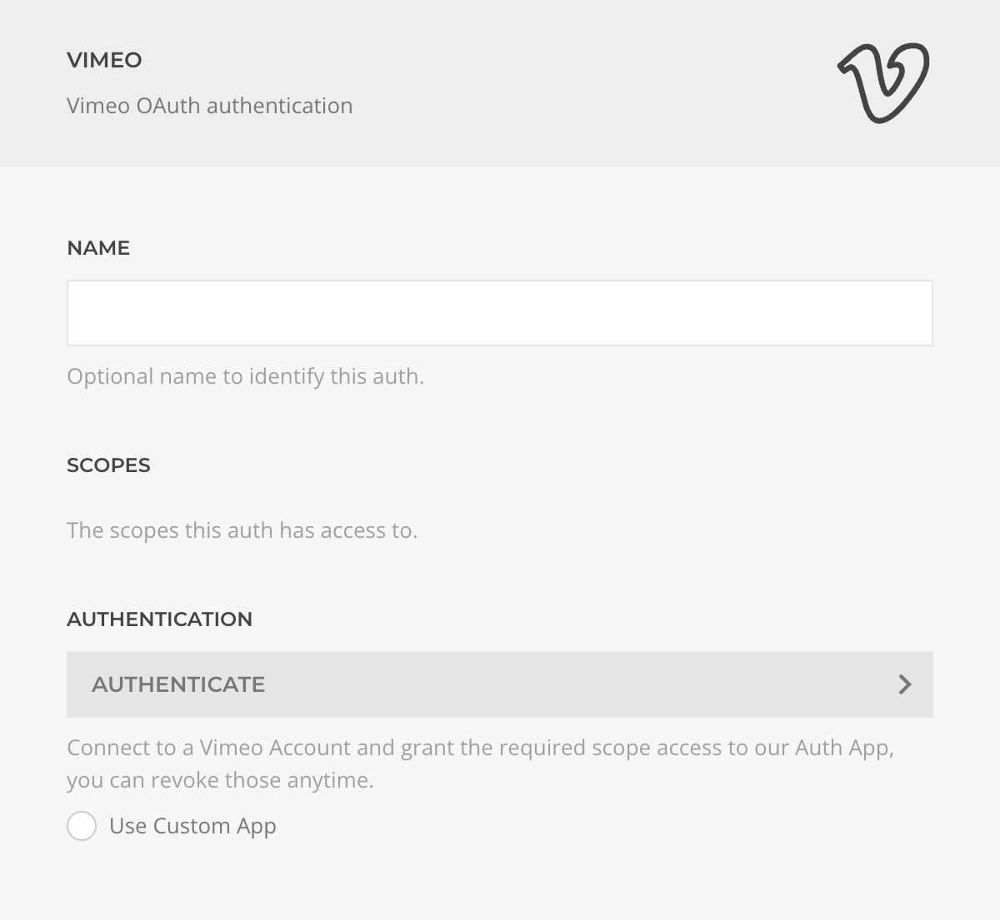

# Vimeo Auth Driver

The **Vimeo Auth Driver** enables authentication and permission management using the Vimeo OAuth protocol.

| Setting         | Description |
|-----------------|-------------|
| **Name**        | Identifier for this authentication instance. |
| **Scopes**      | Permissions granted to this auth; scopes can be managed or revoked at [vimeo.com/settings/apps](https://vimeo.com/settings/apps). |
| **Authentication** | Initiates the OAuth flow to authenticate and grant permissions. |
| **Custom App**  | Option to use your own Vimeo Dev App credentials. |
