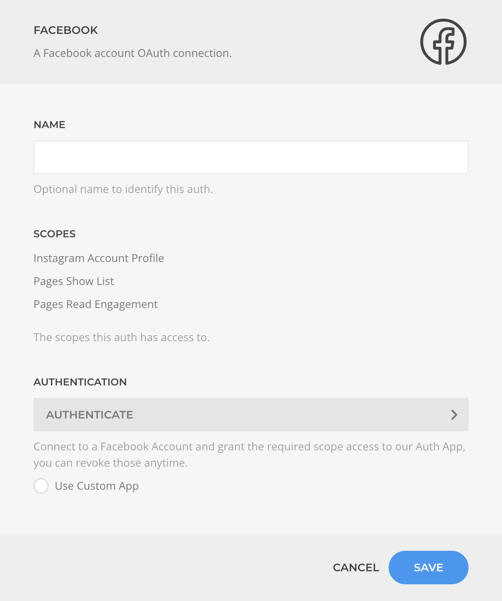
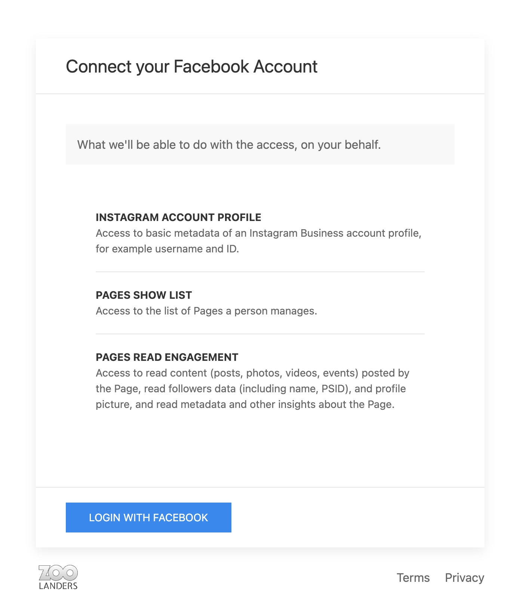
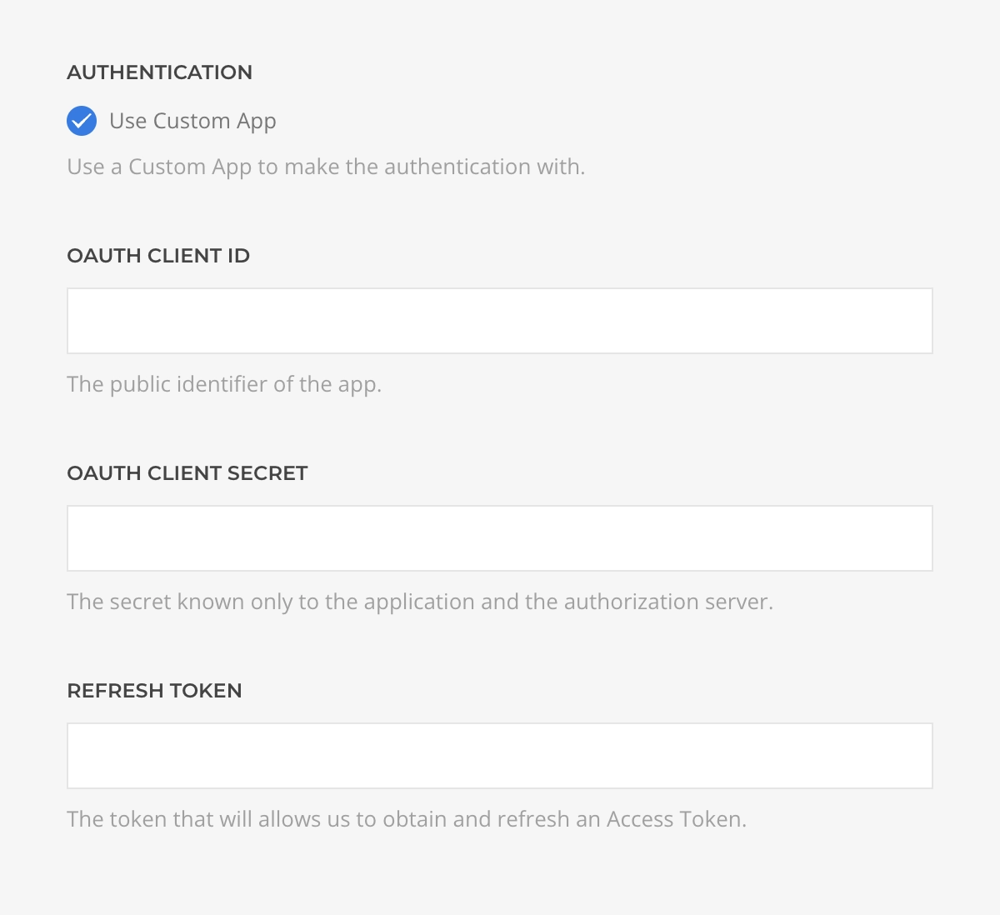
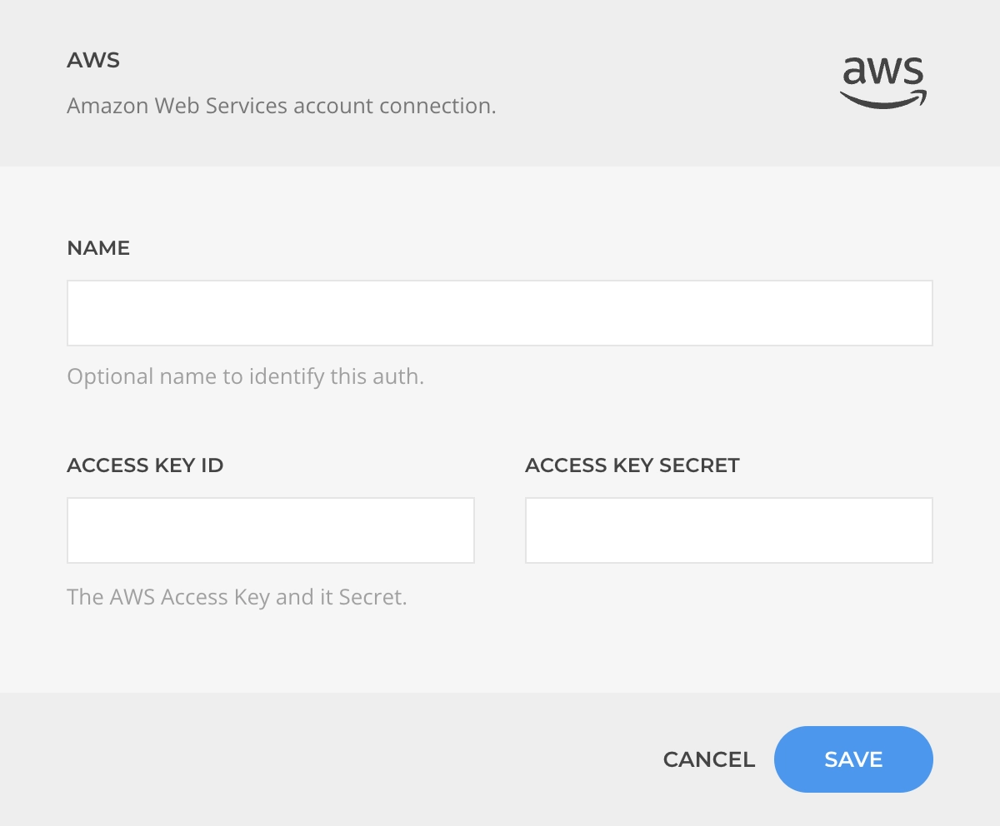
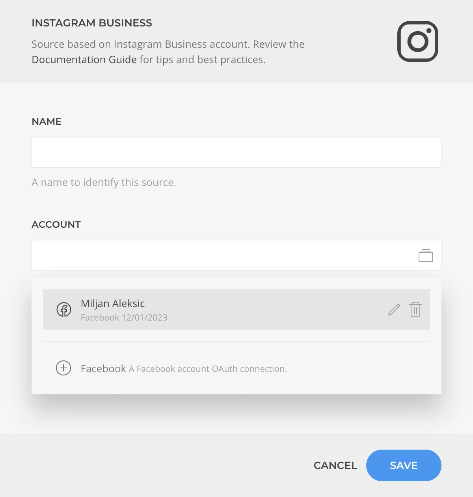
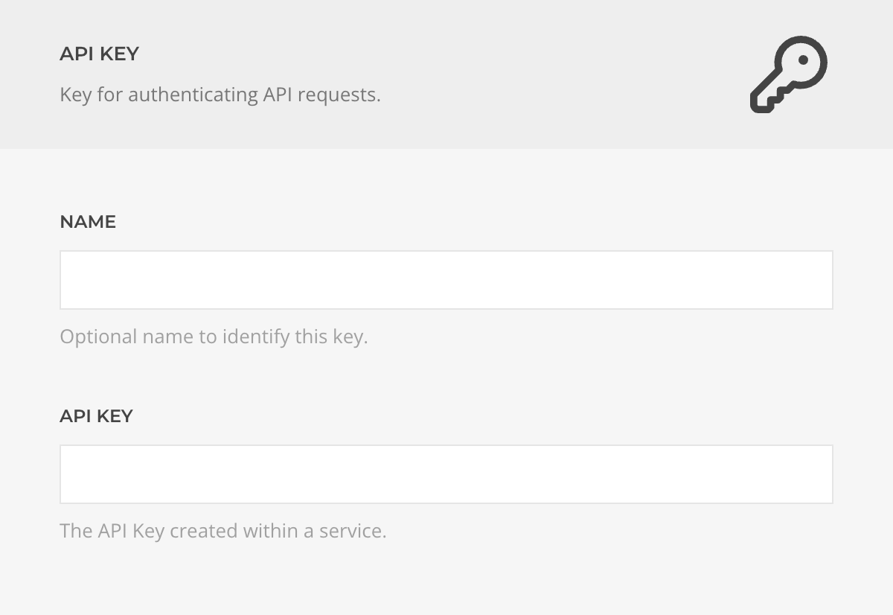

# Auths, Keys & Secrets

Authentication data such as OAuths, keys, and secrets are sensitive credentials collectively referred to as "auths."

Essentials extends YOOtheme Pro with a secure workflow for authenticating to third-party services using the [OAuth](#oauth) protocol, as well as for storing [Keys and Secrets](#keys-and-secrets). The workflow prioritizes [security](#security) and user convenience through the [Auth Manager](#auth-manager).

## OAuth

OAuth enables you to authenticate with third-party services and grant permissions to either the [Essentials OAuth App](#essentials-oauth-app) or your own [Custom OAuth App](#custom-oauth-app). This allows Essentials to access content or perform actions on your behalf.

## Essentials OAuth App

To use OAuth with a service, you typically need to create and get approval for an OAuth App within that service. While this is a best practice for security, it can be complex and time-consuming.

To simplify this, we provide a web app that acts as an intermediary, using pre-approved service-specific apps. This lets you authenticate and grant permissions easily, without managing the setup yourself.

::: warning Quota Limitations
When using our OAuth App, the API quota is shared among all users. While we optimize requests and have not reached any limits so far, please be aware that quota restrictions may occur.
:::

## Custom OAuth App

For high-traffic sites or advanced users, we strongly recommend creating your own OAuth App and using its client ID and secret. This approach avoids shared quota limitations and enhances security, giving you full control over the authentication process.

## Keys and Secrets

Essentials provides a secure and centralized way to manage keys and secrets required by various features and services. Centralizing these credentials ensures they are stored safely and are easily accessible when needed, simplifying management and improving security.

## Security

Security is at the core of the auth workflow. Understanding the underlying concepts helps you keep your applications and services protected from unauthorized access or data breaches.

### Encryption

All auth tokens, keys, and secrets are **encrypted** and stored in the [Essentials Settings](/essentials-for-yootheme-pro/settings) database table. This ensures that even if the data is accessed, it remains unreadable to unauthorized parties.

### OAuth Principles

We adhere to OAuth security best practices by always requesting the minimum permissions required. For example, we request read-only access unless write access is explicitly needed. This minimizes risk by limiting the scope of granted permissions.

You can revoke any granted permissions at any time, either through the service provider or directly. Revoking access immediately invalidates all stored tokens, ensuring quick response in case of a security incident.

### OAuth App

When using the ZOOlanders OAuth App, no login or token information is stored by us; credentials are passed directly to your site. However, for most services, we recommend using a custom OAuth App for greater security and to avoid shared quota issues.

## Auth Manager

Access the Auth Manager in the [Essentials Advanced](/essentials-for-yootheme-pro/settings#auths) section. Here, you can manage OAuths, keys, and secrets. Note that new auths cannot be created here, as each is tied to specific scopes and purposes defined during layout creation.

You can also manage auths conveniently while creating resources that require them.

## Auth Drivers

An **Auth Driver** is a modular component used by the Auth Manager to handle authentication for a specific service. Each driver serves as a bridge between Essentials and the external service, managing authentication details and credential processing.

