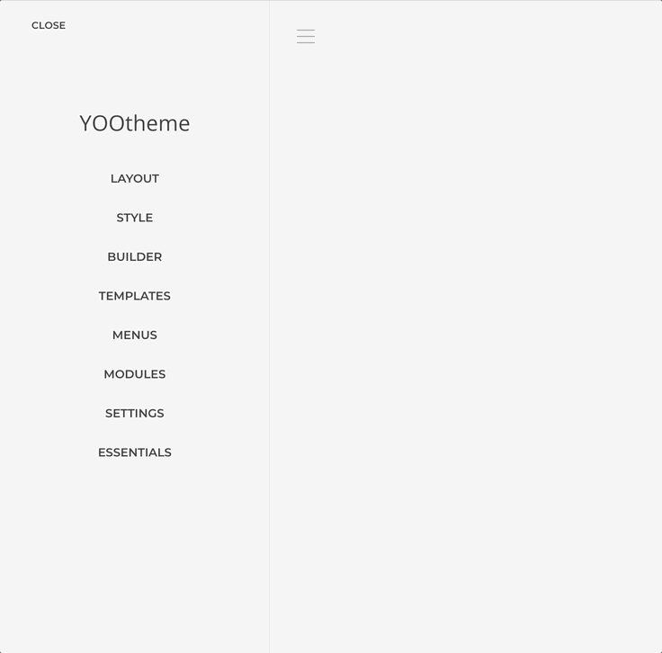
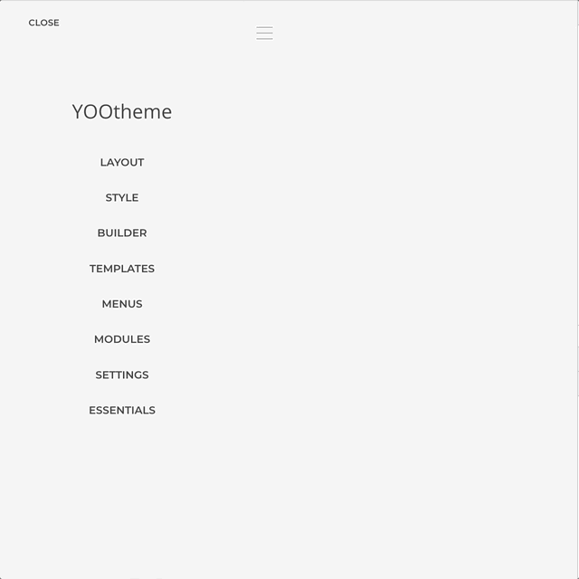
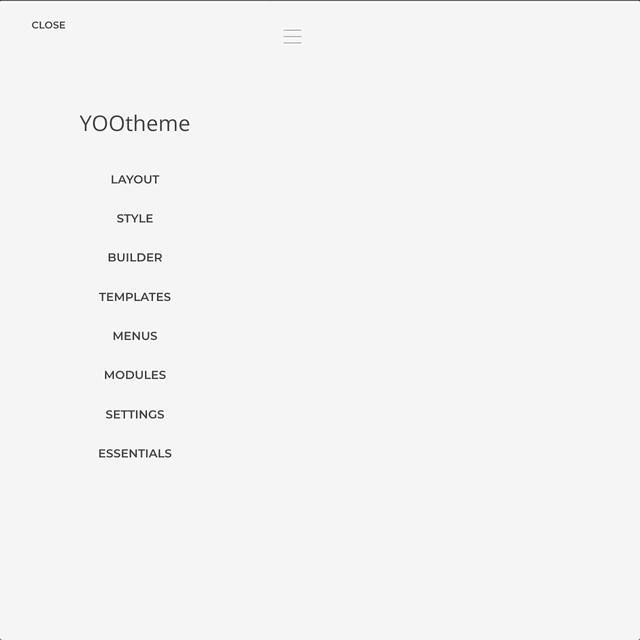
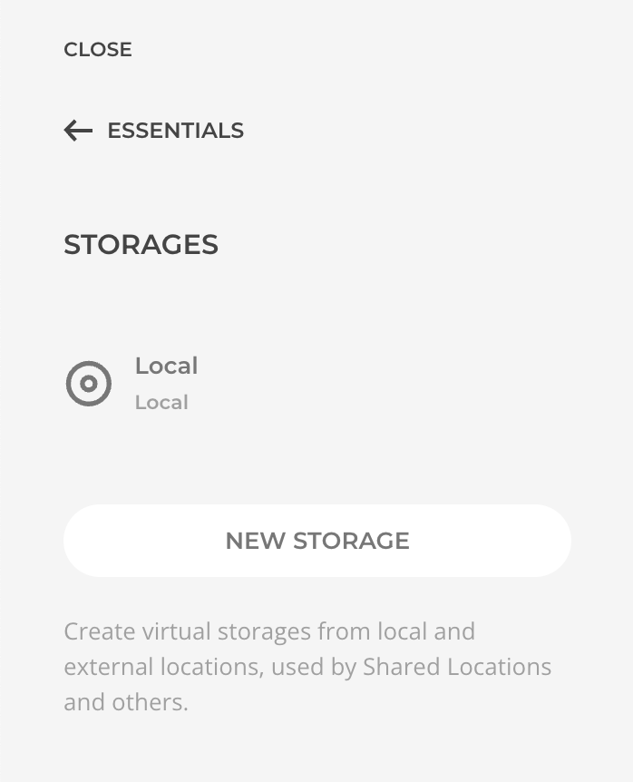
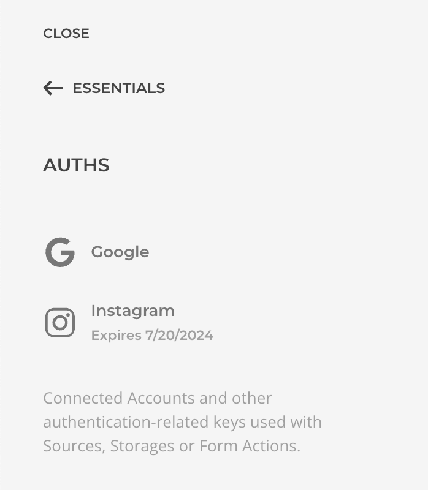
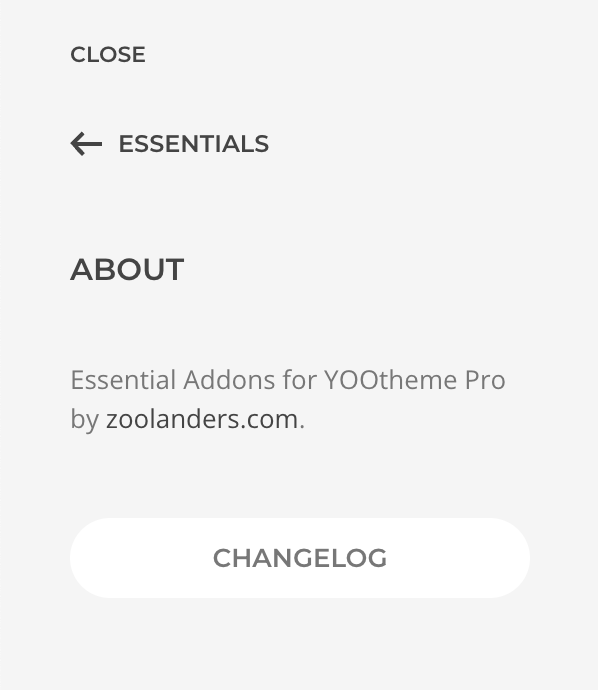

# Settings

The Essentials global settings panel, accessible via _Customizer → Essentials_, allows you to configure and manage all Essentials features. These settings are stored independently from your theme in the database and typically only need to be configured once.

## Sources

Create and manage dynamic content [sources](./addons/dynamic/). Those will become available as sources in the builder dynamic workflow.

## Global Queries

Create and manage source [Global Queries](./addons/dynamic/#global-queries). Those will become available as sources in the builder dynamic workflow.

## Layout Libraries

Create and manage [Layout Libraries](./addons/layouts/). Those will become available as additional libraries in the builder layouts library.

## Icon Collections

Create and manage [Icon Collections](./addons/icons/collection). Those will become available as additional icon collections in the builder icons library.

## Storages

Create and manage [Storages](./storage). Those will become available as storage options for Layout Libraries.

## Auths

Manage [Auths, Keys & Secrets](./auths/) that have been created during other resources creation. At the moment you cannot create auths directly.

## Advanced

Configure some advanced settings.

| Option | Description |
| --- | --- |
| *Addons* | Disable Essential addons individually. A disabled addon will be completely skipped from execution and is a good way to debug issues or to keep the global execution as smooth as possible. |
| *GeoIP Database Source* | The IP Geolocation database is required to localize the device IP geographically, used for example by the **Access IP Geolocation Rule**. If needed, follow the [GeoIP Database Installation](#geoip-database-installation). |
| *Import/Export* | Being Essentials Settings independent from the Theme, the only way to backup and/or restore is using the dedicated methods within _Customizer -> Essentials -> Advanced_ panel. |
| *Debug Data* | If the support team requests it, here is where you can generate and download Debug Data information which includes a copy of the Theme Settings, Essentials Settings, Sources Schema, and the server configuration. As it might include sensitive data, be carefull who you share this with. |

## About

This panel shows the Essentials version currently used on this site, as well as the release changelog. Refer to this section after an update to see what has changed.

## GeoIP Database

Geolocation rely on [MaxMind](https://www.maxmind.com/en/geoip2-services-and-databases)'s **GeoIP2** (commercial) or **GeoLite2** (free) Database. While the free version is enough for the majority of projects, the commercial one is claimed to be more accurate and frequently updated.

As per the license limitations, Essentials doesn't distribute either of them, if geolocation feature is required please proceed with the manual database installation.

### Installation {#geoip-database-installation}

Download the chosen Database from MaxMind, previous free registration is required, and upload it to any chosen folder of your web project server. Copy the relative path to the Database file, prepend it with `~/`, and past it into the _GeoIP Database Source_ setting at the _Customizer -> Essentials -> Advanced_ panel, e.g. `~/geoip/GeoLite2-Country.mmdb`.

Alternatively you can rely on 3rd party plugins for the installation and posterior updates of the Database. If opted this way, make sure the path to the Database is properly updated after installation.

- [Joomla Regular Labs GeoIP Provider](https://regularlabs.com/geoip)
- [WordPress Geolocation IP Detection](https://wordpress.org/plugins/geoip-detect)

::: tip Country or City Database
The **Country Database** allows resolving IP geolocation on the continent and country level, while the **City Database** allows the same plus cities and postal code levels. The City one might seems the obvious choice, but taking into consideration that its size is considerably bigger, choose it only when necessary.
:::
