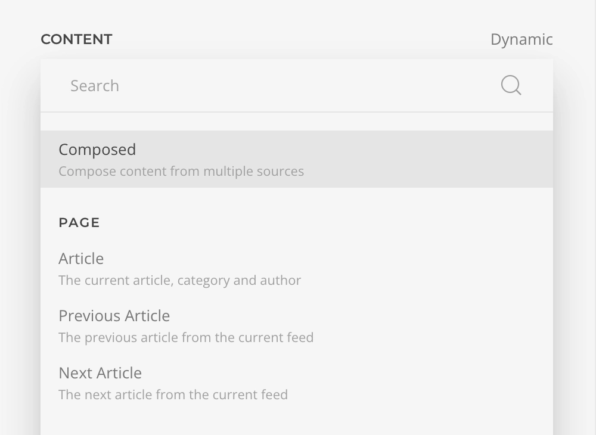
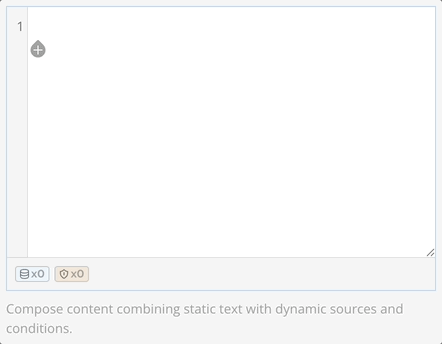

# Composed Sources

**Composed Sources** enable you to freely mix static text with dynamic content from any source within a single field. You can seamlessly insert dynamic values directly into your text, creating flexible, personalized content without needing separate fields.

To enable composition, select the _Composed_ option from the Dynamic Content settings.

::: tip
Already have dynamic content assigned? Click the `compose` icon to migrate it to a composed source automatically.
:::

## Composing Content

Once enabled, the field transforms into an inline editor where you can freely type static text and insert dynamic content. To add dynamic values, click the `insert` button to select a source—the same interface you'd use for regular dynamic content.

After insertion, dynamic blocks appear inline. Click any block to access its options:

| Action      | Description                                                         |
|-------------|---------------------------------------------------------------------|
| **Alias**   | Set a custom label for easier reference                             |
| **Edit**    | Configure filters, arguments, and other block settings              |
| **Copy**    | Duplicate the block within your composition                         |
| **Delete**  | Remove the block                                                    |

::: tip
Click the block again while options are visible to swap it for a different source field.
:::

## Adding Conditions

Wrap any part of your composition with conditional blocks to show content only when specific criteria are met. This uses the same [Access Conditions](../../addons/access/) interface you're already familiar with.

Click `insert` in the editor and choose _Condition_ or _Condition/Else_. The first block shows when conditions are true; the else block (if added) shows when false.

Configure conditions by clicking the block and selecting _Edit_, or double-click it directly. Define your condition rules using the same flexible criteria as Access Conditions.

::: tip
Add else blocks later if needed—they're optional.
:::

## Nesting Compositions

Place one composed source inside another to create modular, reusable content blocks. Reference existing composed sources as blocks within your main composition.

::: tip
Use descriptive names for nested sources (_User Info_, _Product Details_) to keep them easy to identify and manage.
:::

::: tip
Combine nesting with conditions for advanced content control. Break complex content into smaller, independent pieces that you can reuse and update separately.
:::

## Converting Existing Content

Transform any dynamic content into a composed source anytime by pressing the Compose button.

